# Linear Regression

Linear regression is a simple approach to supervised learning. It assumes that the dependence of Y on $X_1, X_2, ..., X_p$ is linear. 
- True regression functions are never linear!

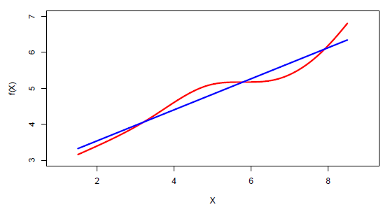

- Although it may seem overly simplistic, linear regression is extremely useful both conceptually and practically.

## Linear regression for the advertising data

Consider the advertising data shown.

Questions we might ask:

- Is there a relationship between advertising budget and sales?
- How strong is the relationship between advertising budget and sales?
- Which media contribute to sales?
- How accurately can we predict future sales?
- Is the relationship linear?
- Is there synergy among the advertising media?

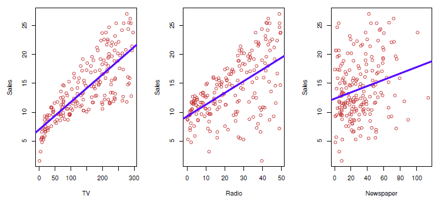

## Simple linear regression using a single predictor X.

We assume a model

$$
Y = \beta_0 + \beta_1 X + \epsilon 
$$

where $\beta_0$ and $\beta_1$ are two unknown constants that represent the intercept and slope, also known as coefficients or parameters, and $\epsilon$ is the error term.

Given some estimates $\hat{\beta_0}$ and $\hat{\beta_1}$ for the model coefficients, we predict future sales using

$$
\hat{y} = \hat{\beta_0} + \hat{\beta_1}x, 
$$

where $\hat{y}$ indicates a prediction of Y on the basis of $X = x$. The hat symbol denotes an estimated value.

### Estimation of the parameters by least squares

Let $\hat{y}_i = \hat{\beta}_0 + \hat{\beta}_1 x_i$ be the prediction for $Y$ based on the $i$th value of $X$. Then $e_i = y_i - \hat{y}_i$ represents the $i$th residual.

We define the residuals sum of squares (RSS) as

$$ 
RSS = e_1^2 + e_2^2 + ... + e_n^2, 
$$

or equivalently as

$$ 
RSS = (y_1 - \hat{\beta}_0 - \hat{\beta}_1 x_1)^2 + (y_2 - \hat{\beta}_0 - \hat{\beta}_1 x_2)^2 + ... + (y_n - \hat{\beta}_0 - \hat{\beta}_1 x_n)^2. 
$$


The least squares approach chooses $\hat{\beta}_0$ and $\hat{\beta}_1$ to minimize the RSS. The minimizing values can be shown to be
$$
\hat{\beta}_1 = \frac{\sum_{i=1}^n (x_i - \bar{x})(y_i - \bar{y})}{\sum_{i=1}^n (x_i - \bar{x})^2},
$$

$$
\hat{\beta}_0 = \bar{y} - \hat{\beta}_1 \bar{x},
$$
where $\bar{y} = \frac{1}{n} \sum_{i=1} y_i$ and $\bar{x} = \frac{1}{n} \sum_{i=1} x_i$ are the sample means.

### Example: advertising data

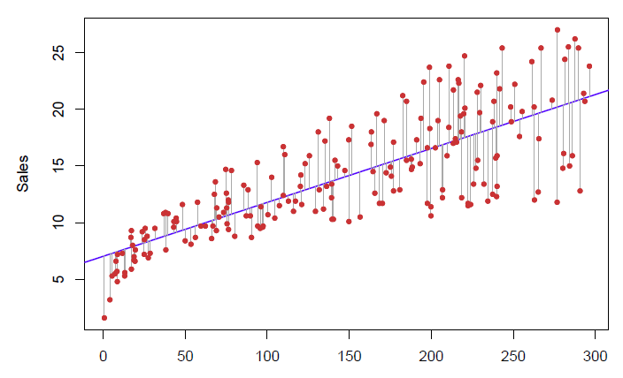

For the Advertising data, the least squares fit for the regression of sales onto TV is shown. The fit is found by minimizing the sum of squared errors. Each grey line segment represents an error, and the fit makes a compromise by averaging their squares. In this case, a linear fit captures the essence of the relationship, although it is somewhat deficient in the left of the plot.

### Assessing the Accuracy of the Coefficient Estimates
The standard error of an estimator reflects how it varies under repeated sampling. We have
$$
SE(\hat{\beta}_1)^2 = \frac{\sigma^2}{\sum_{i=1}^n (x_i - \bar{x})^2}, \quad SE(\hat{\beta}_0)^2 = \sigma^2 \left( \frac{1}{n} + \frac{\bar{x}^2}{\sum_{i=1}^n (x_i - \bar{x})^2} \right),
$$
where $\sigma^2 = \text{Var}(\epsilon)$.

These standard errors can be used to compute confidence intervals. A 95% confidence interval is defined as a range of values such that with 95% probability, the range will contain the true unknown value of the parameter. It has the form
$$
\hat{\beta}_1 \pm 2 \cdot SE(\hat{\beta}_1).
$$

Confidence interval $-$ continued
That is, there is approximately a 95% chance that the interval
$$
[\hat{\beta}_1 - 2 \cdot SE(\hat{\beta}_1), \hat{\beta}_1 + 2 \cdot SE(\hat{\beta}_1)]
$$
will contain the true value of $\beta_1$ (under a scenario where we got repeated samples like the present sample).

For the advertising data, the 95% confidence interval for $\beta_1$ is [0.042, 0.053].

### Hypothesis testing
Standard errors can also be used to perform **hypothesis tests** on the coefficients. The most common hypothesis test involves testing the **null hypothesis** of
$$
H_0: \text{There is no relationship between } X \text{ and } Y
$$
versus the **alternative hypothesis**
$$
H_A: \text{There is some relationship between } X \text{ and } Y.
$$

Mathematically, this corresponds to testing
$$
H_0: \beta_1 = 0
$$
versus
$$
H_A: \beta_1 \neq 0,
$$
since if $\beta_1 = 0$ then the model reduces to $Y = \beta_0 + \epsilon$, and $X$ is not associated with $Y$.

To test the null hypothesis, we compute a **t-statistic**, given by
$$
t = \frac{\hat{\beta}_1 - 0}{SE(\hat{\beta}_1)},
$$

This will have a t-distribution with $n - 2$ degrees of freedom, assuming $\beta_1 = 0$.

Using statistical software, it is easy to compute the probability of observing any value equal to $|t|$ or larger. We call this probability the **p-value**.

### Results for the advertising data

|           | Coefficient | Std. Error | t-statistic | p-value  |
|-----------|-------------|------------|-------------|----------|
| Intercept | 7.0325      | 0.4578     | 15.36       | < 0.0001 |
| TV        | 0.0475      | 0.0027     | 17.67       | < 0.0001 |

### Assessing the Overall Accuracy of the Model

We compute the **Residual Standard Error**
$$
RSE = \sqrt{\frac{1}{n - 2} RSS} = \sqrt{\frac{1}{n - 2} \sum_{i=1}^n (y_i - \hat{y}_i)^2},
$$
where the **residual sum-of-squares** is $RSS = \sum_{i=1}^n (y_i - \hat{y}_i)^2$.

**R-squared** or fraction of variance explained is
$$
R^2 = \frac{TSS - RSS}{TSS} = 1 - \frac{RSS}{TSS},
$$
where $TSS = \sum_{i=1}^n (y_i - \bar{y})^2$ is the total sum of squares.

It can be shown that in this simple linear regression setting that $R^2 = r^2$, where $r$ is the correlation between $X$ and $Y$:
$$
r = \frac{\sum_{i=1}^n (x_i - \bar{x})(y_i - \bar{y})}{\sqrt{\sum_{i=1}^n (x_i - \bar{x})^2 \sum_{i=1}^n (y_i - \bar{y})^2}}.
$$

### Advertising data results

| Quantity                | Value  |
|-------------------------|--------|
| Residual Standard Error | 3.26   |
| $R^2$                   | 0.612  |
| F-statistic             | 312.1  |

## Multiple Linear Regression

Here our model is

$$
Y = \beta_0 + \beta_1X_1 + \beta_2X_2 + \cdots + \beta_pX_p + \epsilon,
$$

We interpret $\beta_j$ as the average effect on $Y$ of a one unit increase in $X_j$, holding all other predictors fixed. In the advertising example, the model becomes

$$
\text{sales} = \beta_0 + \beta_1 \times \text{TV} + \beta_2 \times \text{radio} + \beta_3 \times \text{newspaper} + \epsilon.
$$

### Interpreting Regression Coefficients

The ideal scenario is when the predictors are uncorrelated — a **balanced design**:
- Each coefficient can be estimated and tested separately.
- Interpretations such as “a unit change in $X_j$ is associated with a $\beta_j$ change in $Y$, while all the other variables stay fixed”, are possible.

Correlations amongst predictors cause problems:
- The variance of all coefficients tends to increase, sometimes dramatically.
- Interpretations become hazardous — when $X_j$ changes, everything else changes.

**Claims of causality** should be avoided for observational data.

## The Woes of (Interpreting) Regression Coefficients

“Data Analysis and Regression” Mosteller and Tukey 1977:
- A regression coefficient $\beta_j$ estimates the expected change in $Y$ per unit change in $X_j$, with all other predictors held fixed. But predictors usually change together!

_Example:_ 
- $Y$: total amount of change in your pocket;
- $X_1$: number of coins;
- $X_2$: number of pennies, nickels, and dimes. By itself, the regression coefficient of $Y$ on $X_2$ will be > 0. But how about with $X_1$ in the model?

_Example:_
- $Y$: number of tackles by a football player in a season;
- $W$ and $H$: his weight and height.
- Fitted regression model is $\hat{Y} = \hat{\beta}_0 + 0.50W - 0.10H$. How do we interpret $\hat{\beta}_2 < 0$?

## Estimation and Prediction for Multiple Regression

Given estimates $\hat{\beta}_0, \hat{\beta}_1, \ldots, \hat{\beta}_p$, we can make predictions using the formula

$$
\hat{y} = \hat{\beta}_0 + \hat{\beta}_1x_1 + \hat{\beta}_2x_2 + \cdots + \hat{\beta}_px_p.
$$

We estimate $\beta_0, \beta_1, \ldots, \beta_p$ as the values that minimize the sum of squared residuals

$$
RSS = \sum_{i=1}^n (y_i - \hat{y}_i)^2 = \sum_{i=1}^n (y_i - \hat{\beta}_0 - \hat{\beta}_1x_{i1} - \hat{\beta}_2x_{i2} - \cdots - \hat{\beta}_px_{ip})^2.
$$

This is done using standard statistical software. The values $\hat{\beta}_0, \hat{\beta}_1, \ldots, \hat{\beta}_p$ that minimize $RSS$ are the multiple least squares regression coefficient estimates.

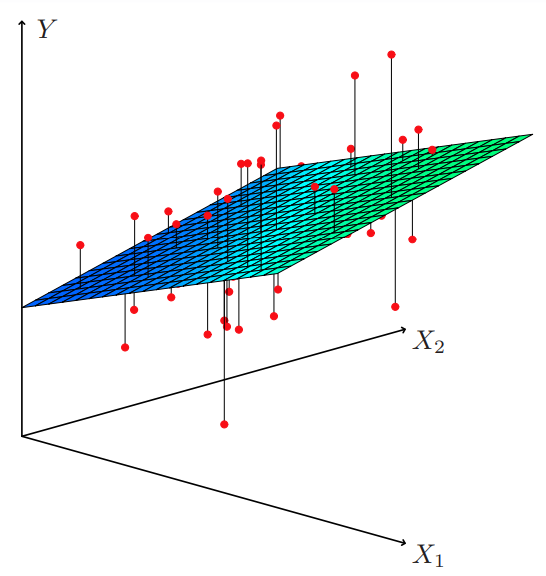

## Results for Advertising Data

|           | Coefficient | Std. Error | t-statistic | p-value  |
|-----------|-------------|------------|-------------|----------|
| Intercept | 2.939       | 0.3119     | 9.42        | < 0.0001 |
| TV        | 0.046       | 0.0014     | 32.81       | < 0.0001 |
| radio     | 0.189       | 0.0086     | 21.89       | < 0.0001 |
| newspaper | -0.001      | 0.0059     | -0.18       | 0.8599   |

### Correlations

|           | TV     | radio  | newspaper | sales  |
|-----------|--------|--------|-----------|--------|
| TV        | 1.0000 | 0.0548 | 0.0567    | 0.7822 |
| radio     |        | 1.0000 | 0.3541    | 0.5762 |
| newspaper |        |        | 1.0000    | 0.2283 |
| sales     |        |        |           | 1.0000 |

## Important Questions

1. Is at least one of the predictors $X_1, X_2, \ldots, X_p$ useful in predicting the response?
2. Do all the predictors help to explain $Y$, or is only a subset of the predictors useful?
3. How well does the model fit the data?
4. Given a set of predictor values, what response value should we predict, and how accurate is our prediction?

## Is at Least One Predictor Useful?

For the first question, we can use the **F-statistic**

$$
F = \frac{(TSS - RSS)/p}{RSS/(n - p - 1)} \sim F_{p, n-p-1}
$$

| Quantity                | Value  |
|-------------------------|--------|
| Residual Standard Error | 1.69   |
| $R^2$                   | 0.897  |
| F-statistic             | 570    |

## Qualitative Predictors with More Than Two Levels
With more than two levels, we create additional dummy variables. For example, for the ethnicity variable we create two dummy variables. The first could be

$$
x_{i1} =
\begin{cases}
1 & \text{if } i\text{th person is Asian} \\
0 & \text{if } i\text{th person is not Asian}
\end{cases}
$$

and the second could be

$$
x_{i2} =
\begin{cases}
1 & \text{if } i\text{th person is Caucasian} \\
0 & \text{if } i\text{th person is not Caucasian}
\end{cases}
$$

Then both of these variables can be used in the regression equation, in order to obtain the model

$$
y_i = \beta_0 + \beta_1x_{i1} + \beta_2x_{i2} + \epsilon_i = 
\begin{cases} 
\beta_0 + \beta_1 + \epsilon_i & \text{if } i\text{th person is Asian} \\
\beta_0 + \beta_2 + \epsilon_i & \text{if } i\text{th person is Caucasian} \\
\beta_0 + \epsilon_i & \text{if } i\text{th person is AA}
\end{cases}
$$

There will always be one fewer dummy variable than the number of levels. The level with no dummy variable — African American in this example — is known as the baseline.

## Results for Ethnicity

|                      | Coefficient | Std. Error | t-statistic | p-value  |
|----------------------|-------------|------------|-------------|----------|
| Intercept            | 531.00      | 46.32      | 11.464      | < 0.0001 |
| ethnicity[Asian]     | -18.69      | 65.02      | -0.287      | 0.7740   |
| ethnicity[Caucasian] | -12.50      | 56.68      | -0.221      | 0.8260   |

## Extensions of the Linear Model

Removing the additive assumption: interactions and nonlinearity

### Interactions

In our previous analysis of the Advertising data, we assumed that the effect on sales of increasing one advertising medium is independent of the amount spent on the other media.

For example, the linear model

$$
\text{sales} = \beta_0 + \beta_1 \times \text{TV} + \beta_2 \times \text{radio} + \beta_3 \times \text{newspaper}
$$

states that the average effect on sales of a one-unit increase in TV is always $\beta_1$, regardless of the amount spent on radio.

Suppose that spending money on radio advertising actually increases the effectiveness of TV advertising, so that the slope term for TV should increase as radio increases.

In this situation, given a fixed budget of \$100,000, spending half on radio and half on TV may increase sales more than allocating the entire amount to either TV or to radio.

In marketing, this is known as a **synergy** effect, and in statistics, it is referred to as an **interaction** effect.

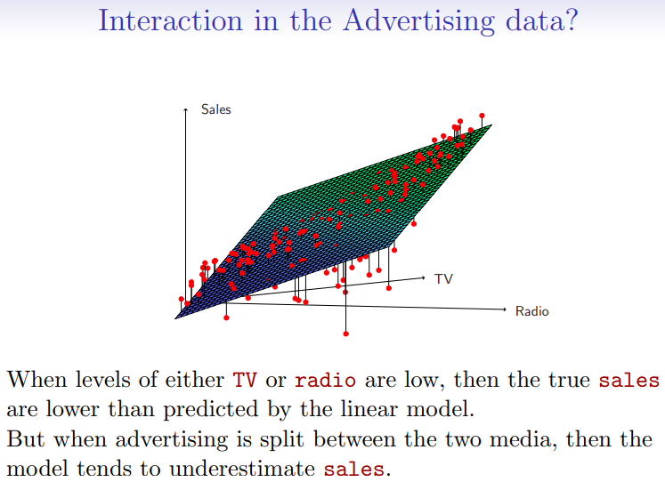

### Modelling Interactions — Advertising Data

Model takes the form

$$
\text{sales} = \beta_0 + \beta_1 \times \text{TV} + \beta_2 \times \text{radio} + \beta_3 \times (\text{radio} \times \text{TV}) + \epsilon = \beta_0 + (\beta_1 + \beta_3 \times \text{radio}) \times \text{TV} + \beta_2 \times \text{radio} + \epsilon.
$$

Results:

|           | Coefficient | Std. Error | t-statistic | p-value  |
|-----------|-------------|------------|-------------|----------|
| Intercept | 6.7502      | 0.248      | 27.23       | < 0.0001 |
| TV        | 0.0191      | 0.002      | 12.70       | < 0.0001 |
| radio     | 0.0289      | 0.009      | 3.24        | 0.0014   |
| TV×radio  | 0.0011      | 0.000      | 20.73       | < 0.0001 |

The results in this table suggest that interactions are important. The p-value for the interaction term TV×radio is extremely low, indicating that there is strong evidence for $H_A : \beta_3 \neq 0$.

The $R^2$ for the interaction model is 96.8%, compared to only 89.7% for the model that predicts sales using TV and radio without an interaction term.

This means that $(96.8 - 89.7)/(100 - 89.7) = 69\%$ of the variability in sales that remains after fitting the additive model has been explained by the interaction term.

The coefficient estimates in the table suggest that an increase in TV advertising of \$1,000 is associated with increased sales of

$$
(\hat{\beta}_1 + \hat{\beta}_3 \times \text{radio}) \times 1000 = 19 + 1.1 \times \text{radio} \text{ units}.
$$

An increase in radio advertising of \$1,000 will be associated with an increase in sales of

$$
(\hat{\beta}_2 + \hat{\beta}_3 \times \text{TV}) \times 1000 = 29 + 1.1 \times \text{TV} \text{ units}.
$$

### Hierarchy

Sometimes it is the case that an interaction term has a very small p-value, but the associated main effects (in this case, TV and radio) do not.

The **hierarchy principle**:
If we include an interaction in a model, we should also include the main effects, even if the p-values associated with their coefficients are not significant.

The rationale for this principle is that interactions are hard to interpret in a model without main effects — their meaning is changed. Specifically, the interaction terms also contain main effects, if the model has no main effect terms.

### Interactions Between Qualitative and Quantitative Variables

Consider the Credit data set, and suppose that we wish to predict balance using income (quantitative) and student (qualitative).

**Without an interaction term**, the model takes the form

$$
\text{balance}_i \approx \beta_0 + \beta_1 \times \text{income}_i + 
\begin{cases} 
\beta_2 & \text{if } i\text{th person is a student} \\
0 & \text{if } i\text{th person is not a student}
\end{cases}
= \beta_1 \times \text{income}_i + 
\begin{cases} 
\beta_0 + \beta_2 & \text{if } i\text{th person is a student} \\
\beta_0 & \text{if } i\text{th person is not a student}
\end{cases}
$$

**With interactions**, it takes the form

$$
\text{balance}_i \approx \beta_0 + \beta_1 \times \text{income}_i + 
\begin{cases} 
\beta_2 + \beta_3 \times \text{income}_i & \text{if student} \\
0 & \text{if not student}
\end{cases}
= 
\begin{cases} 
(\beta_0 + \beta_2) + (\beta_1 + \beta_3) \times \text{income}_i & \text{if student} \\
\beta_0 + \beta_1 \times \text{income}_i & \text{if not student}
\end{cases}
$$

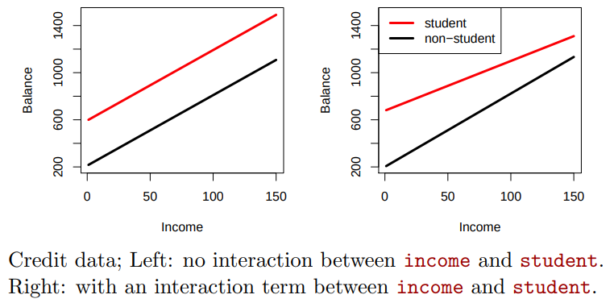

### Non-linear Effects of Predictors

Polynomial regression on Auto data:
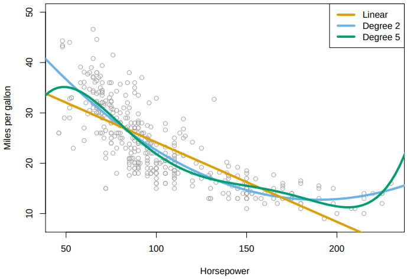

The figure suggests that

$$
\text{mpg} = \beta_0 + \beta_1 \times \text{horsepower} + \beta_2 \times \text{horsepower}^2 + \epsilon
$$

may provide a better fit.

|              | Coefficient | Std. Error | t-statistic | p-value  |
|--------------|-------------|------------|-------------|----------|
| Intercept    | 56.9001     | 1.8004     | 31.6        | < 0.0001 |
| horsepower   | -0.4662     | 0.0311     | -15.0       | < 0.0001 |
| horsepower^2 | 0.0012      | 0.0001     | 10.1        | < 0.0001 |

# Classification

## Qualitative Variables

Qualitative variables take values in an unordered set $C$, such as:
- $\text{eye color} \in \{ \text{brown}, \text{blue}, \text{green} \}$
- $\text{email} \in \{ \text{spam}, \text{ham} \}$

## Classification Task

Given a feature vector $X$ and a qualitative response $Y$ taking values in the set $C$, the classification task is to build a function $C(X)$ that takes as input the feature vector $X$ and predicts its value for $Y$; i.e. $C(X) \in C$.

## Estimating Probabilities

Often we are more interested in estimating the probabilities that $X$ belongs to each category in $C$. For example, it is more valuable to have an estimate of the probability that an insurance claim is fraudulent, than a classification of fraudulent or not.

## Example: Credit Card Default

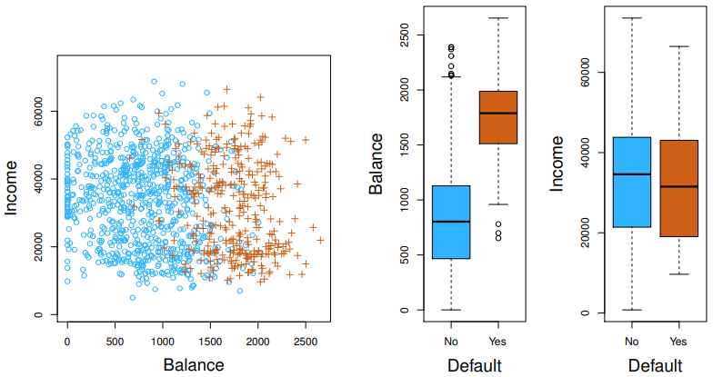

### Default Classification Task

Suppose for the Default classification task that we code:

$$
Y =
\begin{cases} 
0 & \text{if No} \\
1 & \text{if Yes}
\end{cases}
$$

Can we simply perform a linear regression of $Y$ on $X$ and classify as Yes if $\hat{Y} > 0.5$?

- In this case of a binary outcome, linear regression does a good job as a classifier and is equivalent to linear discriminant analysis, which we discuss later.
- Since in the population $E(Y | X = x) = \Pr(Y = 1 | X = x)$, we might think that regression is perfect for this task.
- However, linear regression might produce probabilities less than zero or greater than one. Logistic regression is more appropriate.

### Linear versus Logistic Regression

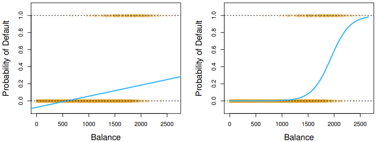

The orange marks indicate the response $Y$, either 0 or 1. Linear regression does not estimate $\Pr(Y = 1 | X)$ well. Logistic regression seems well suited to the task.

Now suppose we have a response variable with three possible values. A patient presents at the emergency room, and we must classify them according to their symptoms.

$$
Y = 
\begin{cases} 
1 & \text{if stroke} \\
2 & \text{if drug overdose} \\
3 & \text{if epileptic seizure}
\end{cases}
$$

This coding suggests an ordering and in fact implies that the difference between stroke and drug overdose is the same as between drug overdose and epileptic seizure.

Linear regression is not appropriate here. Multiclass Logistic Regression or Discriminant Analysis are more appropriate.

## Logistic Regression

Let's write $p(X) = \Pr(Y = 1|X)$ for short and consider using balance to predict default. Logistic regression uses the form:

$$
p(X) = \frac{e^{\beta_0 + \beta_1 X}}{1 + e^{\beta_0 + \beta_1 X}} 
$$

where $e \approx 2.71828$ is a mathematical constant (Euler's number). It is easy to see that no matter what values $\beta_0$, $\beta_1$, or $X $take, $p(X)$ will have values between 0 and 1.

A bit of rearrangement gives:

$$ 
\log \left( \frac{p(X)}{1 - p(X)} \right) = \beta_0 + \beta_1 X 
$$

This monotone transformation is called the **log odds** or **logit** transformation of $p(X)$ (by log we mean natural log: ln).

### Linear versus Logistic Regression


Logistic regression ensures that our estimate for $p(X)$ lies between 0 and 1.

## Maximum Likelihood

We use maximum likelihood to estimate the parameters.

$$
 L(\beta_0, \beta_1) = \prod_{i:y_i=1} p(x_i) \prod_{i:y_i=0} (1 - p(x_i)) 
$$

This **likelihood** gives the probability of the observed zeros and ones in the data. We pick $\beta_0$ and $\beta_1$ to maximize the likelihood of the observed data.

Most statistical packages can fit linear logistic regression models by maximum likelihood. In R, we use the `glm` function.

|           | Coefficient | Std. Error | Z-statistic | P-value  |
|-----------|-------------|------------|-------------|----------|
| Intercept | -10.6513    | 0.3612     | -29.5       | < 0.0001 |
| balance   | 0.0055      | 0.0002     | 24.9        | < 0.0001 |

## Making Predictions

What is our estimated probability of default for someone with a balance of \$1000?

$$
 \hat{p}(X) = \frac{e^{\hat{\beta}_0 + \hat{\beta}_1 X}}{1 + e^{\hat{\beta}_0 + \hat{\beta}_1 X}} = \frac{e^{-10.6513 + 0.0055 \times 1000}}{1 + e^{-10.6513 + 0.0055 \times 1000}} = 0.006 
$$

With a balance of \$2000?

$$
 \hat{p}(X) = \frac{e^{\hat{\beta}_0 + \hat{\beta}_1 X}}{1 + e^{\hat{\beta}_0 + \hat{\beta}_1 X}} = \frac{e^{-10.6513 + 0.0055 \times 2000}}{1 + e^{-10.6513 + 0.0055 \times 2000}} = 0.586 
$$

### Using Student as the Predictor

|              | Coefficient | Std. Error | Z-statistic | P-value  |
|--------------|-------------|------------|-------------|----------|
| Intercept    | -3.5041     | 0.0707     | -49.55      | < 0.0001 |
| student[Yes] | 0.4049      | 0.1150     | 3.52        | 0.0004   |

$$
 \widehat{Pr}(\text{default=Yes}|\text{student=Yes}) = \frac{e^{-3.5041 + 0.4049 \times 1}}{1 + e^{-3.5041 + 0.4049 \times 1}} = 0.0431 
$$

$$
 \widehat{Pr}(\text{default=Yes}|\text{student=No}) = \frac{e^{-3.5041 + 0.4049 \times 0}}{1 + e^{-3.5041 + 0.4049 \times 0}} = 0.0292 
$$

## Logistic Regression with Several Variables

$$
 \log \left( \frac{p(X)}{1 - p(X)} \right) = \beta_0 + \beta_1 X_1 + \cdots + \beta_p X_p 
$$

$$
 p(X) = \frac{e^{\beta_0 + \beta_1 X_1 + \cdots + \beta_p X_p}}{1 + e^{\beta_0 + \beta_1 X_1 + \cdots + \beta_p X_p}} 
$$

|              | Coefficient | Std. Error | Z-statistic | P-value  |
|--------------|-------------|------------|-------------|----------|
| Intercept    | -10.8690    | 0.4923     | -22.08      | < 0.0001 |
| balance      | 0.0057      | 0.0002     | 24.74       | < 0.0001 |
| income       | 0.0030      | 0.0082     | 0.37        | 0.7115   |
| student[Yes] | -0.6468     | 0.2362     | -2.74       | 0.0062   |

Why is the coefficient for student negative, while it was positive before?

## Confounding

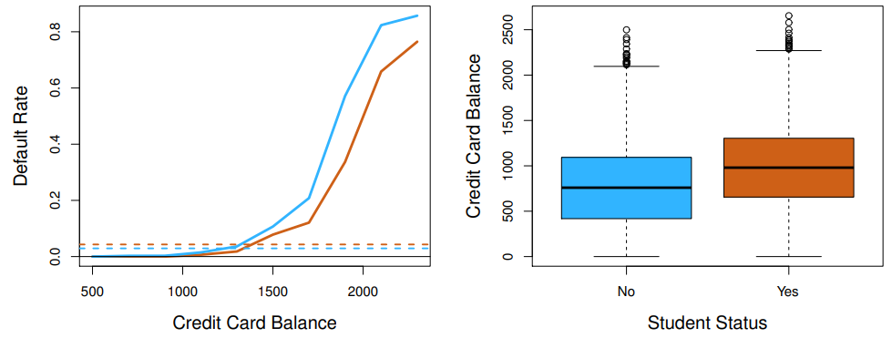

- Students tend to have higher balances than non-students, so their marginal default rate is higher than for non-students.
- But for each level of balance, students default less than non-students.
- Multiple logistic regression can tease this out.

## Example: South African Heart Disease

- 160 cases of MI (myocardial infarction) and 302 controls (all male in age range 15-64), from Western Cape, South Africa in early 80s.
- Overall prevalence very high in this region: 5.1%.
- Measurements on seven predictors (risk factors), shown in scatterplot matrix.
- Goal is to identify relative strengths and directions of risk factors.
- This was part of an intervention study aimed at educating the public on healthier diets.

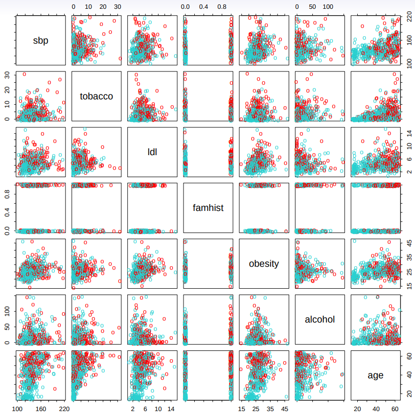

Scatterplot matrix of the South African Heart Disease data. The response is color coded — The cases (MI) are red, the controls turquoise. `famhist` is a binary variable, with 1 indicating family history of MI.

```r
> heartfit <- glm(chd ~ ., data = heart, family = binomial)
> summary(heartfit)
Call:
glm(formula = chd ~ ., family = binomial, data = heart)

Coefficients:
                 Estimate  Std. Error  z value  Pr(>|z|)
(Intercept)     -4.1295997  0.9641558  -4.283   1.84e-05 ***
sbp              0.0057607  0.0056326   1.023   0.30643
tobacco          0.0795256  0.0262150   3.034   0.00242 **
ldl              0.1847793  0.0574115   3.219   0.00129 **
famhistPresent   0.9391855  0.2248691   4.177   2.96e-05 ***
obesity         -0.0345434  0.0291053  -1.187   0.23529
alcohol          0.0006065  0.0044550   0.136   0.89171
age              0.0425412  0.0101749   4.181   2.90e-05 ***
(Dispersion parameter for binomial family taken to be 1)

Null deviance: 596.11 on 461 degrees of freedom
Residual deviance: 483.17 on 454 degrees of freedom
AIC: 499.17
```

## Case-control sampling and logistic regression

In South African data, there are 160 cases, 302 controls — $\tilde{\pi} = 0.35$ are cases. Yet the prevalence of MI in this region is $\pi = 0.05$.

With case-control samples, we can estimate the regression parameters $\beta_j$ accurately (if our model is correct); the constant term $\beta_0$ is incorrect.

We can correct the estimated intercept by a simple transformation: 
$$ \hat{\beta}_0^* = \hat{\beta}_0 + \log \left( \frac{\pi}{1 - \pi} \right) - \log \left( \frac{\tilde{\pi}}{1 - \tilde{\pi}} \right) $$

Often cases are rare and we take them all; up to five times that number of controls is sufficient.

## Diminishing returns in unbalanced binary data

Sampling more controls than cases reduces the variance of the parameter estimates. But after a ratio of about 5 to 1, the variance reduction flattens out.  

## Logistic regression with more than two classes

So far we have discussed logistic regression with two classes. It is easily generalized to more than two classes. One version (used in the R package glmnet) has the symmetric form: 

$$
\Pr(Y = k|X) = \frac{e^{\beta_{0k} + \beta_{1k}X_1 + \ldots + \beta_{pk}X_p}}{\sum_{j=1}^K e^{\beta_{0j} + \beta_{1j}X_1 + \ldots + \beta_{pj}X_p}} 
$$

Here there is a linear function for **each** class. 

(The mathier students will recognize that some cancellation is possible, and only $K - 1$ linear functions are needed as in 2-class logistic regression.) 

Multiclass logistic regression is also referred to as **multinomial regression**.

# Linear Model Selection and Regularization

Despite its simplicity, the linear model has distinct  advantages in terms of its interpretability and often shows  good predictive performance.

Hence, we discuss some ways in which the simple linear model can be improved, by replacing ordinary least squares fitting with some alternative fitting procedures.

## Alternatives to Least Squares

### Why Consider Alternatives to Least Squares?

**Prediction Accuracy**

If $n$ (the number of observations) is not much larger than $p$ (the number of variables or predictor or features), then there can be a lot of variability in the least  squares fit. Sometimes we need to shrink $p$, especially when $p > n$, to control the variance.

**Model Interpretability**

By removing irrelevant features — that is, by setting the corresponding coefficient estimates to zero — we can obtain a model that is more easily interpreted. We will present some approaches for automatically performing feature selection.

### Three Classes of Methods
 
**Subset Selection**

We identify a subset of the $p$ predictors that we believe to be related to the response. We then fit a model using least squares on the reduced set of variables.

There're $2^p$ possible models, so this is computationally infeasible for large $p$.

**Shrinkage**

We fit a model involving all $p$ predictors, but the estimated coefficients are shrunken towards zero relative to the least squares estimates. This shrinkage (also known as **regularization**) has the effect of reducing variance and can also perform variable selection.

**Dimension Reduction**

We project the $p$ predictors into an $M$-dimensional subspace, where $M < p$. This is achieved by computing $M$ different linear combinations, or projections, of the variables. Then these $M$ projections are used as predictors to fit a linear regression model by least squares.

## Shrinkage Methods

### Ridge Regression and Lasso
- The subset selection methods use least squares to fit a linear model that contains a subset of the predictors.
- As an alternative, we can fit a model containing all $p$ predictors using a technique that **constrains** or **regularizes** the coefficient estimates, or equivalently, that **shrinks** the coefficient estimates towards zero.
- It may not be immediately obvious why such a constraint should improve the fit, but it turns out that shrinking the coefficient estimates can significantly reduce their variance.

## Ridge Regression
Recall that the least squares fitting procedure estimates $\beta_0, \beta_1, \ldots, \beta_p$ using the values that minimize

$$
RSS = \sum_{i=1}^n \left( y_i - \beta_0 - \sum_{j=1}^p \beta_j x_{ij} \right)^2.
$$

In contrast, the ridge regression coefficient estimates $\hat{\beta}^R$ are the values that minimize

$$
\sum_{i=1}^n \left( y_i - \beta_0 - \sum_{j=1}^p \beta_j x_{ij} \right)^2 + \lambda \sum_{j=1}^p \beta_j^2 = RSS + \lambda \sum_{j=1}^p \beta_j^2,
$$

where $\lambda \geq 0$ is a tuning parameter, to be determined separately.

- As with least squares, ridge regression seeks coefficient estimates that fit the data well, by making the RSS small.
- However, the second term, $\lambda \sum_{j} \beta_j^2$, called a shrinkage penalty, is small when $\beta_1, \ldots, \beta_p$ are close to zero, and so it has the effect of shrinking the estimates of $\beta_j$ towards zero.
- The **tuning parameter** $\lambda$ serves to control the relative impact of these two terms on the regression coefficient estimates.
  - $\lambda = 0$: The penalty term has no effect. Ridge regression estimates will be identical to least squares estimates.
  - $\lambda \to \infty$: The penalty term dominates the criterion, and the ridge regression coefficient estimates will be shrunk towards zero.
- Selecting a good value for $\lambda$ is critical; cross-validation is used for this.

### Tuning parameter $\lambda$

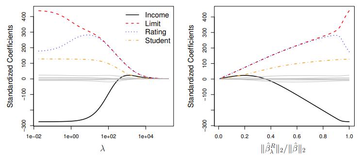

- In the left-hand panel, each curve corresponds to the ridge  regression coefficient estimate for one of the ten variables,  plotted as a function of $\lambda$.
  - The right-hand panel displays the same ridge coefficient estimates as the left-hand panel, but instead of displaying $\lambda$ on the x-axis, we now display $||\hat{\beta}^R_\lambda||_2/||\hat{\beta}^R||_2$, where $\hat{\beta}$  denotes the vector of least squares coefficient estimates.
- The notation $||\hat{\beta}||_2 $denotes the $\ell_2$ norm (pronounced “ell 2”) of a vector, and is defined as $||\hat{\beta}||_2 = \sqrt{\sum_{j=1}^p \beta_j^2}$.

### Standardizing the Variables

It is best to apply ridge regression after standardizing the predictors, using the formula

$$
\tilde{x}_{ij} = \frac{x_{ij}}{\sqrt{\frac{1}{n} \sum_{i=1}^n (x_{ij} - \bar{x}_j)^2}},
$$

so that they are all on the **same scale**. In this formula, the denominator is the estimated standard deviation of the $j$-th predictor. Consequently, all the standardized predictors will have a standard deviation of one. As a result, the final fit will not depend on the scale on which the predictors are measured.

## Why Does Ridge Regression Improve Over Least Squares?

### The Bias-Variance Tradeoff

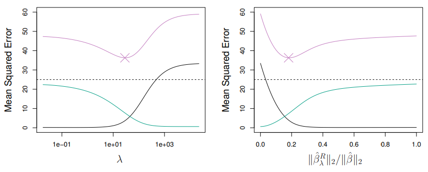

Simulated data with $n = 50$ observations, $p = 45$ predictors, all having nonzero coefficients. Squared bias (black), variance (green), and test mean squared error (purple) for the ridge regression predictions on a simulated data set, as a function of $\lambda$ and $\frac{||\hat{\beta}^R_\lambda||_2}{||\hat{\beta}||_2}$. The horizontal dashed lines indicate the minimum possible MSE. The purple crosses indicate the ridge regression models for which the MSE is smallest.

## The Lasso

- Ridge regression does have one obvious disadvantage: unlike subset selection, which will generally select models that involve just a subset of the variables, ridge regression will include all $p$ predictors in the final model.
- The Lasso is a relatively recent alternative to ridge regression that overcomes this disadvantage. The lasso coefficients, $\hat{\beta}^L_\lambda$, minimize the quantity

$$
\sum_{i=1}^n \left( y_i - \beta_0 - \sum_{j=1}^p \beta_j x_{ij} \right)^2 + \lambda \sum_{j=1}^p |\beta_j| = RSS + \lambda \sum_{j=1}^p |\beta_j|.
$$

- In statistical parlance, the lasso uses an $\ell_1$ (pronounced “ell 1”) penalty instead of an $\ell_2$ penalty. The $\ell_1$ norm of a coefficient vector $\beta$ is given by $||\beta||_1 = \sum |\beta_j|$.

- As with ridge regression, the lasso shrinks the coefficient estimates towards zero.
  - However, in the case of the lasso, the $\ell_1$ penalty has the effect of forcing some of the coefficient estimates to be exactly equal to zero when the tuning parameter $\lambda$ is sufficiently large.
  - Hence, much like best subset selection, the lasso performs **variable selection**.
- We say that the lasso yields **sparse models** — that is, models that involve only a subset of the variables.
- As in ridge regression, selecting a good value of $\lambda$ for the lasso is critical; cross-validation is again the method of choice.

## Comparing the Lasso and Ridge Regression

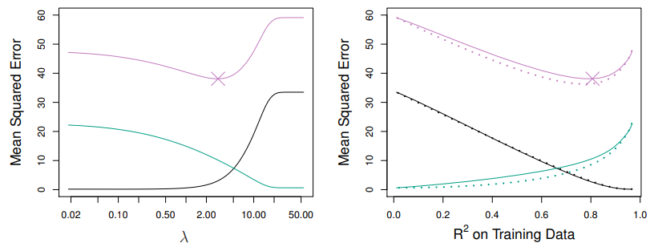

- **Left**: Plots of squared bias (black), variance (green), and test MSE (purple) for the lasso on simulated data set of Slide 32.
- **Right**: Comparison of squared bias, variance and test MSE between lasso (solid) and ridge (dashed). Both are plotted against their $R^2$ on the training data, as a common form of indexing. The crosses in both plots indicate the lasso model for which the MSE is smallest.

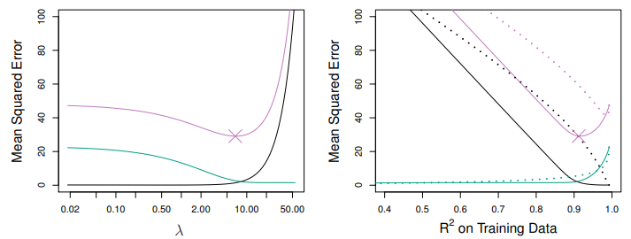

- **Left**: Plots of squared bias (black), variance (green), and test MSE (purple) for the lasso. The simulated data is similar to that in Slide 38, except that now only two predictors are related to the response.
- **Right**: Comparison of squared bias, variance and test MSE between lasso (solid) and ridge (dashed). Both are plotted against their $R^2$ on the training data, as a common form of indexing. The crosses in both plots indicate the lasso model for which the MSE is smallest.

These two examples illustrate that neither ridge regression nor the lasso will universally dominate the other.
- In general, one might expect the **lasso to perform better** when **the response is a function of only a relatively small number of predictors**.
- However, the number of predictors that is related to the response is never known a priori for real data sets.
- A technique such as **cross-validation** can be used in order to **determine which approach is better on a particular data set**.

# The Trade-Of Between Prediction Accuracy and Model Interpretability

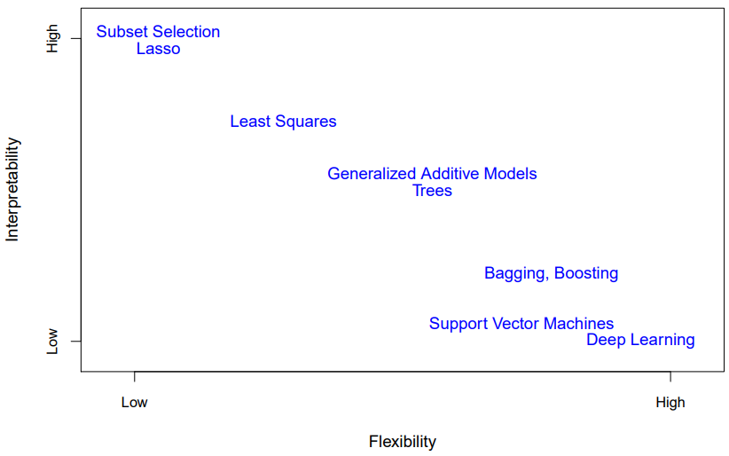

*In general, as the flexibility of a method increases, its interpretability decreases.*

There are several reasons that we might prefer a more restrictive model instead of a very flexible approach. If we are mainly interested in inference, then restrictive models are much more interpretable. For instance, when inference is the goal, the linear model may be a good choice since it will be quite easy to understand the relationship between $Y$ and $X_1, X_2,...,X_p$. In contrast, very flexible approaches, such as the splines and boosting methods, can lead to such complicated estimates of $f$ that it is difficult to understand how any individual predictor is associated with the response.

We have established that when inference is the goal, there are clear advantages to using simple and relatively inflexible statistical learning methods. In some settings, however, we are only interested in prediction, and the interpretability of the predictive model is simply not of interest. For instance, if we seek to develop an algorithm to predict the price of a stock, our sole requirement for the algorithm is that it predict accurately— interpretability is not a concern. In this setting, we might expect that it will be best to use the most flexible model available. Surprisingly, this is not always the case! We will often obtain more accurate predictions using a less flexible method. This phenomenon, which may seem counterintuitive at frst glance, has to do with the potential for overflowing in highly flexible methods. 

# The Bias-Variance Trade-Of

Though the mathematical proof is beyond the scope of this book, it is possible to show that the expected test MSE, for a given value$ x_0$, can always be decomposed into the sum of three fundamental quantities: the variance of$ \hat{f}(x_0)$, the squared bias of$ \hat{f}(x_0)$, and the variance of the error terms$ \epsilon$. That is,

$$
E \left[ (y_0 - \hat{f}(x_0))^2 \right] = \text{Var}(\hat{f}(x_0)) + [\text{Bias}(\hat{f}(x_0))]^2 + \text{Var}(\epsilon). \quad (2.7)
$$

Here the notation $E \left[ (y_0 - \hat{f}(x_0))^2 \right]$ defines the expected test MSE at $x_0$, and refers to the average test MSE that we would obtain if we repeatedly estimated $f$ using a large number of training sets, and tested each at $x_0$. The overall expected test MSE can be computed by averaging $E \left[ (y_0 - \hat{f}(x_0))^2 \right]$ over all possible values of $x_0$ in the test set.

In order to minimize the expected test error, we need to select a statistical learning method that simultaneously achieves low variance and low bias. Note that variance is inherently a nonnegative quantity, and squared bias is also nonnegative. Hence, we see that the expected test MSE can never lie below  $\text{Var}(\epsilon)$, the irreducible error from (2.3).

What do we mean by the variance and bias of a statistical learning method? Variance refers to the amount by which $\hat{f}$ would change if we estimated it using a different training data set. Since the training data are used to fit the statistical learning method, different training data sets will result in a different $\hat{f}$. But ideally, the estimate for $f$ should not vary too much between training sets. However, if a method has high variance, then small changes in the training data can result in large changes in $\hat{f}$. In general, more flexible statistical methods have higher variance. Consider the green and orange curves in Figure 2.9. The flexible green curve is following the observations very closely. It has high variance because changing any one of these data points may cause the estimate $\hat{f}$ to change considerably. In contrast, the orange least squares line is relatively inflexible and has low variance, because moving any single observation will likely cause only a small shift in the position of the line.

On the other hand, bias refers to the error that is introduced by approximating a real-life problem, which may be extremely complicated, by a much simpler model. For example, linear regression assumes that there is a linear relationship between $Y$ and $X_1, X_2, \ldots, X_p$. It is unlikely that any real-life problem truly has such a simple linear relationship, and so performing linear regression will undoubtedly result in some bias in the estimate of $f$. In Figure 2.11, the true $f$ is substantially non-linear, so no matter how many training observations we are given, it will not be possible to produce an accurate estimate using linear regression. In other words, linear regression results in high bias in this example. However, in Figure 2.10 the true $f$ is very close to linear, and so given enough data, it should be possible for linear regression to produce an accurate estimate. Generally, more flexible methods result in less bias.

As a general rule, as we use more flexible methods, the variance will increase and the bias will decrease. The relative rate of change of these two quantities determines whether the test MSE increases or decreases. As we increase the flexibility of a class of methods, the bias tends to initially decrease faster than the variance increases. Consequently, the expected test MSE declines. However, at some point increasing flexibility has little impact on the bias but starts to significantly increase the variance. When this happens the test MSE increases. Note that we observed this pattern of decreasing test MSE followed by increasing test MSE in the right-hand panels of Figures 2.9–2.11.

| Example 1                                                                                                                                                                                                                                                                                                                                                                                        | Example 2                                                                                                                       | Example 3                                                                                                            |
|--------------------------------------------------------------------------------------------------------------------------------------------------------------------------------------------------------------------------------------------------------------------------------------------------------------------------------------------------------------------------------------------------|---------------------------------------------------------------------------------------------------------------------------------|----------------------------------------------------------------------------------------------------------------------|
| 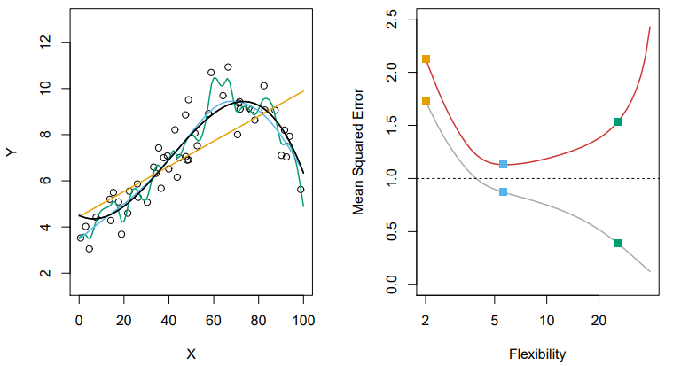                                                                                                                                                                                                                                                                                                                                                                   | 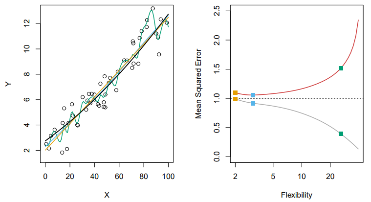                                                                                                  | 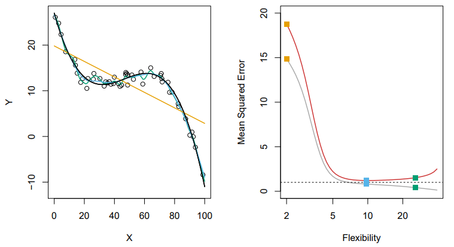                                                                                       |
| Left: Data simulated from f, shown in black. Three estimates of f are shown: the linear regression line (orange curve), and two smoothing spline fts (blue and green curves). Right: Training MSE (grey curve), test MSE (red curve), and minimum possible test MSE over all methods (dashed line). Squares represent the training and test MSEs for the three fts shown in the left-hand panel. | Using a different true f that is much closer to linear. In this setting, linear regression provides a very good ft to the data. | Using a different f that is far from linear. In this setting, linear regression provides a very poor ft to the data. |

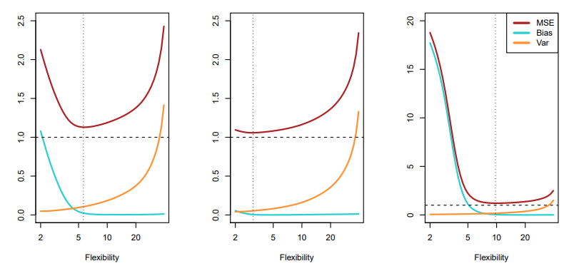

The three plots in  illustrate the examples 1-3. In each case, the blue solid curve represents the squared bias, for different levels of flexibility, while the orange curve corresponds to the variance. The horizontal dashed line represents $\text{Var}(\epsilon)$, the irreducible error. Finally, the red curve, corresponding to the test set MSE, is the sum of these three quantities. In all three cases, the variance increases and the bias decreases as the method’s flexibility increases. However, the flexibility level corresponding to the optimal test MSE differs considerably among the three data sets, because the squared bias and variance change at different rates in each of the data sets. In the left-hand panel of Figure 2.12, the bias initially decreases rapidly, resulting in an initial sharp decrease in the expected test MSE. On the other hand, in the center panel of Figure the true $f$ is close to linear, so there is only a small decrease in bias as flexibility increases, and the test MSE only declines slightly before increasing rapidly as the variance increases. Finally, in the right-hand panel of Figure, as flexibility increases, there is a dramatic decline in bias because the true $f$ is very non-linear. There is also very little increase in variance as flexibility increases. Consequently, the test MSE declines substantially before experiencing a small increase as model flexibility increases.

The relationship between bias, variance, and test set MSE given in Equation and displayed in Figure is referred to as the bias-variance trade-off. Good test set performance of a statistical learning method requires low variance as well as low squared bias. This is referred to as a trade-off because it is easy to obtain a method with extremely low bias but high variance (for instance, by drawing a curve that passes through every single training observation) or a method with very low variance but high bias (by fitting a horizontal line to the data). The challenge lies in finding a method for which both the variance and the squared bias are low. This trade-off is one of the most important recurring themes in this book.

In a real-life situation in which $f$ is unobserved, it is generally not possible to explicitly compute the test MSE, bias, or variance for a statistical learning method. Nevertheless, one should always keep the bias-variance trade-off in mind. In this book, we explore methods that are extremely flexible and hence can essentially eliminate bias. However, this does not guarantee that they will outperform a much simpler method such as linear regression. To take an extreme example, suppose that the true $f$ is linear. In this situation, linear regression will have no bias, making it very hard for a more flexible method to compete. In contrast, if the true $f$ is highly non-linear and we have an ample number of training observations, then we may do better using a highly flexible approach.