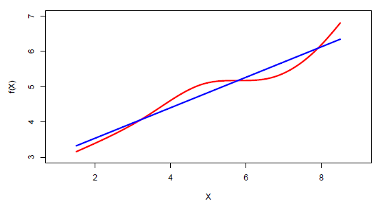
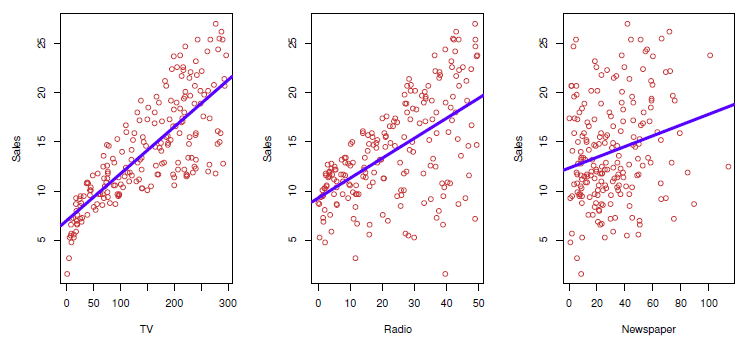
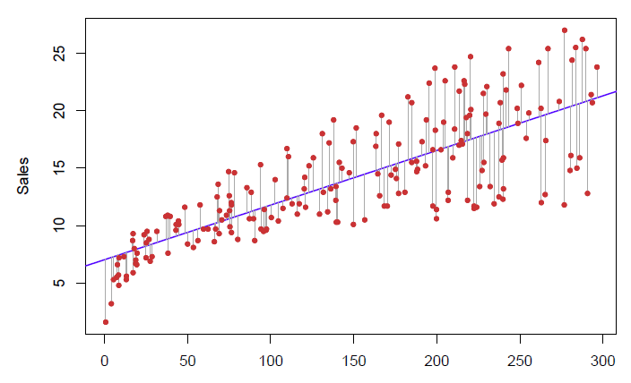

# Linear regression

Linear regression is a simple approach to supervised learning. It assumes that the dependence of Y on $X_1, X_2, ..., X_p$ is linear. 
- True regression functions are never linear!
- although it may seem overly simplistic, linear regression is extremely useful both conceptually and practically.

- 

## Linear regression for the advertising data

Consider the advertising data shown on the next slide.

Questions we might ask:

- Is there a relationship between advertising budget and sales?
- How strong is the relationship between advertising budget and sales?
- Which media contribute to sales?
- How accurately can we predict future sales?
- Is the relationship linear?
- Is there synergy among the advertising media?

## Simple linear regression using a single predictor X.

We assume a model

$$
Y = \beta_0 + \beta_1 X + \epsilon 
$$

where $\beta_0$ and $\beta_1$ are two unknown constants that represent the intercept and slope, also known as coefficients or parameters, and $\epsilon$ is the error term.

Given some estimates $\hat{\beta_0}$ and $\hat{\beta_1}$ for the model coefficients, we predict future sales using

$$
\hat{y} = \hat{\beta_0} + \hat{\beta_1}x, 
$$

where $\hat{y}$ indicates a prediction of Y on the basis of $X = x$. The hat symbol denotes an estimated value.

## Estimation of the parameters by least squares

Let $\hat{y}_i = \hat{\beta}_0 + \hat{\beta}_1 x_i$ be the prediction for $Y$ based on the $i$th value of $X$. Then $e_i = y_i - \hat{y}_i$ represents the $i$th residual.

We define the residuals sum of squares (RSS) as

$$ 
RSS = e_1^2 + e_2^2 + ... + e_n^2, 
$$

or equivalently as

$$ 
RSS = (y_1 - \hat{\beta}_0 - \hat{\beta}_1 x_1)^2 + (y_2 - \hat{\beta}_0 - \hat{\beta}_1 x_2)^2 + ... + (y_n - \hat{\beta}_0 - \hat{\beta}_1 x_n)^2. 
$$

The least squares approach chooses $\hat{\beta}_0$ and $\hat{\beta}_1$ to minimize
the RSS. The minimizing values can be shown to be
$$
\hat{\beta}_1 = \frac{\sum_{i=1}^n (x_i - \bar{x})(y_i - \bar{y})}{\sum_{i=1}^n (x_i - \bar{x})^2},
$$

$$
\hat{\beta}_0 = \bar{y} - \hat{\beta}_1 \bar{x},
$$
where $\bar{y} = \frac{1}{n} \sum_{i=1} y_i$ and $\bar{x} = \frac{1}{n} \sum_{i=1} x_i$ are the sample
means.

## Example: advertising data

For the Advertising data, the least squares fit for the regression of sales onto TV is shown. The fit is found by minimizing the sum of squared errors. Each grey line segment represents an error, and the fit makes a compromise by averaging their squares. In this case, a linear fit captures the essence of the relationship, although it is somewhat deficient in the left of the plot.

## Assessing the Accuracy of the Coefficient Estimates
The standard error of an estimator reflects how it varies under repeated sampling. We have
$$
SE(\hat{\beta}_1)^2 = \frac{\sigma^2}{\sum_{i=1}^n (x_i - \bar{x})^2}, \quad SE(\hat{\beta}_0)^2 = \sigma^2 \left( \frac{1}{n} + \frac{\bar{x}^2}{\sum_{i=1}^n (x_i - \bar{x})^2} \right),
$$
where $\sigma^2 = \text{Var}(\epsilon)$.

These standard errors can be used to compute confidence intervals. A 95% confidence interval is defined as a range of values such that with 95% probability, the range will contain the true unknown value of the parameter. It has the form
$$
\hat{\beta}_1 \pm 2 \cdot SE(\hat{\beta}_1).
$$

Confidence interval $-$ continued
That is, there is approximately a 95% chance that the interval
$$
[\hat{\beta}_1 - 2 \cdot SE(\hat{\beta}_1), \hat{\beta}_1 + 2 \cdot SE(\hat{\beta}_1)]
$$
will contain the true value of $\beta_1$ (under a scenario where we got repeated samples like the present sample).

For the advertising data, the 95% confidence interval for $\beta_1$ is [0.042, 0.053].

## Hypothesis testing
Standard errors can also be used to perform **hypothesis tests** on the coefficients. The most common hypothesis test involves testing the **null hypothesis** of
$$
H_0: \text{There is no relationship between } X \text{ and } Y
$$
versus the **alternative hypothesis**
$$
H_A: \text{There is some relationship between } X \text{ and } Y.
$$

Mathematically, this corresponds to testing
$$
H_0: \beta_1 = 0
$$
versus
$$
H_A: \beta_1 \neq 0,
$$
since if $\beta_1 = 0$ then the model reduces to $Y = \beta_0 + \epsilon$, and $X$ is not associated with $Y$.

To test the null hypothesis, we compute a **t-statistic**, given by
$$
t = \frac{\hat{\beta}_1 - 0}{SE(\hat{\beta}_1)},
$$

This will have a t-distribution with $n - 2$ degrees of freedom, assuming $\beta_1 = 0$.

Using statistical software, it is easy to compute the probability of observing any value equal to $|t|$ or larger. We call this probability the **p-value**.

## Results for the advertising data

|           | Coefficient | Std. Error | t-statistic | p-value  |
|-----------|-------------|------------|-------------|----------|
| Intercept | 7.0325      | 0.4578     | 15.36       | < 0.0001 |
| TV        | 0.0475      | 0.0027     | 17.67       | < 0.0001 |

## Assessing the Overall Accuracy of the Model

We compute the **Residual Standard Error**
$$
RSE = \sqrt{\frac{1}{n - 2} RSS} = \sqrt{\frac{1}{n - 2} \sum_{i=1}^n (y_i - \hat{y}_i)^2},
$$
where the **residual sum-of-squares** is $RSS = \sum_{i=1}^n (y_i - \hat{y}_i)^2$.

**R-squared** or fraction of variance explained is
$$
R^2 = \frac{TSS - RSS}{TSS} = 1 - \frac{RSS}{TSS},
$$
where $TSS = \sum_{i=1}^n (y_i - \bar{y})^2$ is the total sum of squares.

It can be shown that in this simple linear regression setting that $R^2 = r^2$, where $r$ is the correlation between $X$ and $Y$:
$$
r = \frac{\sum_{i=1}^n (x_i - \bar{x})(y_i - \bar{y})}{\sqrt{\sum_{i=1}^n (x_i - \bar{x})^2 \sum_{i=1}^n (y_i - \bar{y})^2}}.
$$

## Advertising data results

| Quantity                | Value  |
|-------------------------|--------|
| Residual Standard Error | 3.26   |
| $R^2$                   | 0.612  |
| F-statistic             | 312.1  |

