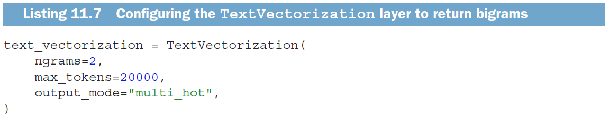
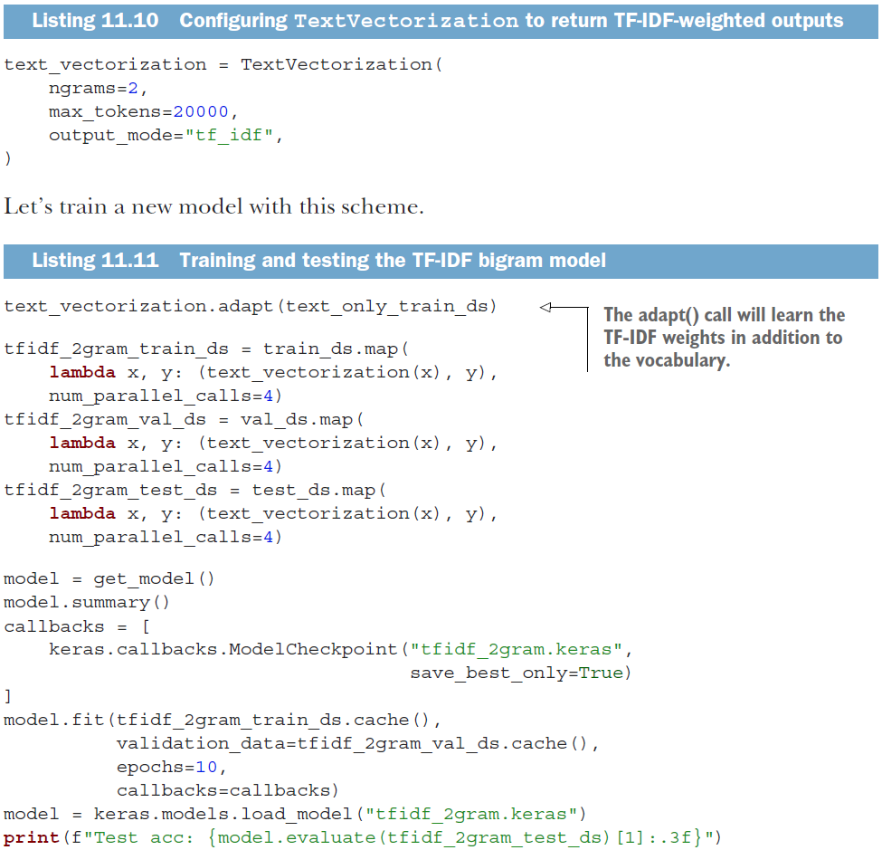
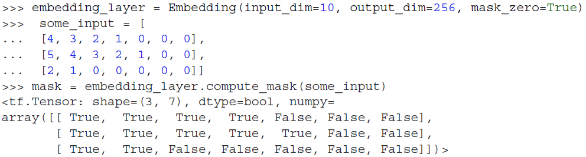
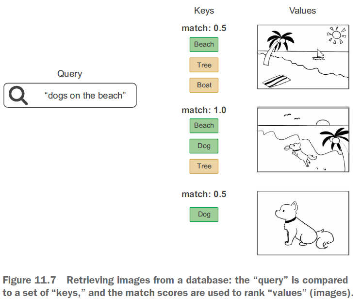
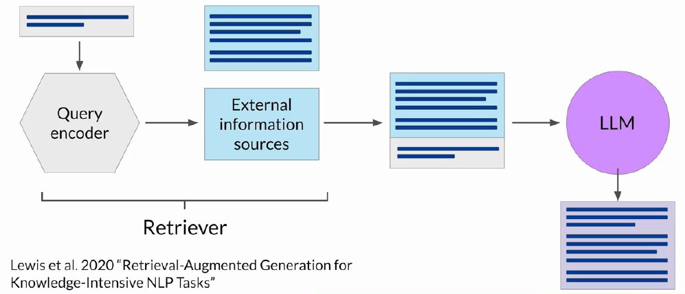

<!-- TOC -->
* [Linear Regression](#linear-regression)
  * [Linear Regression for the Advertising Data](#linear-regression-for-the-advertising-data)
  * [Simple linear regression using a single predictor X.](#simple-linear-regression-using-a-single-predictor-x)
    * [Estimation of the parameters by least squares](#estimation-of-the-parameters-by-least-squares)
    * [Example: advertising data](#example-advertising-data)
    * [Assessing the Accuracy of the Coefficient Estimates](#assessing-the-accuracy-of-the-coefficient-estimates)
    * [Hypothesis testing](#hypothesis-testing)
    * [Results for the advertising data](#results-for-the-advertising-data)
    * [Assessing the Overall Accuracy of the Model](#assessing-the-overall-accuracy-of-the-model)
    * [Advertising data results](#advertising-data-results)
  * [Multiple Linear Regression](#multiple-linear-regression)
    * [Interpreting Regression Coefficients](#interpreting-regression-coefficients)
  * [The Woes of (Interpreting) Regression Coefficients](#the-woes-of-interpreting-regression-coefficients)
  * [Estimation and Prediction for Multiple Regression](#estimation-and-prediction-for-multiple-regression)
  * [Results for Advertising Data](#results-for-advertising-data)
    * [Correlations](#correlations)
  * [Important Questions](#important-questions)
  * [Is at Least One Predictor Useful?](#is-at-least-one-predictor-useful)
  * [Qualitative Predictors with More Than Two Levels](#qualitative-predictors-with-more-than-two-levels)
  * [Results for Ethnicity](#results-for-ethnicity)
  * [Extensions of the Linear Model](#extensions-of-the-linear-model)
    * [Interactions](#interactions)
    * [Modelling Interactions — Advertising Data](#modelling-interactions--advertising-data)
    * [Hierarchy](#hierarchy)
    * [Interactions Between Qualitative and Quantitative Variables](#interactions-between-qualitative-and-quantitative-variables)
    * [Non-linear Effects of Predictors](#non-linear-effects-of-predictors)
* [Classification](#classification)
  * [Qualitative Variables](#qualitative-variables)
  * [Classification Task](#classification-task)
  * [Estimating Probabilities](#estimating-probabilities)
  * [Example: Credit Card Default](#example-credit-card-default)
    * [Default Classification Task](#default-classification-task)
    * [Linear versus Logistic Regression](#linear-versus-logistic-regression)
  * [Logistic Regression](#logistic-regression)
    * [Linear versus Logistic Regression](#linear-versus-logistic-regression-1)
  * [Maximum Likelihood](#maximum-likelihood)
  * [Making Predictions](#making-predictions)
    * [Using Student as the Predictor](#using-student-as-the-predictor)
  * [Logistic Regression with Several Variables](#logistic-regression-with-several-variables)
  * [Confounding](#confounding)
  * [Example: South African Heart Disease](#example-south-african-heart-disease)
  * [Case-control sampling and logistic regression](#case-control-sampling-and-logistic-regression)
  * [Diminishing returns in unbalanced binary data](#diminishing-returns-in-unbalanced-binary-data)
  * [Logistic regression with more than two classes](#logistic-regression-with-more-than-two-classes)
* [Linear Model Selection and Regularization](#linear-model-selection-and-regularization)
  * [Alternatives to Least Squares](#alternatives-to-least-squares)
    * [Why Consider Alternatives to Least Squares?](#why-consider-alternatives-to-least-squares)
    * [Three Classes of Methods](#three-classes-of-methods)
  * [Shrinkage Methods](#shrinkage-methods)
    * [Ridge Regression and Lasso](#ridge-regression-and-lasso)
  * [Ridge Regression](#ridge-regression)
    * [Tuning parameter $\lambda$](#tuning-parameter-lambda)
    * [Standardizing the Variables](#standardizing-the-variables)
  * [Why Does Ridge Regression Improve Over Least Squares?](#why-does-ridge-regression-improve-over-least-squares)
    * [The Bias-Variance Tradeoff](#the-bias-variance-tradeoff)
  * [The Lasso](#the-lasso)
  * [Comparing the Lasso and Ridge Regression](#comparing-the-lasso-and-ridge-regression)
* [Neural Networks](#neural-networks)
  * [Perceptrón](#perceptrón)
    * [Funciones de Activación](#funciones-de-activación)
      * [Step(u)](#stepu)
      * [Sigmoid](#sigmoid)
      * [tanh(u)](#tanhu)
      * [ReLU](#relu)
      * [lineal(u)](#linealu)
  * [Red Neuronal](#red-neuronal)
    * [Ejemplo](#ejemplo)
      * [Calcular XOR](#calcular-xor)
    * [Generalización](#generalización)
  * [Teorema Universal de Aproximación (Universal Approximation Theorem)](#teorema-universal-de-aproximación-universal-approximation-theorem)
  * [Redes Neuronales Profundas](#redes-neuronales-profundas)
    * [Ilustración de una red general profunda](#ilustración-de-una-red-general-profunda)
    * [Batches](#batches)
  * [Función de Salida](#función-de-salida)
  * [Entrenamiento](#entrenamiento)
    * [Función de Error](#función-de-error)
    * [Función de Pérdida](#función-de-pérdida)
    * [Descenso de Gradiente](#descenso-de-gradiente)
  * [Backpropagation](#backpropagation)
    * [Ejemplo 1](#ejemplo-1)
    * [Funciones de Más de Una Variable](#funciones-de-más-de-una-variable)
  * [Layer](#layer)
  * [Tensor](#tensor)
    * [Scalars (rank-0 tensors)](#scalars-rank-0-tensors)
    * [Vectors (rank-1 tensors)](#vectors-rank-1-tensors)
    * [Matrices (rank-2 tensors)](#matrices-rank-2-tensors)
    * [Rank-3 and higher-rank tensors](#rank-3-and-higher-rank-tensors)
    * [Key attributes](#key-attributes)
    * [Notion of Data Batches](#notion-of-data-batches)
  * [Tensor Operations](#tensor-operations)
    * [Element-wise Operations](#element-wise-operations)
    * [Broadcasting](#broadcasting)
    * [Tensor Product](#tensor-product)
  * [Architecture](#architecture)
* [Introduction to deep learning for computer vision](#introduction-to-deep-learning-for-computer-vision)
  * [History](#history)
  * [The goals of a Convolutional Neural Networks (CNN)](#the-goals-of-a-convolutional-neural-networks-cnn)
    * [Common Neural Network Approach](#common-neural-network-approach)
    * [CNN Approach](#cnn-approach)
  * [Convolutional Neural Networks (CNN)](#convolutional-neural-networks-cnn)
    * [Locality](#locality)
    * [Translation invariance](#translation-invariance)
    * [Spatial Hierarchies of Patterns](#spatial-hierarchies-of-patterns)
  * [Basic CNN Architecture](#basic-cnn-architecture)
  * [Convolution](#convolution)
    * [Common 2D Convolution](#common-2d-convolution)
    * [Convolutions on RGB image](#convolutions-on-rgb-image)
  * [Padding](#padding)
  * [Stride](#stride)
  * [Pooling](#pooling)
    * [Max Pooling](#max-pooling)
  * [CNN example: AlexNet](#cnn-example-alexnet)
    * [Input Layer](#input-layer)
    * [Convolutional Layers](#convolutional-layers)
    * [Fully Connected Layers](#fully-connected-layers)
    * [Output Layer](#output-layer)
* [Advanced deep learning for computer vision](#advanced-deep-learning-for-computer-vision)
  * [Computer Vision Tasks](#computer-vision-tasks)
    * [Image Classification](#image-classification)
    * [Image Segmentation](#image-segmentation)
    * [Object Detection](#object-detection)
  * [Modern Convnet Architecture Patterns](#modern-convnet-architecture-patterns)
    * [Modularity, Hierarchy, and Reuse](#modularity-hierarchy-and-reuse)
    * [Residual Connections](#residual-connections)
    * [Batch normalization](#batch-normalization)
* [⏳ Deep learning for timeseries](#-deep-learning-for-timeseries)
  * [Time series properties](#time-series-properties)
  * [A temperature-forecasting example](#a-temperature-forecasting-example)
    * [Parsing the data](#parsing-the-data)
    * [Plotting the temperature timeseries](#plotting-the-temperature-timeseries)
    * [Preparing the data](#preparing-the-data)
  * [Recurrent Neural Networks](#recurrent-neural-networks)
    * [Example](#example)
    * [A simple RNN in Keras `SimpleRNN`](#a-simple-rnn-in-keras-simplernn)
  * [Long Short-Term Memory (LSTM)](#long-short-term-memory-lstm)
  * [Advanced use of recurrent neural networks](#advanced-use-of-recurrent-neural-networks)
    * [Recurrent dropout](#recurrent-dropout)
    * [Stacking recurrent layers](#stacking-recurrent-layers)
    * [Bidirectional RNNs](#bidirectional-rnns)
* [The Trade-Of Between Prediction Accuracy and Model Interpretability](#the-trade-of-between-prediction-accuracy-and-model-interpretability)
* [Deep learning for text](#deep-learning-for-text)
  * [Preparing text data](#preparing-text-data)
    * [Text standardization](#text-standardization)
    * [Tokenization](#tokenization)
    * [Vocabulary Indexing](#vocabulary-indexing)
    * [Using the TextVectorization layer](#using-the-textvectorization-layer)
  * [Two approaches for representing groups of words: Sets and sequences](#two-approaches-for-representing-groups-of-words-sets-and-sequences)
    * [Processing words as a set: The bag-of-words approach](#processing-words-as-a-set-the-bag-of-words-approach)
    * [Processing words as a sequence: The sequence model approach](#processing-words-as-a-sequence-the-sequence-model-approach)
    * [Word embeddings](#word-embeddings)
* [The Transformer architecture](#the-transformer-architecture)
  * [Understanding self-attention](#understanding-self-attention)
    * [Generalized Self-Attention: The Query-Key-Value Mode](#generalized-self-attention-the-query-key-value-mode)
  * [Multi-head attention](#multi-head-attention)
  * [The Transformer encoder](#the-transformer-encoder)
    * [Using Positional Encoding ro Re-Inject Order Information](#using-positional-encoding-ro-re-inject-order-information)
  * [When to use sequence models over bag-of-words models](#when-to-use-sequence-models-over-bag-of-words-models)
  * [Beyond text classification: Sequence-to-sequence learning](#beyond-text-classification-sequence-to-sequence-learning)
    * [Sequence-to-sequence learning with Transformer](#sequence-to-sequence-learning-with-transformer)
* [Large Language Models](#large-language-models)
  * [Prompt engineering](#prompt-engineering)
    * [In-context learning (ICL)](#in-context-learning-icl)
  * [LLM fine-tuning](#llm-fine-tuning)
    * [Process](#process)
  * [LLM main use cases](#llm-main-use-cases)
  * [Using LLM in applications](#using-llm-in-applications)
    * [Retrieval Augmented Generation (RAG)](#retrieval-augmented-generation-rag)
* [Reglas de Asociación](#reglas-de-asociación)
  * [Supervised and Unsupervised Learning](#supervised-and-unsupervised-learning)
  * [Reglas de Asociación, Soporte y Confianza](#reglas-de-asociación-soporte-y-confianza)
    * [Interpretación de las Métricas](#interpretación-de-las-métricas)
  * [Descubrimiento de Reglas de Asociación](#descubrimiento-de-reglas-de-asociación)
    * [Algoritmos](#algoritmos)
    * [Propiedad Apriori](#propiedad-apriori)
    * [Algoritmo Apriori](#algoritmo-apriori)
  * [Derivación de Reglas de Asociación](#derivación-de-reglas-de-asociación)
  * [Software](#software)
  * [Conclusiones](#conclusiones)
* [Recommender System or Recommendation System](#recommender-system-or-recommendation-system)
  * [Content-Based and Collaborative Filtering](#content-based-and-collaborative-filtering)
    * [Content-Based (CB)](#content-based-cb)
    * [Collaborative Filtering (CF)](#collaborative-filtering-cf)
  * [CF Approaches](#cf-approaches)
    * [k-Nearest Neighbors (k-NN)](#k-nearest-neighbors-k-nn)
      * [_USER BASED RATING PREDICTION_](#_user-based-rating-prediction_)
      * [_ITEM BASED RATING PREDICTION_](#_item-based-rating-prediction_)
      * [Pros and Cons](#pros-and-cons)
    * [Matrix Factorization](#matrix-factorization)
    * [Random Walk on Graph](#random-walk-on-graph)
* [The Bias-Variance Trade-Of](#the-bias-variance-trade-of)
<!-- TOC -->

# Linear Regression

Linear regression is a simple approach to supervised learning. It assumes that the dependence of Y
on $X_1, X_2, ..., X_p$ is linear.

- True regression functions are never linear!


- Although it may seem overly simplistic, linear regression is extremely useful both conceptually and practically.

## Linear Regression for the Advertising Data

Consider the advertising data shown.

Questions we might ask:

- Is there a relationship between advertising budget and sales?
- How strong is the relationship between advertising budget and sales?
- Which media contribute to sales?
- How accurately can we predict future sales?
- Is the relationship linear?
- Is there synergy among the advertising media?


## Simple linear regression using a single predictor X.

We assume a model

$$Y = \beta_0 + \beta_1 X + \epsilon$$

where $\beta_0$ and $\beta_1$ are two unknown constants that represent the intercept and slope, also known as
coefficients or parameters, and $\epsilon$ is the error term.

Given some estimates $\hat{\beta_0}$ and $\hat{\beta_1}$ for the model coefficients, we predict future sales using

$$\hat{y} = \hat{\beta_0} + \hat{\beta_1}x,$$

where $\hat{y}$ indicates a prediction of Y on the basis of $X = x$. The hat symbol denotes an estimated value.

### Estimation of the parameters by least squares

Let $\hat{y}_i = \hat{\beta}_0 + \hat{\beta}_1 x_i$ be the prediction for $Y$ based on the $i$ th value of $X$.
Then $e_i = y_i - \hat{y}_i$ represents the $i$ th residual.

We define the residuals sum of squares (RSS) as

$$RSS = e_1^2 + e_2^2 + ... + e_n^2,$$

or equivalently as

$$RSS = (y_1 - \hat{\beta}_0 - \hat{\beta}_1 x_1)^2 + (y_2 - \hat{\beta}_0 - \hat{\beta}_1 x_2)^2 + ... + (y_n - \hat{\beta}_0 - \hat{\beta}_1 x_n)^2.$$

The least squares approach chooses $\hat{\beta}_0$ and $\hat{\beta}_1$ to minimize the RSS. The minimizing values can be
shown to be

$${\hat{\beta}_1 = \frac{\sum_{i=1}^n (x_i - \bar{x})(y_i - \bar{y})}{\sum_{i=1}^n (x_i - \bar{x})^2},}$$

$$\hat{\beta}_0 = \bar{y} - \hat{\beta}_1 \bar{x},$$

where $\bar{y} = \frac{1}{n} \sum_{i=1} y_i$ and $\bar{x} = \frac{1}{n} \sum_{i=1} x_i$ are the sample means.

### Example: advertising data


For the Advertising data, the least squares fit for the regression of sales onto TV is shown. The fit is found by
minimizing the sum of squared errors. Each grey line segment represents an error, and the fit makes a compromise by
averaging their squares. In this case, a linear fit captures the essence of the relationship, although it is somewhat
deficient in the left of the plot.

### Assessing the Accuracy of the Coefficient Estimates

The standard error of an estimator reflects how it varies under repeated sampling. We have

$$SE(\hat{\beta}_1)^2 = \frac{\sigma^2}{\sum_{i=1}^n (x_i - \bar{x})^2}, \quad SE(\hat{\beta}_0)^2 = \sigma^2 \left( \frac{1}{n} + \frac{\bar{x}^2}{\sum_{i=1}^n (x_i - \bar{x})^2} \right),$$

where $\sigma^2 = \text{Var}(\epsilon)$.

These standard errors can be used to compute confidence intervals. A 95% confidence interval is defined as a range of
values such that with 95% probability, the range will contain the true unknown value of the parameter. It has the form

$$\hat{\beta}_1 \pm 2 \cdot SE(\hat{\beta}_1).$$

Confidence interval $-$ continued
That is, there is approximately a 95% chance that the interval

$$[\hat{\beta}_1 - 2 \cdot SE(\hat{\beta}_1), \hat{\beta}_1 + 2 \cdot SE(\hat{\beta}_1)]$$

will contain the true value of $\beta_1$ (under a scenario where we got repeated samples like the present sample).

For the advertising data, the 95% confidence interval for $\beta_1$ is [0.042, 0.053].

### Hypothesis testing

Standard errors can also be used to perform **hypothesis tests** on the coefficients. The most common hypothesis test
involves testing the **null hypothesis** of

$$H_0: \text{There is no relationship between } X \text{ and } Y$$

versus the **alternative hypothesis**

$$H_A: \text{There is some relationship between } X \text{ and } Y.$$

Mathematically, this corresponds to testing

$$H_0: \beta_1 = 0$$

versus

$$H_A: \beta_1 \neq 0,$$

since if $\beta_1 = 0$ then the model reduces to $Y = \beta_0 + \epsilon$, and $X$ is not associated with $Y$.

To test the null hypothesis, we compute a **t-statistic**, given by

$$t = \frac{\hat{\beta}_1 - 0}{SE(\hat{\beta}_1)},$$

This will have a t-distribution with $n - 2$ degrees of freedom, assuming $\beta_1 = 0$.

Using statistical software, it is easy to compute the probability of observing any value equal to $|t|$ or larger. We
call this probability the **p-value**.

### Results for the advertising data

|           | Coefficient | Std. Error | t-statistic | p-value  |
|-----------|-------------|------------|-------------|----------|
| Intercept | 7.0325      | 0.4578     | 15.36       | < 0.0001 |
| TV        | 0.0475      | 0.0027     | 17.67       | < 0.0001 |

### Assessing the Overall Accuracy of the Model

We compute the **Residual Standard Error**

$$RSE = \sqrt{\frac{1}{n - 2} RSS} = \sqrt{\frac{1}{n - 2} \sum_{i=1}^n (y_i - \hat{y}_i)^2},$$

where the **residual sum-of-squares** is $RSS = \sum_{i=1}^n (y_i - \hat{y}_i)^2$ .

**R-squared** or fraction of variance explained is

$$R^2 = \frac{TSS - RSS}{TSS} = 1 - \frac{RSS}{TSS},$$

where $TSS = \sum_{i=1}^n (y_i - \bar{y})^2$ is the total sum of squares.

It can be shown that in this simple linear regression setting that $R^2 = r^2$, where $r$ is the correlation between $X$
and $Y$:

$$r = \frac{\sum_{i=1}^n (x_i - \bar{x})(y_i - \bar{y})}{\sqrt{\sum_{i=1}^n (x_i - \bar{x})^2 \sum_{i=1}^n (y_i - \bar{y})^2}}.$$

### Advertising data results

| Quantity                | Value |
|-------------------------|-------|
| Residual Standard Error | 3.26  |
| $R^2$                   | 0.612 |
| F-statistic             | 312.1 |

## Multiple Linear Regression

Here our model is

$$Y = \beta_0 + \beta_1X_1 + \beta_2X_2 + \cdots + \beta_pX_p + \epsilon,$$

We interpret $\beta_j$ as the average effect on $Y$ of a one unit increase in $X_j$, holding all other predictors fixed.
In the advertising example, the model becomes

$$\text{sales} = \beta_0 + \beta_1 \times \text{TV} + \beta_2 \times \text{radio} + \beta_3 \times \text{newspaper} + \epsilon.$$

### Interpreting Regression Coefficients

The ideal scenario is when the predictors are uncorrelated — a **balanced design**:

- Each coefficient can be estimated and tested separately.
- Interpretations such as “a unit change in $X_j$ is associated with a $\beta_j$ change in $Y$, while all the other
  variables stay fixed”, are possible.

Correlations amongst predictors cause problems:

- The variance of all coefficients tends to increase, sometimes dramatically.
- Interpretations become hazardous — when $X_j$ changes, everything else changes.

**Claims of causality** should be avoided for observational data.

## The Woes of (Interpreting) Regression Coefficients

“Data Analysis and Regression” Mosteller and Tukey 1977:

- A regression coefficient $\beta_j$ estimates the expected change in $Y$ per unit change in $X_j$, with all other
  predictors held fixed. But predictors usually change together!

_Example:_

- $Y$: total amount of change in your pocket;
- $X_1$: number of coins;
- $X_2$: number of pennies, nickels, and dimes. By itself, the regression coefficient of $Y$ on $X_2$ will be > 0. But
  how about with $X_1$ in the model?

_Example:_

- $Y$: number of tackles by a football player in a season;
- $W$ and $H$: his weight and height.
- Fitted regression model is $\hat{Y} = \hat{\beta}_0 + 0.50W - 0.10H$. How do we interpret $\hat{\beta}_2 < 0$?

## Estimation and Prediction for Multiple Regression

Given estimates $\hat{\beta}_0, \hat{\beta}_1, \ldots, \hat{\beta}_p$, we can make predictions using the formula

$$\hat{y} = \hat{\beta}_0 + \hat{\beta}_1x_1 + \hat{\beta}_2x_2 + \cdots + \hat{\beta}_px_p$$ .

We estimate $\beta_0, \beta_1, \ldots, \beta_p$ as the values that minimize the sum of squared residuals

$$RSS = \sum_{i=1}^n (y_i - \hat{y}_i)^2 = \sum_{i=1}^n (y_i - \hat{\beta}_0 - \hat{\beta}_1x_{i1} - \hat{\beta}_2x_{i2} - \cdots - \hat{\beta}_px_{ip})^2$$ .

This is done using standard statistical software. The values $\hat{\beta}_0, \hat{\beta}_1, \ldots, \hat{\beta}_p$ that
minimize $RSS$ are the multiple least squares regression coefficient estimates.


## Results for Advertising Data

|           | Coefficient | Std. Error | t-statistic | p-value  |
|-----------|-------------|------------|-------------|----------|
| Intercept | 2.939       | 0.3119     | 9.42        | < 0.0001 |
| TV        | 0.046       | 0.0014     | 32.81       | < 0.0001 |
| radio     | 0.189       | 0.0086     | 21.89       | < 0.0001 |
| newspaper | -0.001      | 0.0059     | -0.18       | 0.8599   |

### Correlations

|           | TV     | radio  | newspaper | sales  |
|-----------|--------|--------|-----------|--------|
| TV        | 1.0000 | 0.0548 | 0.0567    | 0.7822 |
| radio     |        | 1.0000 | 0.3541    | 0.5762 |
| newspaper |        |        | 1.0000    | 0.2283 |
| sales     |        |        |           | 1.0000 |

## Important Questions

1. Is at least one of the predictors $X_1, X_2, \ldots, X_p$ useful in predicting the response?
2. Do all the predictors help to explain $Y$, or is only a subset of the predictors useful?
3. How well does the model fit the data?
4. Given a set of predictor values, what response value should we predict, and how accurate is our prediction?

## Is at Least One Predictor Useful?

For the first question, we can use the **F-statistic**

$$F = \frac{(TSS - RSS)/p}{RSS/(n - p - 1)} \sim F_{p, n-p-1}$$

| Quantity                | Value |
|-------------------------|-------|
| Residual Standard Error | 1.69  |
| $R^2$                   | 0.897 |
| F-statistic             | 570   |

## Qualitative Predictors with More Than Two Levels

With more than two levels, we create additional dummy variables. For example, for the ethnicity variable we create two
dummy variables. The first could be

$$x_{i1} = \begin{cases} 1 & \text{if } i\text{th person is Asian} \\ 0 & \text{if } i\text{th person is not Asian} \end{cases}$$

and the second could be

$$x_{i2} = \begin{cases} 1 & \text{if } i\text{th person is Caucasian} \\ 0 & \text{if } i\text{th person is not Caucasian} \end{cases}$$

Then both of these variables can be used in the regression equation, in order to obtain the model

$$y_i = \beta_0 + \beta_1x_{i1} + \beta_2x_{i2} + \epsilon_i = \begin{cases} \beta_0 + \beta_1 + \epsilon_i & \text{if } i\text{th person is Asian} \\ \beta_0 + \beta_2 + \epsilon_i & \text{if } i\text{th person is Caucasian} \\ \beta_0 + \epsilon_i & \text{if } i\text{th person is AA} \end{cases}$$

There will always be one fewer dummy variable than the number of levels. The level with no dummy variable — African
American in this example — is known as the baseline.

## Results for Ethnicity

|                      | Coefficient | Std. Error | t-statistic | p-value  |
|----------------------|-------------|------------|-------------|----------|
| Intercept            | 531.00      | 46.32      | 11.464      | < 0.0001 |
| ethnicity[Asian]     | -18.69      | 65.02      | -0.287      | 0.7740   |
| ethnicity[Caucasian] | -12.50      | 56.68      | -0.221      | 0.8260   |

## Extensions of the Linear Model

Removing the additive assumption: interactions and nonlinearity

### Interactions

In our previous analysis of the Advertising data, we assumed that the effect on sales of increasing one advertising
medium is independent of the amount spent on the other media.

For example, the linear model

$$\text{sales} = \beta_0 + \beta_1 \times \text{TV} + \beta_2 \times \text{radio} + \beta_3 \times \text{newspaper}$$

states that the average effect on sales of a one-unit increase in TV is always $\beta_1$, regardless of the amount spent
on radio.

Suppose that spending money on radio advertising actually increases the effectiveness of TV advertising, so that the
slope term for TV should increase as radio increases.

In this situation, given a fixed budget of \$100,000, spending half on radio and half on TV may increase sales more than
allocating the entire amount to either TV or to radio.

In marketing, this is known as a **synergy** effect, and in statistics, it is referred to as an **interaction** effect.


### Modelling Interactions — Advertising Data

Model takes the form

$$\text{sales} = \beta_0 + \beta_1 \times \text{TV} + \beta_2 \times \text{radio} + \beta_3 \times (\text{radio} \times \text{TV}) + \epsilon = \beta_0 + (\beta_1 + \beta_3 \times \text{radio}) \times \text{TV} + \beta_2 \times \text{radio} + \epsilon.$$

Results:

|           | Coefficient | Std. Error | t-statistic | p-value  |
|-----------|-------------|------------|-------------|----------|
| Intercept | 6.7502      | 0.248      | 27.23       | < 0.0001 |
| TV        | 0.0191      | 0.002      | 12.70       | < 0.0001 |
| radio     | 0.0289      | 0.009      | 3.24        | 0.0014   |
| TV×radio  | 0.0011      | 0.000      | 20.73       | < 0.0001 |

The results in this table suggest that interactions are important. The p-value for the interaction term TV×radio is
extremely low, indicating that there is strong evidence for $H_A : \beta_3 \neq 0$.

The $R^2$ for the interaction model is 96.8%, compared to only 89.7% for the model that predicts sales using TV and
radio without an interaction term.

This means that $(96.8 - 89.7)/(100 - 89.7) = 69\%$ of the variability in sales that remains after fitting the additive
model has been explained by the interaction term.

The coefficient estimates in the table suggest that an increase in TV advertising of \$1,000 is associated with
increased sales of

$$(\hat{\beta}_1 + \hat{\beta}_3 \times \text{radio}) \times 1000 = 19 + 1.1 \times \text{radio} \text{ units}.$$

An increase in radio advertising of \$1,000 will be associated with an increase in sales of

$$(\hat{\beta}_2 + \hat{\beta}_3 \times \text{TV}) \times 1000 = 29 + 1.1 \times \text{TV} \text{ units}.$$

### Hierarchy

Sometimes it is the case that an interaction term has a very small p-value, but the associated main effects (in this
case, TV and radio) do not.

The **hierarchy principle**:
If we include an interaction in a model, we should also include the main effects, even if the p-values associated with
their coefficients are not significant.

The rationale for this principle is that interactions are hard to interpret in a model without main effects — their
meaning is changed. Specifically, the interaction terms also contain main effects, if the model has no main effect
terms.

### Interactions Between Qualitative and Quantitative Variables

Consider the Credit data set, and suppose that we wish to predict balance using income (quantitative) and student (
qualitative).

**Without an interaction term**, the model takes the form

$$\text{balance}_i \approx \beta_0 + \beta_1 \times \text{income}_i + \begin{cases} \beta_2 & \text{if } i\text{th person is a student} \\ 0 & \text{if } i\text{th person is not a student} \end{cases} = \beta_1 \times \text{income}_i + \begin{cases} \beta_0 + \beta_2 & \text{if } i\text{th person is a student} \\ \beta_0 & \text{if } i\text{th person is not a student} \end{cases}$$

**With interactions**, it takes the form

$$\text{balance}_i \approx \beta_0 + \beta_1 \times \text{income}_i + \begin{cases} \beta_2 + \beta_3 \times \text{income}_i & \text{if student} \\ 0 & \text{if not student} \end{cases}= \begin{cases}(\beta_0 + \beta_2) + (\beta_1 + \beta_3) \times \text{income}_i & \text{if student} \\ \beta_0 + \beta_1 \times \text{income}_i & \text{if not student} \end{cases}$$


### Non-linear Effects of Predictors

Polynomial regression on Auto data:


The figure suggests that

$$\text{mpg} = \beta_0 + \beta_1 \times \text{horsepower} + \beta_2 \times \text{horsepower}^2 + \epsilon$$

may provide a better fit.

|              | Coefficient | Std. Error | t-statistic | p-value  |
|--------------|-------------|------------|-------------|----------|
| Intercept    | 56.9001     | 1.8004     | 31.6        | < 0.0001 |
| horsepower   | -0.4662     | 0.0311     | -15.0       | < 0.0001 |
| horsepower^2 | 0.0012      | 0.0001     | 10.1        | < 0.0001 |

# Classification

## Qualitative Variables

Qualitative variables take values in an unordered set $C$, such as:

- $\text{eye color} \in \{ \text{brown}, \text{blue}, \text{green} \}$
- $\text{email} \in \{ \text{spam}, \text{ham} \}$

## Classification Task

Given a feature vector $X$ and a qualitative response $Y$ taking values in the set $C$, the classification task is to
build a function $C(X)$ that takes as input the feature vector $X$ and predicts its value for $Y$; i.e. $C(X) \in C$.

## Estimating Probabilities

Often we are more interested in estimating the probabilities that $X$ belongs to each category in $C$. For example, it
is more valuable to have an estimate of the probability that an insurance claim is fraudulent, than a classification of
fraudulent or not.

## Example: Credit Card Default


### Default Classification Task

Suppose for the Default classification task that we code:

$$Y = \begin{cases} 0 & \text{if No} \\ 1 & \text{if Yes} \end{cases}$$

Can we simply perform a linear regression of $Y$ on $X$ and classify as Yes if $\hat{Y} > 0.5$?

- In this case of a binary outcome, linear regression does a good job as a classifier and is equivalent to linear
  discriminant analysis, which we discuss later.
- Since in the population $E(Y | X = x) = \Pr(Y = 1 | X = x)$, we might think that regression is perfect for this task.
- However, linear regression might produce probabilities less than zero or greater than one. Logistic regression is more
  appropriate.

### Linear versus Logistic Regression


The orange marks indicate the response $Y$, either 0 or 1. Linear regression does not estimate $\Pr(Y = 1 | X)$ well.
Logistic regression seems well suited to the task.

Now suppose we have a response variable with three possible values. A patient presents at the emergency room, and we
must classify them according to their symptoms.

$$Y = \begin{cases} 1 & \text{if stroke} \\ 2 & \text{if drug overdose} \\ 3 & \text{if epileptic seizure} \end{cases}$$

This coding suggests an ordering and in fact implies that the difference between stroke and drug overdose is the same as
between drug overdose and epileptic seizure.

Linear regression is not appropriate here. Multiclass Logistic Regression or Discriminant Analysis are more appropriate.

## Logistic Regression

Let's write $p(X) = \Pr(Y = 1|X)$ for short and consider using balance to predict default. Logistic regression uses the
form:

$$p(X) = \frac{e^{\beta_0 + \beta_1 X}}{1 + e^{\beta_0 + \beta_1 X}}$$

where $e \approx 2.71828$ is a mathematical constant (Euler's number). It is easy to see that no matter what
values $\beta_0$, $\beta_1$, or $X$ take, $p(X)$ will have values between 0 and 1.

A bit of rearrangement gives:

$$\log \left( \frac{p(X)}{1 - p(X)} \right) = \beta_0 + \beta_1 X$$

This monotone transformation is called the **log odds** or **logit** transformation of $p(X)$ (by log we mean natural
log: ln).

### Linear versus Logistic Regression


Logistic regression ensures that our estimate for $p(X)$ lies between 0 and 1.

## Maximum Likelihood

We use maximum likelihood to estimate the parameters.

$$L(\beta_0, \beta_1) = \prod_{i:y_i=1} p(x_i) \prod_{i:y_i=0} (1 - p(x_i))$$

This **likelihood** gives the probability of the observed zeros and ones in the data. We pick $\beta_0$ and $\beta_1$ to
maximize the likelihood of the observed data.

Most statistical packages can fit linear logistic regression models by maximum likelihood. In R, we use the `glm`
function.

|           | Coefficient | Std. Error | Z-statistic | P-value  |
|-----------|-------------|------------|-------------|----------|
| Intercept | -10.6513    | 0.3612     | -29.5       | < 0.0001 |
| balance   | 0.0055      | 0.0002     | 24.9        | < 0.0001 |

## Making Predictions

What is our estimated probability of default for someone with a balance of \$1000?

$$\hat{p}(X) = \frac{e^{\hat{\beta}_0 + \hat{\beta}_1 X}}{1 + e^{\hat{\beta}_0 + \hat{\beta}_1 X}} = \frac{e^{-10.6513 + 0.0055 \times 1000}}{1 + e^{-10.6513 + 0.0055 \times 1000}} = 0.006$$

With a balance of \$2000?

$$\hat{p}(X) = \frac{e^{\hat{\beta}_0 + \hat{\beta}_1 X}}{1 + e^{\hat{\beta}_0 + \hat{\beta}_1 X}} = \frac{e^{-10.6513 + 0.0055 \times 2000}}{1 + e^{-10.6513 + 0.0055 \times 2000}} = 0.586$$

### Using Student as the Predictor

|              | Coefficient | Std. Error | Z-statistic | P-value  |
|--------------|-------------|------------|-------------|----------|
| Intercept    | -3.5041     | 0.0707     | -49.55      | < 0.0001 |
| student[Yes] | 0.4049      | 0.1150     | 3.52        | 0.0004   |

$$\widehat{Pr}(\text{default=Yes}|\text{student=Yes}) = \frac{e^{-3.5041 + 0.4049 \times 1}}{1 + e^{-3.5041 + 0.4049 \times 1}} = 0.0431$$

$$\widehat{Pr}(\text{default=Yes}|\text{student=No}) = \frac{e^{-3.5041 + 0.4049 \times 0}}{1 + e^{-3.5041 + 0.4049 \times 0}} = 0.0292$$

## Logistic Regression with Several Variables

$$\log \left( \frac{p(X)}{1 - p(X)} \right) = \beta_0 + \beta_1 X_1 + \cdots + \beta_p X_p$$

$$p(X) = \frac{e^{\beta_0 + \beta_1 X_1 + \cdots + \beta_p X_p}}{1 + e^{\beta_0 + \beta_1 X_1 + \cdots + \beta_p X_p}}$$

|              | Coefficient | Std. Error | Z-statistic | P-value  |
|--------------|-------------|------------|-------------|----------|
| Intercept    | -10.8690    | 0.4923     | -22.08      | < 0.0001 |
| balance      | 0.0057      | 0.0002     | 24.74       | < 0.0001 |
| income       | 0.0030      | 0.0082     | 0.37        | 0.7115   |
| student[Yes] | -0.6468     | 0.2362     | -2.74       | 0.0062   |

Why is the coefficient for student negative, while it was positive before?

## Confounding


- Students tend to have higher balances than non-students, so their marginal default rate is higher than for
  non-students.
- But for each level of balance, students default less than non-students.
- Multiple logistic regression can tease this out.

## Example: South African Heart Disease

- 160 cases of MI (myocardial infarction) and 302 controls (all male in age range 15-64), from Western Cape, South
  Africa in early 80s.
- Overall prevalence very high in this region: 5.1%.
- Measurements on seven predictors (risk factors), shown in scatterplot matrix.
- Goal is to identify relative strengths and directions of risk factors.
- This was part of an intervention study aimed at educating the public on healthier diets.


Scatterplot matrix of the South African Heart Disease data. The response is color coded — The cases (MI) are red, the
controls turquoise. `famhist` is a binary variable, with 1 indicating family history of MI.

```r
> heartfit <- glm(chd ~ ., data = heart, family = binomial)
> summary(heartfit)
Call:
glm(formula = chd ~ ., family = binomial, data = heart)

Coefficients:
				 Estimate  Std. Error  z value  Pr(>|z|)
(Intercept)     -4.1295997  0.9641558  -4.283   1.84e-05 ***
sbp              0.0057607  0.0056326   1.023   0.30643
tobacco          0.0795256  0.0262150   3.034   0.00242 **
ldl              0.1847793  0.0574115   3.219   0.00129 **
famhistPresent   0.9391855  0.2248691   4.177   2.96e-05 ***
obesity         -0.0345434  0.0291053  -1.187   0.23529
alcohol          0.0006065  0.0044550   0.136   0.89171
age              0.0425412  0.0101749   4.181   2.90e-05 ***
(Dispersion parameter for binomial family taken to be 1)

Null deviance: 596.11 on 461 degrees of freedom
Residual deviance: 483.17 on 454 degrees of freedom
AIC: 499.17
```

## Case-control sampling and logistic regression

In South African data, there are 160 cases, 302 controls — $\tilde{\pi} = 0.35$ are cases. Yet the prevalence of MI in
this region is $\pi = 0.05$.

With case-control samples, we can estimate the regression parameters $\beta_j$ accurately (if our model is correct); the
constant term $\beta_0$ is incorrect.

We can correct the estimated intercept by a simple transformation:

$$ \hat{\beta}_0^* = \hat{\beta}_0 + \log \left( \frac{\pi}{1 - \pi} \right) - \log \left( \frac{\tilde{\pi}}{1 - \tilde{\pi}} \right) $$

Often cases are rare and we take them all; up to five times that number of controls is sufficient.

## Diminishing returns in unbalanced binary data

Sampling more controls than cases reduces the variance of the parameter estimates. But after a ratio of about 5 to 1,
the variance reduction flattens out.

## Logistic regression with more than two classes

So far we have discussed logistic regression with two classes. It is easily generalized to more than two classes. One
version (used in the R package glmnet) has the symmetric form:

$$\Pr(Y = k|X) = \frac{e^{\beta_{0k} + \beta_{1k}X_1 + \ldots + \beta_{pk}X_p}}{\sum_{j=1}^K e^{\beta_{0j} + \beta_{1j}X_1 + \ldots + \beta_{pj}X_p}}$$

Here there is a linear function for **each** class.

(The mathier students will recognize that some cancellation is possible, and only $K - 1$ linear functions are needed as
in 2-class logistic regression.)

Multiclass logistic regression is also referred to as **multinomial regression**.

# Linear Model Selection and Regularization

Despite its simplicity, the linear model has distinct advantages in terms of its interpretability and often shows good
predictive performance.

Hence, we discuss some ways in which the simple linear model can be improved, by replacing ordinary least squares
fitting with some alternative fitting procedures.

## Alternatives to Least Squares

### Why Consider Alternatives to Least Squares?

**Prediction Accuracy**

If $n$ (the number of observations) is not much larger than $p$ (the number of variables or predictor or features), then
there can be a lot of variability in the least squares fit. Sometimes we need to shrink $p$, especially when $p > n$, to
control the variance.

**Model Interpretability**

By removing irrelevant features — that is, by setting the corresponding coefficient estimates to zero — we can obtain a
model that is more easily interpreted. We will present some approaches for automatically performing feature selection.

### Three Classes of Methods

**Subset Selection**

We identify a subset of the $p$ predictors that we believe to be related to the response. We then fit a model using
least squares on the reduced set of variables.

There are $2^p$ possible models, so this is computationally infeasible for large $p$.

**Shrinkage**

We fit a model involving all $p$ predictors, but the estimated coefficients are shrunken towards zero relative to the
least squares estimates. This shrinkage (also known as **regularization**) has the effect of reducing variance and can
also perform variable selection.

**Dimension Reduction**

We project the $p$ predictors into an $M$-dimensional subspace, where $M < p$. This is achieved by computing $M$
different linear combinations, or projections, of the variables. Then these $M$ projections are used as predictors to
fit a linear regression model by least squares.

## Shrinkage Methods

### Ridge Regression and Lasso

- The subset selection methods use least squares to fit a linear model that contains a subset of the predictors.
- As an alternative, we can fit a model containing all $p$ predictors using a technique that **constrains** or *
  *regularizes** the coefficient estimates, or equivalently, that **shrinks** the coefficient estimates towards zero.
- It may not be immediately obvious why such a constraint should improve the fit, but it turns out that shrinking the
  coefficient estimates can significantly reduce their variance.

## Ridge Regression

Recall that the least squares fitting procedure estimates $\beta_0, \beta_1, \ldots, \beta_p$ using the values that
minimize

$$RSS = \sum_{i=1}^n \left( y_i - \beta_0 - \sum_{j=1}^p \beta_j x_{ij} \right)^2.$$

In contrast, the ridge regression coefficient estimates $\hat{\beta}^R$ are the values that minimize

$$\sum_{i=1}^n \left( y_i - \beta_0 - \sum_{j=1}^p \beta_j x_{ij} \right)^2 + \lambda \sum_{j=1}^p \beta_j^2 = RSS + \lambda \sum_{j=1}^p \beta_j^2,$$

where $\lambda \geq 0$ is a tuning parameter, to be determined separately.

- As with least squares, ridge regression seeks coefficient estimates that fit the data well, by making the RSS small.
- However, the second term, $\lambda \sum_{j} \beta_j^2$, called a shrinkage penalty, is small
  when $\beta_1, \ldots, \beta_p$ are close to zero, and so it has the effect of shrinking the estimates of $\beta_j$
  towards zero.
- The **tuning parameter** $\lambda$ serves to control the relative impact of these two terms on the regression
  coefficient estimates.
	- $\lambda = 0$: The penalty term has no effect. Ridge regression estimates will be identical to least squares
	  estimates.
	- $\lambda \to \infty$: The penalty term dominates the criterion, and the ridge regression coefficient estimates
	  will be shrunk towards zero.
- Selecting a good value for $\lambda$ is critical; cross-validation is used for this.

### Tuning parameter $\lambda$


- In the left-hand panel, each curve corresponds to the ridge regression coefficient estimate for one of the ten
  variables, plotted as a function of $\lambda$.
	- The right-hand panel displays the same ridge coefficient estimates as the left-hand panel, but instead of
	  displaying $\lambda$ on the x-axis, we now display $||\hat{\beta}^R_\lambda||_2/||\hat{\beta}^R||_2$,
	  where $\hat{\beta}$  denotes the vector of least squares coefficient estimates.
- The notation $||\hat{\beta}||_2$ denotes the $\ell_2$ norm (pronounced “ell 2”) of a vector, and is defined
  as $||\hat{\beta}||_2 = \sqrt{\sum_{j=1}^p \beta_j^2}$ .

### Standardizing the Variables

It is best to apply ridge regression after standardizing the predictors, using the formula

$$\tilde{x}_{ij} = \frac{x_{ij}}{\sqrt{\frac{1}{n} \sum_{i=1}^n (x_{ij} - \bar{x}_j)^2}},$$

so that they are all on the **same scale**. In this formula, the denominator is the estimated standard deviation of
the $j$-th predictor. Consequently, all the standardized predictors will have a standard deviation of one. As a result,
the final fit will not depend on the scale on which the predictors are measured.

## Why Does Ridge Regression Improve Over Least Squares?

### The Bias-Variance Tradeoff


Simulated data with $n = 50$ observations, $p = 45$ predictors, all having nonzero coefficients. Squared bias (black),
variance (green), and test mean squared error (purple) for the ridge regression predictions on a simulated data set, as
a function of $\lambda$ and $\frac{||\hat{\beta}^R_\lambda||_2}{||\hat{\beta}||_2}$. The horizontal dashed lines
indicate the minimum possible MSE. The purple crosses indicate the ridge regression models for which the MSE is
smallest.

## The Lasso

- Ridge regression does have one obvious disadvantage: unlike subset selection, which will generally select models that
  involve just a subset of the variables, ridge regression will include all $p$ predictors in the final model.
- The Lasso is a relatively recent alternative to ridge regression that overcomes this disadvantage. The lasso
  coefficients, $\hat{\beta}^L_\lambda$, minimize the quantity

$$\sum_{i=1}^n \left( y_i - \beta_0 - \sum_{j=1}^p \beta_j x_{ij} \right)^2 + \lambda \sum_{j=1}^p |\beta_j| = RSS + \lambda \sum_{j=1}^p |\beta_j|.$$

- In statistical parlance, the lasso uses an $\ell_1$ (pronounced “ell 1”) penalty instead of an $\ell_2$ penalty.
  The $\ell_1$ norm of a coefficient vector $\beta$ is given by $||\beta||_1 = \sum |\beta_j|$.

- As with ridge regression, the lasso shrinks the coefficient estimates towards zero.
	- However, in the case of the lasso, the $\ell_1$ penalty has the effect of forcing some of the coefficient
	  estimates to be exactly equal to zero when the tuning parameter $\lambda$ is sufficiently large.
	- Hence, much like best subset selection, the lasso performs **variable selection**.
- We say that the lasso yields **sparse models** — that is, models that involve only a subset of the variables.
- As in ridge regression, selecting a good value of $\lambda$ for the lasso is critical; cross-validation is again the
  method of choice.

## Comparing the Lasso and Ridge Regression


- **Left**: Plots of squared bias (black), variance (green), and test MSE (purple) for the lasso on simulated data set
  of Slide 32.
- **Right**: Comparison of squared bias, variance and test MSE between lasso (solid) and ridge (dashed). Both are
  plotted against their $R^2$ on the training data, as a common form of indexing. The crosses in both plots indicate the
  lasso model for which the MSE is smallest.


- **Left**: Plots of squared bias (black), variance (green), and test MSE (purple) for the lasso. The simulated data is
  similar to that in Slide 38, except that now only two predictors are related to the response.
- **Right**: Comparison of squared bias, variance and test MSE between lasso (solid) and ridge (dashed). Both are
  plotted against their $R^2$ on the training data, as a common form of indexing. The crosses in both plots indicate the
  lasso model for which the MSE is smallest.

These two examples illustrate that neither ridge regression nor the lasso will universally dominate the other.

- In general, one might expect the **lasso to perform better** when **the response is a function of only a relatively
  small number of predictors**.
- However, the number of predictors that is related to the response is never known a priori for real data sets.
- A technique such as **cross-validation** can be used in order to **determine which approach is better on a particular
  data set**.

# Neural Networks

## Perceptrón

La unidad de computación más básica basada en la neurona.


El perceptrón recibe

- entradas $X_{1}, \dots, X_{k}$ ,
	- cada entrada va a tener parámetros **pesos** $W_{1},\dots, W_{k}$ respectivamente;
- parámetro **sesgo/bias** $b$;
- y va a tener una salida $y$.

Los parámetros pesos y bias se aprenden en el algoritmo.

Suponiendo que:

- $X_{1}, \dots, X_{k}$ son binarios (como 0 y 1)
- $W_{1},\dots, W_{k}$ son reales

Se define una variable $u$ que representa cuanta información está acumulando el perceptron.

$$u = X_{1}W_{1} + \dots + X_{k}W_{k} + b$$

Sea $f$ la **función de excitación**, la salida del perceptrón es:

$$y = f(u)$$

### Funciones de Activación

#### Step(u)

$$step(u) = \begin{cases} 1 & \text{si } u \geq 0 \\ 0 & \text{si } u < 0 \end{cases}$$


#### Sigmoid

$$sigmoid(u)=\frac{1}{1+e^{-u}}$$


#### tanh(u)

$$\tanh(u) = \frac{e^{u} - e^{-u}}{e^{u} + e^{-u}}$$


#### ReLU

$$ReLU(u) = max(0, u)$$


**ReLU (Rectified Linear Unit)** es una de las funciones de activación más utilizadas en redes neuronales profundas.

*Ventajas de ReLU:*

- Simplicidad Computacional: La función **ReLU es muy simple de calcular**, ya que solo requiere evaluar si un número es
  mayor que cero.
- No Saturación Positiva: A diferencia de funciones de activación como la sigmoide o tanh, que pueden saturarse y
  derivar en gradientes muy pequeños (problema de vanishing gradients), **ReLU no se satura en la región positiva,
  permitiendo un aprendizaje más rápido**.
- Sparsity (Esparsidad): Como ReLU activa solo las unidades que reciben una entrada positiva, tiende a producir una red
  más esparsa, lo que puede ayudar a reducir la complejidad computacional y mejorar la interpretabilidad.
- Mejor Convergencia: En muchos casos, ReLU ayuda a las redes neuronales a converger más rápido que otras funciones de
  activación, como la sigmoide o tanh, debido a su naturaleza lineal en la parte positiva.

*Desventajas de ReLU:*

- Muerte de Neuronas (Dead Neurons): Uno de los principales problemas de ReLU es que si las neuronas reciben entradas
  negativas constantes durante el entrenamiento, pueden quedar atrapadas en esa región y dejar de activarse, lo que se
  conoce como "muerte de neuronas". En este caso, los gradientes se vuelven cero, y las neuronas dejan de contribuir al
  aprendizaje.
- Gradientes Explosivos: Aunque ReLU ayuda a mitigar el problema de vanishing gradients, no evita el problema de los
  gradientes explosivos en las redes neuronales profundas.
- No Centrados en Cero: ReLU no es centrada en cero, lo que significa que puede inducir un sesgo en la salida y, en
  algunos casos, afectar el rendimiento de la red.
- No Diferenciabilidad en 0: En el punto donde la entrada es 0, ReLU no es diferenciable, aunque en la práctica, esto
  rara vez afecta el rendimiento de la red debido a cómo se manejan los cálculos durante el entrenamiento.
	- Se eligen valores arbitrarios en 0.

#### lineal(u)

$$lineal(u) = u$$


Para $y$ se utiliza $sigmoid$ en problemas de clasificación y $lineal$ en problemas de regresión.

## Red Neuronal

Una red neuronal es una conexión de neuronas (perceptrones).

**Red Neuronal:**


- k entradas ($X_{1},\dots,X_{k}$) a k perceptrones
- la salida de esos perceptrones es la entrada del último perceptron que calcula la salida y.
- Donde están los x se llama capa de entrada, la siguiente es la capa oculta y la última es la de salida.
	- La capa de salida tiene una función de activación $g$.
- Cada perceptrón es independiente y se puede calcular en paralelo.
- Para calcular una capa es necesario calcular la anterior.
- En general para una misma capa oculta hay una misma función de activación.
	- Es más eficiente.

**Perceptrón en la red:**


- Cada perceptrón tiene su peso $W_{1i}, W_{2i}, \dots W_{ki}$ y bias $b_{i}$

### Ejemplo

#### Calcular XOR

*Red para XOR:*


*Cálculo para $(X_{1},X_{2})=(0,1)$:*


*Cálculo para $(X_{1},X_{2})=(1,1)$:*


$h_{1}$ y $h_{2}$ son las salidas de las neuronas.


### Generalización


- **Capa de entrada**: Recibe las entradas y las pasa a la capa oculta.
	- Cada neurona en la capa de entrada corresponde a una característica de la entrada.
	- Las entradas son $x_{1}, \dots, x_{k}$.
- **Capa oculta**: Procesa las entradas y las pasa a la capa de salida.
	- Cada neurona en la capa oculta toma las salidas de la capa de entrada y las combina para producir una salida.
	- La salida es $h_{j} = f(\sum_{i} x_{i}W_{ij} + b_{j})$.
- **Capa de salida**: Produce la salida final.
	- La salida es $y = g(\sum_{j} h_{j}U_{j} + c)$.

$$\begin{aligned} \vec{h} &= f(\vec{x}W+\vec{b}) \\ y &= g(\vec{h}U+c)\end{aligned}$$

Donde:

- $\vec{h}$ es el vector de salidas de la capa oculta.
- $f$ es la función de activación de la capa oculta.
- $\vec{x}$ es el vector de entradas.
- $\vec{b}$ es el vector de bias de la capa oculta.
- $W$ es la matriz de pesos de la capa oculta.
- $g$ es la función de activación de la capa de salida.

*Dimensiones:*

- $\vec{x}$ : (1, F) $\rightarrow$ F es el número de características (features).
- $W$: (F, r)
- $\vec{b}$: (1, r)
- $\vec{h}$ : (1, r)

**Más de una neurona en la capa de salida:**


$$\begin{aligned} \vec{h} &= f(\vec{x}W+\vec{b}) \\ \vec{y} &= g(\vec{h}U+\vec{c})\end{aligned}$$

- La capa de salida puede tener más de una neurona.
- Cada neurona en la capa de salida corresponde a una clase.
- La salida de la red es un vector de probabilidades de pertenecer a cada clase.

## Teorema Universal de Aproximación (Universal Approximation Theorem)

Sea $f: [0,1]^k \rightarrow [0,1]$ una función continua. Luego para todo $\epsilon > 0$, existe $W$, $\vec{b}$ y $U$ tal
que

$$ F(\vec{x}) = sigmoid(\vec{x} W + \vec{b}) U $$ cumple

$$|F(\vec{x})-f(\vec{x})| < \epsilon \text{ para todo } \vec{x} \in [0,1]^k$$

- Es muy poderoso, porque dice que una red neuronal con una capa oculta puede aproximar cualquier función continua tanto
  como se quiera.
- El teorema no dice nada de los tamaños ni de los valores de $W$, $\vec{b}$ y $U$.
- Tampoco te dice nada de la cantidad de neuronas en la capa oculta.

La razón por la que se usa más de una capa oculta en la práctica es que con una capa oculta se necesitan muchas neuronas
para aproximar una función. Con más capas ocultas se necesitan menos neuronas.

El teorema se demostró con una función de activación sigmoidal, pero se generaliza a otras funciones de activación no
lineales acotadas por arriba y por abajo. Es decir, con ReLU no funciona, puede funcionar si se usa más de una capa
oculta.

## Redes Neuronales Profundas

Se llaman Multilayer Perceptrons (MLP) o Feedforward-Fully Connected Neural Networks (FNN).

- Se llaman *Feedforward* porque la información fluye de la capa de entrada a la de salida sin ciclos.
	- Las redes convolucionales también son feedforward.
- Se llaman *Fully Connected* porque cada neurona en una capa está conectada a todas las neuronas de la capa anterior.

### Ilustración de una red general profunda


- $L$ es la cantidad de capas ocultas.
- $d_{(i)}$ es la cantidad de neuronas en la capa oculta i.
- $F$ es la cantidad de características (features) de entrada.
	- La capa de entrada tiene $F$ neuronas.
- $W^{(i)}$ es la matriz de pesos de la capa oculta i.
	- Tiene dimensiones $(d_{(i-1)}, d_{(i)})$.
- $C$ es la cantidad de neuronas en la capa de salida.
	- $C$ es la cantidad de clases en un problema de clasificación.
		- En ese caso, la salida de la red es un vector de probabilidades de pertenecer a cada clase.

$$\begin{aligned} \vec{h}^{(1)} &= f^{(1)}(\vec{x}W^{(1)}+\vec{b}^{(1)}) \\ \vec{h}^{(2)} &= f^{(2)}(\vec{h}^{(1)}W^{(2)}+\vec{b}^{(2)}) \\ &\dots \\ \vec{h}^{(i)} &= f^{(i)}(\vec{h}^{(i-1)}W^{(i)}+\vec{b}^{(i)}) \\ &\dots \\ \vec{h}^{(L)} &= f^{(L)}(\vec{h}^{(L-1)}W^{(L)}+\vec{b}^{(L)}) \\ \vec{y} &= g(\vec{h}^{(L)}U+\vec{c})\end{aligned}$$

### Batches


Se hace operación **broadcasting** en $b^{(i)}$ para que tenga la misma forma que $X W^{(i)}$.

## Función de Salida

En clasificación multiclase, la salida de la red es un vector de probabilidades de pertenecer a cada clase. Es
decir: $\hat{y}_{i} = P(y=i|x)$

Para ello se requiere una función que:

1. Deje todos los números entre 0 y 1.
2. Asegure que la suma de todos los números sea 1.

La función más común es **softmax**.

$$\begin{aligned} softmax((z_{1}, \dots, z_{C})) &= (s_{1}, \dots, s_{C}) \\ s_{i} &= \frac{e^{z_{i}}}{\sum_{j=1}^{C} e^{z_{j}}} \end{aligned}$$

Se llama softmax porque suaviza los números. Si un número es muy grande en comparación con los demás, el softmax lo va a
hacer cercano a 1 y los demás cercanos a 0.

En clasificación binaria, se puede usar **sigmoid**.

La diferencia entre las funciones de activación y la de salida es que en la función de activación se aplican
independientemente a cada neurona, mientras que en la de salida se depende de todas las neuronas.

## Entrenamiento

Se tiene un conjunto de entrenamiento $\mathcal{D} = \{(x^{(1)}, y^{(1)}), \dots, (x^{(n)}, y^{(n)})\}$.

- En el entrenamiento se usan $X$ y $Y$.
	- Si tengo este input $x^{(i)}$, espero que la red me de este output $y^{(i)}$.
- $\hat{y}^{(i)}$ es la salida de la red.
	- $\hat{y} = forward(x)$

### Función de Error

$error(\hat{y}^{(i)}, y^{(i)})$ es una función que mide cuánto se equivoca la red al predecir $\hat{y}$ cuando el valor
real es $y$.

- Es positiva.
- Cómo mínimo es 0.

La elección de la función de error es importante y depende del problema.

### Función de Pérdida

Se promedia el error en todo el conjunto de entrenamiento. Obteniendo el **error promedio**:

$$\mathcal{L} = \frac{1}{n} \sum_{i=1}^{n} error(\hat{y}^{(i)}, y^{(i)})$$

$\mathcal{L}$ es la función de pérdida, también llamada **loss**.

- Cuantifica cuánto se equivoca la red en promedio con respecto a los datos de entrenamiento.
- Cuando más pequeño es $\mathcal{L}$, mejor es la red.
- $\mathcal{L}$ es una función de $\theta$ y $\mathcal{D}$.
	- $\theta = (W^{(1)}, \vec{b}^{(1)}, \dots, W^{(L)}, \vec{b}^{(L)}, U, \vec{c})$
	- Como los datos van a estar fijos, se puede escribir $\mathcal{L}(\theta)$, ya que solo van a variar los
	  parámetros $\theta$.

Para obtener el menor valor de $\mathcal{L}$, se necesita encontrar los valores de $\theta$ que minimizan $\mathcal{L}$.

$$\theta^{\star} = \arg \min_{\theta} \mathcal{L}(\theta)$$

Sea:

- $d$ la cántidad de neuronas en la capa más chica.
- $L$ la profundidad de la red.

La **cantidad de parámetros mínima** de la red es $\Omega(Ld^{2})$. $d^{2}$ porque es la dimensionalidad de la matriz de
pesos.

Cómo son muchos los valores que se deben optimizar, se usa **descenso de gradiente**.

### Descenso de Gradiente

Suponiendo que $\theta$ es solo una variable, se puede graficar $\mathcal{L}(\theta)$ de la siguiente manera:


En el algoritmo, se calcula el gradiente de la función de pérdida con respecto a los parámetros de la red y se
actualizan los parámetros en la dirección contraria al gradiente.

**Algoritmo:**

> $\hat{\theta} := random$
>
> $\text{repetir hasta algún criterio de parada:}$
> > $ \hat{\theta} := \hat{\theta} - \lambda \frac{d\mathcal{L}}{d\theta}|_{\hat{\theta}}$

- $\lambda$ es el **learning rate**.
	- Indica cuánto se mueve en cada paso.
- No hay garantía de que el algoritmo converja al mínimo global, pero en la práctica funciona bien.
- Lo más costoso computacionalmente del descenso de gradiente es calcular el gradiente de la función de pérdida con
  respecto a los parámetros de la red.
	- Para calcular el gradiente se usa **backpropagation**.

Al haber más de un parámetro se calcula la derivada parcial de la función de pérdida con respecto a cada parámetro
evaluada en los valores actuales de los parámetros.


## Backpropagation

El grafo computacional dice cómo están interactuando las variables en la red.


*Grafo de una NN Feedforward - Fully Connected*

Características:

- Es un árbol
	- Dirigido
	- Acíclico
	- Conexo
- Todas las hojas son:
	- Parámetros de la red (pesos y bias)
	- Entradas de la red

El algoritmo utiliza este grafo para calcular la derivada de forma eficiente.

Backpropagation is simply the application of the chain rule to a computation graph. There’s nothing more to it.
Backpropagation starts with the final loss value and works backward from the top layers to the bottom layers, computing
the contribution that each parameter had in the loss value. That’s where the name “backpropagation” comes from: we “back
propagate” the loss contributions of different nodes in a computation graph.

La regla de la cadena dice:

$$\begin{aligned} h(x) &= f(g(x)) \\ h'(x) &= f'(g(x))g'(x) \end{aligned}$$

En notación de Leibniz: Si la variable z depende de y que depende de x, entonces:

$$\frac{dz}{dx} = \frac{dz}{dy} \frac{dy}{dx}$$

### Ejemplo 1


Cuando se calcula $\frac{d\mathcal{L}}{db}$ ya tengo calculado las derivadas necesarias.


Luego, se vuelve completando con los valores.

### Funciones de Más de Una Variable


$$\frac{\partial \mathcal{L}}{\partial u} = \sum_{i=1}^k \frac{\partial \mathcal{L}}{\partial v_{i}} \frac{\partial v_{i}}{\partial u}$$


El nodo tiene:

- grad
- data

## Layer

The core building block of neural networks is the **layer**. You can think of a layer as a filter for data: some data
goes in, and it comes out in a more useful form. Specifically, **layers extract representations out of the data fed into
them**—hopefully, representations that are more meaningful for the problem at hand.

```python
from tensorflow import keras
from tensorflow.keras import layers

model = keras.Sequential([
	layers.Dense(512, activation="relu"),
	layers.Dense(10, activation="softmax")
])
```

Here, our model consists of a sequence of two **Dense layers**, which are densely connected(also called **fully
connected**) neural layers. The second (and last) layer is a 10-way **softmax classification** layer, which means it
will return an array of 10 probability scores (summing to 1). Each score will be the probability that the current digit
image belongs to one of our 10 digit classes.

To make the model ready for training, we need to pick three more things as part of the compilation step:

- An **optimizer** — The mechanism through which the model will update itself based on the training data it sees, so as
  to improve its performance.
- A **loss function** — How the model will be able to measure its performance on the training data, and thus how it will
  be able to steer itself in the right direction.
- **Metrics** to monitor during training and testing.

## Tensor

At its core, a tensor is a container for data—usually numerical data. So, it’s a container for numbers. You may be
already familiar with matrices, which are rank-2 tensors:tensors are a generalization of matrices to an arbitrary number
of **dimensions** (note that in the context of tensors, a dimension is often called an **axis**).

### Scalars (rank-0 tensors)

A tensor that contains only one number is called a **scalar** (or scalar tensor, or **rank-0 tensor**, or 0D tensor). In
NumPy, a float32 or float64 number is a scalar tensor (or scalar array). The number of axes of a tensor is also called
its rank.

``` python
>>> import numpy as np
>>> x = np.array(12)
>>> x
array(12)
>>> x.ndim
0
```

### Vectors (rank-1 tensors)

An array of numbers is called a **vector**, or **rank-1 tensor**, or 1D tensor. A rank-1 tensor is said to have exactly
one axis. Following is a NumPy vector:

```python
>> > x = np.array([12, 3, 6, 14, 7])
>> > x
array([12, 3, 6, 14, 7])
>> > x.ndim
1
```

This vector has five entries and so is called a 5-dimensional vector. A **5D vector** has only one axis and has five
dimensions along its axis, whereas a **5D tensor** has five axes (and may have any number of dimensions along each
axis).

**Dimensionality** can denote either the _number of entries_ along a specific axis (as in the case of our 5D vector) or
the _number of axes_ in a tensor (such as a 5D tensor), which can be confusing at times.

### Matrices (rank-2 tensors)

An array of vectors is a matrix, or **rank-2** tensor, or 2D tensor. A matrix has **two axes** (often referred to as
rows and columns).

```python
>> > x = np.array([[5, 78, 2, 34, 0],
				   [6, 79, 3, 35, 1],
				   [7, 80, 4, 36, 2]])
>> > x.ndim
2
```

### Rank-3 and higher-rank tensors

If you pack such matrices in a new array, you obtain a **rank-3 tensor** (or 3D tensor), which you can visually
interpret as a cube of numbers. Following is a NumPy rank-3 tensor:

```python
>> > x = np.array([[[5, 78, 2, 34, 0],
					[6, 79, 3, 35, 1],
					[7, 80, 4, 36, 2]],
				   [[5, 78, 2, 34, 0],
					[6, 79, 3, 35, 1],
					[7, 80, 4, 36, 2]],
				   [[5, 78, 2, 34, 0],
					[6, 79, 3, 35, 1],
					[7, 80, 4, 36, 2]]])
>> > x.ndim
3
```

By packing rank-3 tensors in an array, you can create a rank-4 tensor, and so on. In deep learning, you’ll generally
manipulate tensors with ranks 0 to 4, although you may go up to 5 if you process video data.

### Key attributes

A tensor is defined by three key attributes:

- Number of **axes (rank)** — For instance, a rank-3 tensor has three axes, and a matrix has two axes.
- **Shape** — This is a tuple of integers that describes how many dimensions the tensor has along each axis. For
  instance, the previous _matrix_ example has shape(3, 5), and the _rank-3 tensor_ example has shape (3, 3, 5). A
  _vector_ has a shape with a single element, such as (5,), whereas a _scalar_ has an empty shape, ().
- **Data type** — This is the type of the data contained in the tensor.

### Notion of Data Batches

In general, the first axis (**axis 0**, because indexing starts at 0) in all data tensors you’ll come across in deep
learning will be the **samples axis** (sometimes called the samples dimension). In the MNIST example, “samples” are
images of digits.

In addition, deep learning models don’t process an entire dataset at once; rather, they break the data into **small
batches**.

## Tensor Operations

All transformations learned by deep neural networks can be reduced to a handful of tensor operations (or tensor
functions) applied to tensors of numeric data.

A layer can be interpreted as a function, which takes as input a matrix and returns another matrix—a new representation
for the input tensor. Specifically, the function is as follows (where `W` is a matrix and `b` is a vector, both
attributes of the layer):

`output = relu(dot(input, W) + b)`

Let’s unpack this. We have three tensor operations here:

- A dot product (`dot`) between the input tensor and a tensor named W
- An addition (`+`) between the resulting matrix and a vector b
- A relu operation: `relu(x)` is `max(x, 0)`; “relu” stands for “rectified linear unit”

### Element-wise Operations

- The relu operation and addition are element-wise operations: operations that are applied independently to each entry
  in the tensors being considered.
- These operations are highly amenable to massively parallel implementations.

### Broadcasting

What happens with addition when the shapes of the two
tensors being added differ? When possible, and if there’s no ambiguity, **the smaller tensor will be broadcast to match
the shape of the larger tensor**. Broadcasting consists of two steps:

1. Axes (called broadcast axes) are added to the smaller tensor to match the `ndim` of the larger tensor.
2. The smaller tensor is repeated alongside these new axes to match the full shape of the larger tensor

Let’s look at a concrete example. Consider X with shape `(32, 10)` and y with shape `(10,)`:

```python
import numpy as np

X = np.random.random((32, 10))
y = np.random.random((10,))
```

First, we add an empty first axis to y, whose shape becomes (1, 10):

```python
y = np.expand_dims(y, axis=0)
```

Then, we repeat y 32 times alongside this new axis, so that we end up with a tensor Y with shape (32, 10), where
Y[i, :] == y for i in range(0, 32):

```python
Y = np.concatenate([y] * 32, axis=0)
```

At this point, we can proceed to add X and Y, because they have the same shape.

With broadcasting, you can generally perform element-wise operations that take two inputs tensors if one tensor has
shape `(a, b, … n, n + 1, … m)` and the other has shape `(n, n + 1, … m)`. The broadcasting will then automatically
happen for axes `a` through `n - 1`.

### Tensor Product

The **tensor product**, or **dot product $\cdot$** (not to be confused with an element-wise product, the $*$ operator)

- The dot product between two vectors is a scalar
- The dot product between a matrix x and a vector y, which returns a vector where the coefficients are the dot products
  between y and the rows of x.
- As soon as one of the two tensors has an ndim greater than 1, dot is no longer symmetric, which is to say that
  `dot(x, y)` isn’t the same as `dot(y, x)`.


You can take the dot product between higher-dimensional tensors, following the same rules for shape compatibility as
outlined earlier for the 2D case:

$$(a, b, c, d) \cdot (d,) \rightarrow (a, b, c)$$

$$(a, b, c, d) \cdot (d, e) \rightarrow (a, b, c, e)$$

## Architecture

# Introduction to deep learning for computer vision

## History

1. Computer vision is the earliest and biggest success story of deep learning.
2. 1998, LeNet-5 (Yann LeCunn et al., 1989)
3. 2011, Dan Ciresan wins the ICDAR 2011 Chinese character recognition competition and the IJCNN 2011 German traffic
   signs recognition competition
4. 2012, AlexNet (Alex Krizhevsky et al., 2012). Hinton’s group winning the high-profile ImageNet large-scale visual
   recognition challenge.
5. In 2013 and 2014, deep learning still faced intense skepticism from many senior computer vision researchers.
6. It was only in 2016 that it finally became dominant.

## The goals of a Convolutional Neural Networks (CNN)

### Common Neural Network Approach

Dense layers learn **global** patterns in their input feature space.


### CNN Approach

Convolution layers learn **local** patterns—in the case of images, patterns found in small 2D windows of the inputs.


## Convolutional Neural Networks (CNN)

### Locality


### Translation invariance


After learning a certain pattern in the lower-right corner of a picture, a convnet can recognize it anywhere: for
example, in the upper-left corner. A densely connected model would have to learn the pattern anew if it appeared at a
new location. This makes convnets data-efficient when processing images (because the visual world is fundamentally
translation-invariant): they need fewer training samples to learn representations that have generalization power.

### Spatial Hierarchies of Patterns

- A first convolution layer will learn small local patterns such as edges.
- A second convolution layer will learn larger patterns made of the features of the first layers, and so on.

This allows convnets to efficiently learn increasingly complex and abstract visual concepts, because the visual world is
fundamentally spatially hierarchical.


## Basic CNN Architecture


## Convolution

2D convolution is a dot product between an image (nxn matrix) and a kernel (3x3).

Convolutions operate over rank-3 tensors called **feature maps**, with two **spatial** axes (height and width) as well
as a **depth** axis (also called the **channels** axis). For an RGB image, the dimension of the depth axis is 3, because
the image has three color channels: red, green, and blue. For a black-and-white picture the depth is 1 (levels of gray).

The convolution operation extracts patches from its input feature map and applies the same transformation to all of
these patches, producing an **output feature map**. This output feature map is still a rank-3 tensor: it has a width and
a height. Its depth can be arbitrary, because the output depth is a parameter of the layer, and the different channels
in that depth axis no longer stand for specific colors as in RGB input; rather, they stand for **filters**. Filters
encode specific aspects of the input data: at a high level, a single filter could encode the concept “presence of a face
in the input,” for instance.

In the MNIST example, the first convolution layer takes a feature map of size (28, 28, 1) and outputs a feature map of
size (26, 26, 32): it computes 32 filters over its input. Each of these 32 output channels contains a 26 × 26 grid of
values, which is a**response map** of the filter over the input, indicating the response of that filter pattern at
different locations in the input.


That is what the term feature map means: every dimension in the depth axis is a feature(or filter), and the rank-2
tensor output[:, :, n] is the 2D spatial map of the response of this filter over the input.

Convolutions are defined by two key parameters:

- Size of the patches extracted from the inputs—These are typically 3 × 3 or 5 × 5. In the example, they were 3 × 3,
  which is a common choice.
- Depth of the output feature map—This is the number of filters computed by the convolution. The example started with a
  depth of 32 and ended with a depth of 64.

In Keras `Conv2D` layers, these parameters are the first arguments passed to the layer:
`Conv2D(output_depth, (window_height, window_width))`.

A convolution works by **sliding** these windows of size 3 × 3 or 5 × 5 over the 3D input feature map, stopping at every
possible location, and extracting the 3D patch of surrounding features (shape
`(window_height, window_width, input_depth)`). Each such 3D patch is then transformed into a 1D vector of shape
`(output_depth,)`, which is done via a tensor product with a learned weight matrix, called the **convolution kernel**—
the same kernel is reused across every patch. All of these vectors (one per patch) are then spatially reassembled into a
3D output map of shape `(height, width, output_depth)`. Every spatial location in the output feature map corresponds to
the same location in the input feature map (for example, the lower-right corner of the output contains information about
the lower-right corner of the input). For instance, with 3 × 3 windows, the vector `output[i, j, :]` comes from the 3D
patch `input[i-1:i+1, j-1:j+1, :]`.

The **output width and height may differ from the input width** and height for two reasons:

- **Border effects**, which can be countered by padding the input feature map
- The use of **strides**


### Common 2D Convolution


_Edge detector_


_Sharpening_


_Gaussian_


_Smoothing_

Don’t worry! The CNN will learn the kernels!

### Convolutions on RGB image


## Padding

In general, a 2D convolution reduces the size of the image.


Consider a 5 × 5 feature map (25 tiles total). There are only 9 tiles around which you can center a 3 × 3 window,
forming a 3 × 3 grid. Hence, the output feature map will be 3 × 3. It shrinks a little: by exactly two tiles alongside
each dimension, in this case.


If you want to get an output feature map with the same spatial dimensions as the input, you can use padding. **Padding**
consists of adding an appropriate number of rows and columns on each side of the input feature map so as to make it
possible to fit center convolution windows around every input tile. For a **3 × 3 window**, you add one column on the
right, one column on the left, one row at the top, and one row at the bottom. For a **5 × 5 window**, you add two rows.

## Stride

Stride is the **number of rows and columns traversed per windows**. In general, a 2D convolution kernel moves 1 row at a
time in both directions.

Our description of convolution so far has assumed that the center tiles of the convolution windows are all contiguous.
But the **distance between two successive windows** is a parameter of the convolution, called its stride, which defaults
to 1. It’s possible to have strided convolutions: convolutions with a stride higher than 1.


*Patches extracted by a 3 × 3 convolution with stride 2 over a 5 × 5 input (without padding).*

Using **stride 2** means the width and height of the feature map are downsampled by a factor of 2 (in addition to any
changes induced by border effects). Strided convolutions are rarely used in classification models, but they come in
handy for some types of models.

Reasons for stride of 2 vertically and 2 horizontally:

- Computational efficiency
- Downsampling


## Pooling

Pooling is image compression to reduce computation.


### Max Pooling

The role of max pooling is to aggressively downsample feature maps, much like strided convolutions. Max pooling consists
of extracting windows from the input feature maps and outputting the **max value of each channel**.

It’s conceptually similar to convolution, except that instead of transforming local patches via a learned linear
transformation (the convolution kernel), they’re **transformed via a hardcoded max tensor operation**. A big difference
from convolution is that max pooling is usually done with **2 × 2 windows** and **stride 2**, in order to **downsample
the feature maps by a factor of 2**. On the other hand, convolution is typically done with 3 × 3 windows and no stride (
stride 1).

In short, the reason to use downsampling is to **reduce the number of feature-map coefficients** to process, as well as
to **induce spatial-filter hierarchies** by making successive convolution layers look at increasingly large windows (in
terms of the fraction of the original input they cover).

## CNN example: AlexNet


### Input Layer

AlexNet takes images of the input size of 227x227x3 RGB pixels.

### Convolutional Layers

1. **First Layer**: 96 kernels of size 11×11 with a stride of 4, ReLU activation, and Max Pooling.
2. **Second Layer**: 256 kernels of size 5x5x48.
3. **Third Layer**: 384 kernels of size 3x3x256.
4. **Fourth Layer**: 384 kernels of size 3x3x192.
5. **Fifth Layer**: 256 kernels of size 3x3x192.

### Fully Connected Layers

The fully connected layers have 4096 neurons each.

### Output Layer

The output layer is a SoftMax layer that outputs probabilities of the 1000 class labels.

# Advanced deep learning for computer vision

## Computer Vision Tasks


- [Image Classification](#image-classification)
- [Image Segmentation](#image-segmentation)
- [Object Detection](#object-detection)

### Image Classification

Where the goal is to assign one or more labels to an image. It may be either single-label classification (an image can
only be in one category, excluding the others), or multi-label classification (tagging all categories that an image
belongs to).

### Image Segmentation

Where the goal is to “segment” or “partition” an image into different areas, with each area usually representing a
category. For instance, when Zoom or Google Meet diplays a custom background behind you in a video call, it’s using an
image segmentation model to tell your face apart from what’s behind it, at pixel precision.

There are two different flavors of image segmentation:

- **Semantic** segmentation, where each pixel is independently classified into a semantic category, like “cat.” If there
  are two cats in the image, the corresponding pixels are all mapped to the same generic “cat” category.
- **Instance** segmentation, which seeks not only to classify image pixels by category, but also to parse out individual
  object instances. In an image with two cats in it, instance segmentation would treat “cat 1” and “cat 2” as two
  separate classes of pixels.


A **segmentation mask** is the image-segmentation equivalent of a label: it’s an image the same size as the input image,
with a single color channel where each integer value corresponds to the class of the corresponding pixel in the input
image.


***Strides***

We **downsample by adding strides** to every other convolution layer. We do this because, in the case of image
segmentation, we care a lot about the **spatial location** of information in the image, since we need to produce
per-pixel target masks as output of the model.

When you do 2 × 2 max pooling, you are completely destroying location information within each pooling window:you return
one scalar value per window, with zero knowledge of which of the four locations in the windows the value came from. So
while **max pooling** layers perform well for **classification tasks**, they would hurt us quite a bit for a
segmentation task. **Strided convolutions** do a better job at downsampling feature maps while retaining location
information.

***Conv2DTranspose layer***

We want our final output to have the same shape as the target masks. Therefore, we need to apply a kind of inverse of
the transformations we’ve applied so far—something that will **upsample** the feature maps instead of downsampling them.
That’s the purpose of the **Conv2DTranspose** layer: you can think of it as a kind of convolution layer that learns to
upsample.

If you have an input of `shape (100, 100, 64)`, and you run it through the layer
`Conv2D(128, 3, strides=2, padding="same")`, you get an output of `shape (50, 50, 128)`. If you run this output through
the layer `Conv2DTranspose(64, 3, strides=2, padding="same")`, you get back an output of `shape (100, 100, 64)`, the
same as the original.

### Object Detection

Where the goal is to draw rectangles (called bounding boxes) around objects of interest in an image, and associate each
rectangle with a class. A self-driving car could use an object-detection model to monitor cars, pedestrians, and signs
in view of its cameras, for instance.

## Modern Convnet Architecture Patterns

A model’s “architecture” is the sum of the choices that went into creating it:

- which layers to use,
- how to configure them,
- and in what arrangement to connect them.

These choices define the **hypothesis space of your model**: the space of possible functions that gradient descent can
search over, parameterized by the model’s weights. Like feature engineering, a good hypothesis space encodes prior
knowledge that you have about the problem at hand and its solution.

A good model architecture will **accelerate learning** and will enable your model to **make efficient use of the
training data** available, reducing the need for large datasets. A good model architecture is one that **reduces the
size of the search space** or otherwise **makes it easier to converge to a good point** of the search space. Just like
feature engineering and data curation, model architecture is all about making the **problem simpler for gradient descent
to solve**. And remember that gradient descent is a pretty stupid search process, so it needs all the help it can get.

### Modularity, Hierarchy, and Reuse

MHR formula (modularity-hierarchy-reuse):

1. structure your amorphous soup of complexity into **modules**,
2. organize the modules into a **hierarchy**, and
3. start **reusing** the same modules in multiple places as appropriate (“reuse” is another word for abstraction in this
   context).

***VGG16 architecture***


- Structured into repeated “conv, conv, max pooling” blocks (modules).
- Most convnets often feature pyramid-like structures (feature hierarchies).
- The number of filters grows with layer depth, while the size of the feature maps shrinks accordingly

**Deeper hierarchies** are intrinsically good because they encourage feature reuse, and therefore abstraction. In
general, a deep stack of narrow layers performs better than a shallow stack of large layers. However, there’s a limit to
how deep you can stack layers, due to the problem of **vanishing gradients**. This leads us to our first essential model
architecture pattern: **residual connections**.

### Residual Connections

As it happens, **backpropagation** in a sequential deep learning model is pretty similar to the **game of Telephone**.
You’ve got a chain of functions, like this one:

```y = f4(f3(f2(f1(x))))```

The name of the game is to adjust the parameters of each function in the chain based on the error recorded on the output
of f4 (the loss of the model). To adjust f1, you’ll need to percolate error information through f2, f3, and f4. However,
each successive function in the chain introduces some amount of noise. If your function chain is too deep, this noise
starts overwhelming gradient information, and backpropagation stops working. Your model won’t train at all. This is the
**vanishing gradients** problem.

The fix is simple: just **force each function in the chain to be nondestructive**—to **retain a noiseless version of the
information** contained in the previous input. The easiest way to implement this is to use a **residual connection**.
It’s dead easy: just **add the input of a layer or block of layers back to its output**. The residual connection acts as
an information shortcut around destructive or noisy blocks (such as blocks that contain relu activations or dropout
layers), enabling error gradient information from early layers to propagate noiselessly through a deep network.


Note that adding the input back to the output of a block implies that the output should have the same shape as the
input. However, this is not the case if your block includes convolutional layers with an increased number of filters, or
a max pooling layer. In such cases, use a 1 × 1 Conv2D layer with no activation to linearly project the residual to the
desired output shape.


You’d typically use `padding="same"` in the convolution layers in your target block so as to avoid spatial downsampling
due to padding, and you’d use strides in the residual projection to match any downsampling caused by a max pooling
layer.


With residual connections, you can build networks of arbitrary depth, without having to worry about vanishing gradients.

### Batch normalization


Normalization is a broad category of methods that seek to **make different samples seen by a machine learning model more
similar to each other**, which **helps the model learn and generalize well to new data**.

The **most common** form of data normalization is: centering the data on zero by subtracting the mean from the data, and
giving the data a unit standard deviation by dividing the data by its standard deviation. In effect, this makes the *
*assumption that the data follows a normal (or Gaussian) distribution** and makes sure this distribution is centered and
scaled to unit variance:

`normalized_data = (data - np.mean(data, axis=...)) / np.std(data, axis=...)`

Batch normalization is a **type of layer**; it can **adaptively normalize data** even as the mean and variance change
over time during training. During **training**, it uses the **mean and variance of the current batch** of data to
normalize samples, and during **inference** (when a big enough batch of representative data may not be available), it
uses an **exponential moving average of the batch-wise mean and variance** of the data seen during training.

Although the original paper stated that batch normalization operates by “reducing internal covariate shift,” no one
really knows for sure why batch normalization helps. In practice, the main effect of batch normalization appears to be
that it **helps with gradient propagation**—much like residual connections—and thus allows for deeper networks.


I would generally recommend placing the previous layer’s activation after the batch normalization layer. Batch
normalization will center your inputs on zero, while your relu activation uses zero as a pivot for keeping or dropping
activated channels: doing normalization before the activation maximizes the utilization of the relu.

# ⏳ Deep learning for timeseries

A **timeseries** can be any data obtained via measurements at regular intervals, like the daily price of a stock, the
hourly electricity consumption of a city, or the weekly sales of a store. Working with timeseries involves understanding
the dynamics of a system—its periodic cycles, how it trends over time, its regular regime and its sudden spikes.

By far, the most common timeseries-related task is **forecasting**: predicting what will happen next in a series. But
there’s actually a wide range of other things you can do with timeseries:

- **Classification:** Assign one or more categorical labels to a timeseries. For instance, given the timeseries of the
  activity of a visitor on a website, classify whether the visitor is a bot or a human.
- **Event detection:** Identify the _occurrence of a specific expected event_ within a continuous data stream. A
  particularly useful application is “hotword detection,” where a model monitors an audio stream and detects utterances
  like “Ok Google” or “Hey Alexa.”
- **Anomaly detection:** Detect _anything unusual happening within a continuous datastream_. Anomaly detection is
  typically done via _unsupervised learning_, because you often don’t know what kind of anomaly you’re looking for, so
  you can’t train on specific anomaly examples.

## Time series properties

1. **Period:** time steps at which the series is observed;
2. **Frequency:** Frequency at which the series is observed;
3. **Trend:** long-term change in the mean of the data;
4. **Stationarity:** When time series properties remain constant over time;
5. **Regularity:** Whether the series is captured at regular intervals;
6. **Seasonality:** regular and predictable changes;
7. **Autocorrelation:** Correlation with past observations;

## A temperature-forecasting example

- **Predicting the temperature 24 hours in the future**, given a timeseries of hourly measurements of quantities.
	- Weather timeseries dataset: 14 different quantities (such as temperature, pressure, humidity, wind direction, and
	  so on) were _recorded every 10 minutes over_ several years.
- Densely connected networks and convolutional networks aren’t well-equipped to deal with this kind of dataset, while a
  different kind of **machine learning technique—recurrent neural networks (RNNs)**—really shines on this type of
  problem.

### Parsing the data

Convert lines of data into NumPy arrays: one array for the temperature and another one for the rest of the data—the
features we will use to predict future temperatures.

```python
import numpy as np

temperature = np.zeros((len(lines),))
raw_data = np.zeros((len(lines), len(header) - 1))
for i, line in enumerate(lines):
	values = [float(x) for x in line.split(",")[1:]]
temperature[i] = values[1]  # We store column 1 in the “temperature” array.
raw_data[i, :] = values[:]  # We store all columns (including the temperature) in the “raw_data” array.
```

### Plotting the temperature timeseries


_The plot of temperature (in degrees Celsius) over time._ On this plot, the yearly periodicity of temperature can be
seen—the data spans 8 years.


_The first 10 days of the temperature timeseries._ This plot shows the daily periodicity, especially for the last 4
days.

**Always look for periodicity in your data:** Periodicity over multiple timescales is an important and very common
property of timeseries data.

### Preparing the data

In all our experiments, we’ll use the first 50% of the data for training, the following 25% for validation, and the last
25% for testing. When working with timeseries data, **it’s important to use validation and test data that is more recent
than the training data**, because _you’re trying to predict the future given the past, not the reverse_, and your
validation/test splits should reflect that.

## Recurrent Neural Networks

Neither the fully connected approach nor the convolutional approach did well.

- The **densely connected approach** first flattened the timeseries, which removed the notion of time from the input
  data.
- The **convolutional approach** treated every segment of the data in the same way, even applying pooling, which
  destroyed order information.

Let’s instead look at the data as what it is: a sequence, where causality and order matter. There’s a family of neural
network architectures designed specifically for this use case: recurrent neural networks.

A major characteristic of all neural networks you’ve seen so far, such as densely connected networks and convnets, is
that they have no memory. Each input shown to them is processed independently, with no state kept between inputs. With
such networks, in order to process a sequence or a temporal series of data points, you have to show the entire sequence
to the network at once: turn it into a single data point.

A **recurrent neural network** (RNN) processes sequences by _iterating through the sequence elements_ and _maintaining a
state_ that contains information relative to what it has seen so far. In effect, an RNN is a type of neural network that
has an internal loop.


The **state of the RNN is reset** between _processing two different, independent sequences_ (such as two samples in a
batch), so you still consider one sequence to be a single data point: a single input to the network. What changes is
that this data point is no longer processed in a single step; rather, the _network internally loops over sequence
elements_.

**Forward pass of a toy RNN:** This RNN takes as **input** a sequence of vectors, which we’ll encode as a rank-2 tensor
of size `(timesteps, input_features)`. It **loops over timesteps**, and _at each timestep_, it considers its current
state at `t` and the input at `t` (of shape (`input_features,`), and _combines them to obtain_ the **output** at `t`.
We’ll then set the **state for the next step** to be _this previous output_. For the first timestep, the previous output
isn’t defined; hence, there is no current state. So we’ll initialize the state as an _all-zero vector_ called the *
*initial state** of the network.


**Function f:** the transformation of the input and state into an output will be parameterized by two matrices, `W` and
`U`, and a bias vector.


_NumPy implementation of a simple RNN:_


**_RNNs are characterized by their step function._**

### Example


`output_t = np.tanh(np.dot(W, input_t) + np.dot(U, state_t) + b)`

In this example, the final output is a rank-2 tensor of shape `(timesteps, output_features)`, where each timestep is the
output of the loop at time `t`. **Each timestep** `t` in the output tensor **contains information about timesteps** `0`
to `t` in the input sequence—about the entire past. For this reason, in many cases, you don’t need this full sequence of
outputs; **you just need the last output** (`output_t` at the end of the loop), because _it already contains information
about the entire sequence_.

### A simple RNN in Keras `SimpleRNN`

SimpleRNN **processes batches of sequences**. This means it takes inputs of shape
`(batch_size, timesteps, input_features)`. When specifying the shape argument of the initial `Input()`, you can set the
timesteps entry to `None`, which enables your network to **process sequences of arbitrary length**.


All recurrent layers in Keras (`SimpleRNN`, `LSTM`, and `GRU`) can be run in **two different modes**:

- they can **return** either _full sequences of successive outputs for each timestep_ (a rank-3 tensor of shape
  `(batch_size, timesteps, output_features)`) or
- return only the _last output for each input sequence_ (a rank-2 tensor of shape `(batch_size, output_features)`).
  These two modes are controlled by the `return_sequences` constructor argument.


It’s sometimes useful to **stack several recurrent layers** one after the other in order to increase the
representational power of a network. In such a setup, you have to _get all of the intermediate layers to return
a **full sequence** of outputs_.


In practice, you’ll rarely work with the **SimpleRNN layer**. It’s generally _too simplistic to be of real use_. In
particular, SimpleRNN has a major issue: although it should theoretically be able to retain at time `t` information
about inputs seen many timesteps before, such _long-term dependencies prove impossible to learn in practice_. This is
due to the **vanishing gradient problem**, an effect that is similar to what is observed with non-recurrent networks (
feedforward networks) that are many layers deep: as you keep adding layers to a network, the network eventually becomes
untrainable.

## Long Short-Term Memory (LSTM)

- It adds a way to carry information across many timesteps.
- It **saves information for later**, thus _preventing older signals from gradually vanishing_ during processing.


Let’s add to `SimpleRNN` **additional data flow that carries information across timesteps**. Call its _values_ at
different timesteps `c_t`, where C stands for carry. This information will have the following **impact** on the cell: it
will be combined with the input connection and the recurrent connection (via a dense transformation: a dot product with
a weight matrix followed by a bias add and the application of an activation function), and it will affect the state
being sent to the next timestep (via an activation function and a multiplication operation). Conceptually, the carry
dataflow is a way to modulate the next output and the next state.

The way the **next value of the carry dataflow is computed** involves three distinct transformations. But all three
transformations have their own weight matrices, which we’ll index with the letters `i`, `f`, and `k`.


We obtain the new carry state (the next `c_t`) by combining `i_t`, `f_t`, and `k_t`.


The _combination of operations making up an RNN cell_ is better interpreted as a **set of constraints** on your search,
not as a design in an engineering sense. Arguably, the _choice of such constraints_—the question of how to implement RNN
cells—is better left to **optimization algorithms** (like genetic algorithms or reinforcement learning processes) than
to human engineers.

In summary: you don’t need to understand anything about the specific architecture of an LSTM cell. Just keep in mind
what the LSTM cell is meant to do: _allow past information to be reinjected at a later time_, thus fighting the
vanishing-gradient problem.

## Advanced use of recurrent neural networks

- **Recurrent dropout**—This is a variant of dropout, used to _fight overfitting_ in recurrent layers.
- **Stacking recurrent layers**—This _increases the representational power_ of the model (at the cost of higher
  computational loads).
- **Bidirectional recurrent layers**—These _present the same information to a recurrent network in different ways_,
  increasing accuracy and mitigating forgetting issues.

### Recurrent dropout

**Dropout** randomly zeros out input units of a layer in order to break happenstance correlations in the training data
that the layer is exposed to. But how to correctly apply dropout in recurrent networks isn’t a trivial question.

It has long been known that **applying dropout before a recurrent layer** **hinders learning** rather than helping with
regularization.

**Proper way to use dropout with a recurrent network:** the **same dropout mask** (the same pattern of dropped units)
should be **applied at every timestep**, instead of using a dropout mask that varies randomly from timestep to timestep.

What’s more, in order to **regularize** the representations formed by the recurrent gates of layers such as GRU and
LSTM, a **temporally constant _dropout mask_ should be applied to the inner recurrent activations of the layer** (a
recurrent dropout mask). Using the same dropout mask at every timestep _allows the network to properly propagate its
learning error through time_; a temporally random dropout mask would disrupt this error signal and be harmful to the
learning process.

Every recurrent layer in **Keras** has two dropout-related arguments:

- `dropout`, a float specifying the dropout rate for input units of the layer, and
- `recurrent_dropout`, specifying the dropout rate of the recurrent units.


### Stacking recurrent layers

**Consider increasing the capacity and expressive power of the network.** Recall the description of the universal
machine learning workflow: it’s generally a good idea to _increase the capacity of your model until overfitting becomes
the primary obstacle_ (assuming you’re already taking basic steps to mitigate overfitting, such as using dropout). As
long as you aren’t overfitting too badly, you’re likely under capacity.

**Increasing network capacity** is typically done by _increasing the number of units in the layers or adding more
layers_. **Recurrent layer stacking** is a classic way to build more-powerful recurrent networks

To stack recurrent layers on top of each other in Keras, **all intermediate layers should return their full sequence of
outputs** (a rank-3 tensor) rather than their output at the last timestep. As you’ve already learned, this is done by
specifying `return_sequences=True`.

In the following **example**, we’ll try a _stack of two dropout-regularized recurrent layers_. For a change, we’ll use
Gated Recurrent Unit (GRU) layers instead of LSTM. GRU is very similar to LSTM—you can think of it as a slightly
simpler, streamlined version of the LSTM architecture.

```python
inputs = keras.Input(shape=(sequence_length, raw_data.shape[-1]))
x = layers.GRU(32, recurrent_dropout=0.5, return_sequences=True)(inputs)
x = layers.GRU(32, recurrent_dropout=0.5)(x)
x = layers.Dropout(0.5)(x)
outputs = layers.Dense(1)(x)
model = keras.Model(inputs, outputs)

callbacks = [
	keras.callbacks.ModelCheckpoint("jena_stacked_gru_dropout.keras",
									save_best_only=True)
]
model.compile(optimizer="rmsprop", loss="mse", metrics=["mae"])
history = model.fit(train_dataset,
					epochs=50,
					validation_data=val_dataset,
					callbacks=callbacks)
model = keras.models.load_model("jena_stacked_gru_dropout.keras")
```

### Bidirectional RNNs

The last technique we’ll look at in this section is the bidirectional RNN. A bidirectional RNN is a common RNN variant
that **can offer greater performance** than a regular RNN on **certain tasks**. It’s frequently used in **natural
language processing**.

RNNs are notably **order-dependent**: they process the timesteps of their input sequences in order, and shuffling or
reversing the timesteps can completely change the representations the RNN extracts from the sequence. This is precisely
the reason they perform well on problems where order is meaningful, such as the temperature forecasting problem.

A bidirectional RNN exploits the order sensitivity of RNNs: **it uses two regular RNNs**, such as the GRU and LSTM
layers you’re already familiar with, _each of which processes the input sequence in one direction_ (chronologically and
antichronologically), _and then merges their representations_. By processing a sequence both ways, a bidirectional RNN *
*can catch patterns that may be overlooked by a unidirectional RNN**.

On text data, reversed-order processing works just as well as chronological processing—you can read text backwards just
fine. **Although word order does matter in understanding language, which order you use isn’t crucial**.

Importantly, **an RNN trained on reversed sequences will learn different representations than one trained on the
original sequences**. In machine learning, **representations that are different yet useful are always worth exploiting,
and the more they differ, the better**: they offer a new angle from which to look at your data, capturing aspects of the
data that were missed by other approaches, and thus they can help boost performance on a task. This is the intuition
behind **ensembling**.


To instantiate a bidirectional RNN in Keras, you use the _Bidirectional_ layer, which takes as its first argument a
recurrent layer instance. Bidirectional creates a second, separate instance of this recurrent layer and uses one
instance for processing the input sequences in chronological order and the other instance for processing the input
sequences in reversed order.

```python
inputs = keras.Input(shape=(sequence_length, raw_data.shape[-1]))
x = layers.Bidirectional(layers.LSTM(16))(inputs)
outputs = layers.Dense(1)(x)
model = keras.Model(inputs, outputs)
model.compile(optimizer="rmsprop", loss="mse", metrics=["mae"])
history = model.fit(train_dataset,
					epochs=10,
					validation_data=val_dataset)
```

However, bidirectional RNNs are a great fit for text data, or **any other kind of data where order matters, yet where
which order you use doesn’t matter**. In fact, for a while in 2016, bidirectional LSTMs were considered the state of the
art on many natural language processing tasks before the rise of the Transformer architecture.

# The Trade-Of Between Prediction Accuracy and Model Interpretability


*In general, as the flexibility of a method increases, its interpretability decreases.*

There are several reasons that we might prefer a more restrictive model instead of a very flexible approach. If we are
mainly interested in inference, then restrictive models are much more interpretable. For instance, when inference is the
goal, the linear model may be a good choice since it will be quite easy to understand the relationship between $Y$
and $X_1, X_2,...,X_p$. In contrast, very flexible approaches, such as the splines and boosting methods, can lead to
such complicated estimates of $f$ that it is difficult to understand how any individual predictor is associated with the
response.

We have established that when inference is the goal, there are clear advantages to using simple and relatively
inflexible statistical learning methods. In some settings, however, we are only interested in prediction, and the
interpretability of the predictive model is simply not of interest. For instance, if we seek to develop an algorithm to
predict the price of a stock, our sole requirement for the algorithm is that it predict accurately— interpretability is
not a concern. In this setting, we might expect that it will be best to use the most flexible model available.
Surprisingly, this is not always the case! We will often obtain more accurate predictions using a less flexible method.
This phenomenon, which may seem counterintuitive at frst glance, has to do with the potential for overflowing in highly
flexible methods.

# Deep learning for text

**Modern NLP** is about using machine learning and large datasets to give computers the ability not to understand
language, which is a more lofty goal, but to ingest a piece of language as input and return something useful, like
predicting the following:

- “What’s the topic of this text?” (**text classification**)
- “Does this text contain abuse?” (**content filtering**)
- “Does this text sound positive or negative?” (**sentiment analysis**)
- “What should be the next word in this incomplete sentence?” (**language modeling**)
- “How would you say this in German?” (**translation**)
- “How would you summarize this article in one paragraph?” (**summarization**)
- etc.

Text-processing models simply **look for statistical regularities** in their input data, which turns out to be
sufficient to perform well on many simple tasks. NLP is pattern recognition applied to words, sentences, and paragraphs.

## Preparing text data

Deep learning models, being differentiable functions, can only process numeric tensors: they can’t take raw text as
input. **Vectorizing text** is the process of transforming text into numeric tensors. Text vectorization processes come
in many shapes and forms, but they all follow the same template:

- First, you **standardize** the text to make it easier to process, such as by converting it to lowercase or removing
  punctuation.
- You **split the text into units** (called **tokens**), such as characters, words, or groups of words. This is called *
  *tokenization**.
- You **convert each such token into a numerical vector**. This will usually involve first **indexing** all tokens
  present in the data.


### Text standardization

Text standardization is a basic form of feature engineering that aims to erase encoding differences that you don’t want
your model to have to deal with.

**Standardization schemes:**

- Convert to lowercase and remove punctuation characters.
- Convert special characters to a standard form (ascii, for example).
- **Stemming**: converting variations of a term (such as different conjugated forms of a verb) into a single shared
  representation, like turning “caught” and “been catching” into “[catch]” or “cats” into “[cat]”.

With these standardization techniques, your **model will require less training data and will generalize better**—it
won’t need abundant examples of both “Sunset” and “sunset” to learn that they mean the same thing. Of course,
standardization **may also erase some amount of information**, so always keep the context in mind: for instance, if
you’re writing a model that extracts questions from interview articles, it should definitely treat “?” as a separate
token instead of dropping it, because it’s a useful signal for this specific task.

### Tokenization

Once your text is standardized, you need to **break it up into units to be vectorized** (tokens), a step called
tokenization. You could do this in three different ways:

- **Word-level** tokenization—Where _tokens are space-separated (or punctuation-separated) substrings_. A variant of
  this is to further **split words into subwords** when applicable—for instance, treating “staring” as “star+ing” or
  “called” as “call+ed.”
- **N-gram** tokenization—Where tokens are _groups of N consecutive words_. For instance, “the cat” or “he was” would be
  2-gram tokens (also called **bigrams**).
- **Character-level** tokenization—Where _each character is its own token_. In practice, this scheme is rarely used, and
  you only really see it in specialized contexts, like text generation or speech recognition.

In **general**, you’ll always use either _word-level or N-gram_ tokenization. There are two kinds of **text-processing
models**:

- those that _care about word order_, called **sequence models**, and
- those that _treat input words as a set_, discarding their original order, called **bag-of-words models**.
  If you’re building a _sequence model_, you’ll use **word-level** tokenization, and if you’re building a _bag-of-words
  model_, you’ll use **N-gram** tokenization. N-grams are a way to _artificially inject a small amount of local word
  order_ information into the model.

### Vocabulary Indexing

Once your text is split into tokens, you need to **encode each token into a numerical representation**. You could
potentially do this in a **stateless** way, such as by _hashing_ each token into a fixed binary vector, but in practice,
the way you’d go about it is to build an **index of all terms found in the training data** (the “vocabulary”), and *
*assign a unique integer to each entry** in the vocabulary. You can then **convert that integer into a vector encoding**
that can be processed by a neural network, like a one-hot vector.

Note that at this step it’s common to **restrict the vocabulary** to only the top 20,000 or 30,000 most common words
found in the training data.

When we look up a new token in our vocabulary index, it may not necessarily exist. To handle this, you should use an *
*“out of vocabulary” index** (abbreviated as OOV index)—a catch-all for any token that wasn’t in the index. It’s *
*usually index 1**. When decoding a sequence of integers back into words, you’ll replace 1 with something like “[UNK]” (
which you’d call an “OOV token”).

“Why use 1 and not 0?” you may ask. That’s because 0 is already taken by the **mask token** (index 0). The mask token
tells us “ignore me, I’m not a word.” You’d use it in particular to **pad sequence dat**a: because data batches need to
be contiguous, all sequences in a batch of sequence data must have the same length, so shorter sequences should be
padded to the length of the longest sequence.

### Using the TextVectorization layer

Keras _TextVectorization layer_, which is fast and efficient and can be dropped directly into a tf.data pipeline or a
Keras model.


By default, the TextVectorization layer will use the setting “convert to lowercase and remove punctuation” for text
standardization, and “split on whitespace” for tokenization. But importantly, you can provide custom functions for
standardization and tokenization.

```python
text_vectorization = TextVectorization(
	output_mode="int",
	standardize=custom_standardization_fn,
	split=custom_split_fn,
)
```

Note that you can retrieve the computed vocabulary via `get_vocabulary()`. The first two entries in the vocabulary are
the mask token (index 0) and the OOV token (index 1). Entries in the vocabulary list are **sorted by frequency**.

```python
>> > vocabulary = text_vectorization.get_vocabulary()
>> > test_sentence = "I write, rewrite, and still rewrite again"
>> > encoded_sentence = text_vectorization(test_sentence)
>> > print(encoded_sentence)
tf.Tensor([7 3 5 9 1 5 10], shape=(7,), dtype=int64)
>> > inverse_vocab = dict(enumerate(vocabulary))
>> > decoded_sentence = " ".join(inverse_vocab[int(i)] for i in encoded_sentence)
>> > print(decoded_sentence)
"i write rewrite and [UNK] rewrite again"
```

## Two approaches for representing groups of words: Sets and sequences

Words in a sentence don’t have a natural, canonical order. Different languages order similar words in very different
ways. Even within a given language, you can typically say the same thing in different ways by reshuffling the words a
bit. **Order is clearly important, but its relationship to meaning isn’t straightforward.**

**How to represent word order** is the pivotal question from which different kinds of NLP architectures spring. The
simplest thing you could do is just _discard order and treat text as an unordered set of words_—this gives you *
*bag-of-words models**. You could also decide that _words should be processed strictly in the order in which they
appear_, one at a tim. Finally, a _hybrid approach_ is also possible: the **Transformer** architecture is _technically
order-agnostic_, yet it **injects word-position information** into the representations it processes, which enables it to
_simultaneously look at different parts of a sentence_ (unlike RNNs) while still being order-aware. Because they take
into account word order, both RNNs and Transformers are called **sequence models**.

Historically, most early applications of machine learning to NLP just involved bag-of-words models. Interest in sequence
models only started rising in 2015, with the rebirth of recurrent neural networks. Today, both approaches remain
relevant. Let’s see how they work, and when to leverage which.

### Processing words as a set: The bag-of-words approach

The simplest way to encode a piece of text for processing by a machine learning model is to discard order and treat it
as a set (a “bag”) of tokens. You could either look at individual words (unigrams), or try to recover some local order
information by looking at groups of consecutive token (N-grams).

_SINGLE WORDS (UNIGRAMS) WITH BINARY ENCODING_

The main advantage of this encoding is that you can represent an entire text as a single vector, where each entry is a
presence indicator for a given word.


This gets us to a test accuracy of 89.2%: not bad! Note that in this case, since the dataset is a balanced two-class
classification dataset (there are as many positive samples as negative samples), the “naive baseline” we could reach
without training an actual model would only be 50%.

_BIGRAMS WITH BINARY ENCODING_

Of course, **discarding word order is very reductive**, because even atomic concepts can be expressed via multiple
words. For this reason, you will usually end up **re-injecting local order information into your bag-of-words
representation by looking at N-grams** rather than single words (most commonly, bigrams).



**Training and testing the binary bigram model:**

```python
text_vectorization.adapt(text_only_train_ds)
binary_2gram_train_ds = train_ds.map(
	lambda x, y: (text_vectorization(x), y),
	num_parallel_calls=4)
binary_2gram_val_ds = val_ds.map(
	lambda x, y: (text_vectorization(x), y),
	num_parallel_calls=4)
binary_2gram_test_ds = test_ds.map(
	lambda x, y: (text_vectorization(x), y),
	num_parallel_calls=4)

model = get_model()
model.summary()
callbacks = [
	keras.callbacks.ModelCheckpoint("binary_2gram.keras",
									save_best_only=True)
]
model.fit(binary_2gram_train_ds.cache(),
		  validation_data=binary_2gram_val_ds.cache(),
		  epochs=10,
		  callbacks=callbacks)
model = keras.models.load_model("binary_2gram.keras")
print(f"Test acc: {model.evaluate(binary_2gram_test_ds)[1]:.3f}")
```

We’re now getting 90.4% test accuracy. Turns out local order is pretty important.

_BIGRAMS WITH TF-IDF ENCODING_

You can also add a bit more information to this representation by **counting how many times each word or N-gram occurs
**, that is to say, by taking the histogram of the words over the text.

If you’re doing **text classification**, knowing how many times a word occurs in a sample is **critical**.


Now, of course, some words are bound to occur more often than others no matter what the text is about. How could we
address this?

You already guessed it: via **normalization**. We could just normalize word counts by subtracting the mean and dividing
by the variance (computed across the entire training dataset). That would make sense. Except most vectorized sentences
consist almost entirely of zeros.

**_TF-IDF normalization_**—TF-IDF stands for “term frequency, inverse document frequency.”

TF-IDF is so common that it’s built into the `TextVectorization` layer. All you need to do to start using it is to
switch the `output_mode` argument to "`tf_idf`".

The **frequency** at which the term appears across all documents in your dataset matters too: _terms that appear in
almost every document (like “the” or “a”) aren’t particularly **informative**_, while terms that appear only in a _small
subset of all texts are very distinctive, and thus **important**_. TF-IDF is a metric that fuses these two ideas. It
weights a given term by taking “**term frequency**,” how many times the term appears in the current document, and
dividing it by a measure of “**document frequency**”, which estimates how often the term comes up across the dataset.



### Processing words as a sequence: The sequence model approach

What if, instead of manually crafting order-based features, we exposed the model to raw word sequences and let it figure
out such features on its own? This is what _sequence models_ are about.

1. Start by representing your input samples as **sequences of integer indices** (one integer standing for one word).
2. Then, you’d **map each integer to a vector** to obtain vector sequences.
3. Finally, you’d _feed these sequences of vectors into a stack of layers_ that could **cross-correlate features from
   adjacent vectors**, such as a 1D convnet, a RNN, or a Transformer.

Nowadays sequence modeling is almost universally done with Transformers.

_A FIRST PRACTICAL EXAMPLE_


Next, let’s make a model. The simplest way to convert our integer sequences to vector sequences is to one-hot encode the
integers (each dimension would represent one possible term in the vocabulary). On top of these one-hot vectors, we’ll
add a simple bidirectional LSTM.


**This model trains very slowly**. This is because our inputs are quite large: each input sample is encoded as a matrix
of size (600, 20000) (600 words per sample, 20,000 possible words). That’s 12,000,000 floats for a single movie review.
Our bidirectional LSTM has a lot of work to do.

Using **one-hot encoding** to turn words into vectors, which was the simplest
thing we can do, isn’t a great idea. There’s a better way: **word embeddings**.

### Word embeddings

Crucially, when you encode something via **one-hot encoding**, you’re making a feature engineering decision. You’re
injecting into your model a fundamental assumption about the structure of your feature space. That assumption is that
the _different tokens you’re encoding are all independent from each other_: indeed, one-hot vectors are all orthogonal
to one another. And in the case of words, that assumption is clearly wrong. *
*_Words form a structured space: they share information with each other._** The words “movie” and “film” are
interchangeable in most sentences, so the vector that represents “movie” should not be orthogonal to the vector that
represents “film”—they should be the same vector, or close enough.

To get a bit more abstract, **the geometric relationship between two word vectors should reflect the semantic
relationship between these words**. For instance, in a reasonable word vector space, you would expect synonyms to be
embedded into similar word vectors, and in general, you would expect the geometric distance (such as the cosine distance
or L2 distance) between any two word vectors to relate to the “semantic distance” between the associated words. **Words
that mean different things should lie far away from each other, whereas related words should be closer**.

**Word embeddings** are vector representations of words that achieve exactly this: _they map human language into a
structured geometric space_.

Whereas the **vectors obtained through one-hot encoding** are

- binary,
- sparse (mostly made of zeros),
- and very high-dimensional (the same dimensionality as the number of words in the vocabulary),

**word embeddings** are low-dimensional floating-point vectors (that is, dense vectors, as opposed to sparse vectors).
It’s common to see word embeddings that are 256-dimensional, 512-dimensional, or 1,024-dimensional when dealing with
very large vocabularies. On the other hand, one-hot encoding words generally leads to vectors that are
20,000-dimensional or greater (capturing a vocabulary of 20,000 tokens, in this case). So, **word embeddings pack more
information into far fewer dimensions.**


Besides being dense representations, word embeddings are also **structured representations**, and their structure is
learned from data. _Similar words get embedded in close locations_, and further, **specific directions in the embedding
space are meaningful**. To make this clearer, let’s look at a concrete example.


In figure 11.3, four words are embedded on a 2D plane: cat, dog, wolf, and tiger. With the vector representations we
chose here, _some semantic relationships between these words can be encoded as geometric transformations_. For instance,
the same vector allows us to go from cat to tiger and from dog to wolf: this vector could be interpreted as the “from
pet to wild animal” vector. Similarly, another vector lets us go from dog to cat and from wolf to tiger, which could be
interpreted as a “from canine to feline” vector.

In real-world word-embedding spaces, common examples of meaningful geometric transformations are “gender” vectors and
“plural” vectors. For instance, by adding a “female” vector to the vector “king,” we obtain the vector “queen.” By
adding a “plural” vector, we obtain “kings.” Word-embedding spaces typically feature thousands of such interpretable and
potentially useful vectors.

Let’s look at how to use such an embedding space in practice. There are **two ways to obtain word embeddings**:

- **Learn word embeddings jointly with the main task you care about** (such as document classification or sentiment
  prediction). In this setup, you start with random word vectors and then learn word vectors in the same way you learn
  the weights of a neural network.
- Load into your model word embeddings that were precomputed using a different machine learning task than the one you’re
  trying to solve. These are called **pretrained word embeddings**.

_LEARNING WORD EMBEDDINGS WITH THE EMBEDDING LAYER_

More pragmatically, what makes a good word-embedding space depends heavily on your task. It’s thus _reasonable to learn
a new embedding space with every new task_. Fortunately, backpropagation makes this easy. It’s about **learning the
weights of a layer**: the Embedding layer.


The Embedding layer is best understood as **a dictionary that maps integer indices** (which stand for specific words) *
*to dense vectors**. It takes integers as input, looks up these integers in an internal dictionary, and returns the
associated vectors.

$$Word index \rightarrow Embedding layer \rightarrow Corresponding word vector$$

The `Embedding` layer takes as **input** a rank-2 tensor of integers, of shape `(batch_size, sequence_length)`, where
each entry is a sequence of integers. The layer then **returns** a 3D floating-point tensor of shape
`(batch_size, sequence_length, embedding_dimensionality)`.

When you **instantiate** an Embedding layer, its **weights** (its internal dictionary of token vectors) are initially *
*random**, just as with any other layer. During training, **these word vectors are gradually adjusted via
backpropagation**, structuring the space into something the downstream model can exploit. Once fully trained, the
embedding space will show a lot of structure—a kind of structure specialized for the specific problem for which you’re
training your model.


It trains much faster than the one-hot model (since the LSTM only has to process 256-dimensional vectors instead of
20,000-dimensional), and its test accuracy is comparable (87%). However, we’re still some way off from the results of
our basic bigram model. Part of the reason why is simply that **the model is looking at slightly less data**:the bigram
model processed full reviews, while our sequence model truncates sequences after 600 words.

_UNDERSTANDING PADDING AND MASKING_

One thing that’s slightly hurting model performance here is that our input sequences are full of zeros. This comes from
our use of the `output_sequence_length=max_length` option in `TextVectorization` (with `max_length` equal to 600):
sentences longer than 600 tokens are truncated to a length of 600 tokens, and sentences shorter than 600 tokens are
padded with zeros at the end so that they can be concatenated together with other sequences to form contiguous batches.

We’re using a **bidirectional RNN**: the RNN that looks at the tokens in their natural order will spend its last
iterations seeing only vectors that encode padding—possibly for several hundreds of iterations if the original sentence
was short. The information stored in the internal state of the RNN will gradually fade out as it gets exposed to these
meaningless inputs.

We need some way to **tell the RNN that it should skip these iterations**. There’s an API for that: **_masking_**.

The Embedding layer is capable of generating a “mask” that corresponds to its input data. This mask is a **tensor of
ones and zeros** (or True/False booleans), of shape
`(batch_size, sequence_length)`, where the entry `mask[i, t]` indicates where timestep `t` of sample `i` should be
skipped or not (the timestep will be skipped if mask[i, t] is 0 or False, and processed otherwise).

By default, this option isn’t active—you can turn it on by passing `mask_zero=True`
to your Embedding layer. You can retrieve the mask with the `compute_mask()` method.



_USING PRETRAINED WORD EMBEDDINGS_

_Sometimes you have so little training data available that you can’t use your data alone to learn an appropriate
task-specific embedding of your vocabulary._ In such cases, instead of learning word embeddings jointly with the problem
you want to solve, you can load embedding vectors from a precomputed embedding space that you know is highly structured
and exhibits useful properties—one that captures generic aspects of language structure.

Such word embeddings are generally computed using **word-occurrence statistic**s(observations about what words co-occur
in sentences or documents), using a variety of techniques, some involving neural networks, others not.

The most famous and successful word-embedding schemes: the **Word2Vec** algorithm. Word2Vec dimensions _capture specific
semantic properties_, such as gender. Another popular one is called **Global Vectors for Word Representation** (GloVe).
This embedding technique is _based on factorizing a matrix of word co-occurrence statistics_. Its developers have made
available precomputed embeddings for millions of English tokens, obtained from Wikipedia data and Common Crawl data.

The GloVe word embeddings precomputed on the 2014 English Wikipedia dataset is an 822 MB zip file containing
100-dimensional embedding vectors for 400,000 words (or non-word tokens).

Let’s parse the unzipped file (a .txt file) to build an index that maps words (as strings) to their vector
representation.


Next, let’s build an **embedding matrix** that you can load into an Embedding layer. It must be a matrix of shape
`(max_words, embedding_dim)`, where each entry `i` contains the `embedding_dim`-dimensional vector for the word of index
i in the reference word index (built during tokenization).


Finally, we use a `Constant` initializer to load the pretrained embeddings in an Embedding layer. So as not to disrupt
the pretrained representations during training, we freeze the layer via `trainable=False`:

```python
embedding_layer = layers.Embedding(
	max_tokens,
	embedding_dim,
	embeddings_initializer=keras.initializers.Constant(embedding_matrix),
	trainable=False,
	mask_zero=True,
)
```

# The Transformer architecture

Transformers were introduced in the seminal paper **“Attention is all you need”**. The gist of the paper is right there
in the title: as it turned out, a simple mechanism called “**neural attention**” could be used to build powerful
sequence models that didn’t feature any recurrent layers or convolution layers.

Neural attention has fast become one of the most influential ideas in deep learning.

## Understanding self-attention

Not all input information seen by a model is equally important to the task at hand, so models should “pay more
attention” to some features and “pay less attention” to other features.

There are many different forms of attention you could imagine, but they all start by computing importance scores for a
set of features, with higher scores for more relevant features and lower scores for less relevant ones. How these scores
should be computed, and what you should do with them, will vary from approach to approach.

This kind of attention mechanism can be used to make features **context-aware**. You’ve just learned about **word
embeddings**—vector spaces that capture the “shape” of the semantic relationships between different words. In an
embedding space, _a single word has a fixed position—a fixed set of relationships with every other word in the space_.
But that’s not quite how language works: **the meaning of a word is usually context-specific**.

Clearly, a **smart embedding** space would provide a _different vector representation for a word depending on the other
words surrounding it_. That’s where self-attention comes in. The purpose of **self-attention** is to _modulate the
representation of a token by using the representations of related tokens in the sequence_. This produces **context aware
token representations**.


**_Step 1_** is to _compute relevancy scores between the vector for “station” and every other word_ in the sentence.
These are our “**attention scores**.” We’re simply going to use the **dot product** between two word vectors as a
_measure of the strength of their relationship_. It’s a very computationally efficient distance function, and it was
already the standard way to relate two word embeddings to each other long before Transformers. In practice, **these
scores will also go through a scaling function and a softmax**.

**_Step 2_** is to _compute the sum of all word vectors in the sentence, weighted by our relevancy scores_. Words
closely related to “station” will contribute more to the sum (including the word “station” itself), while irrelevant
words will contribute almost nothing. The resulting vector is our _new representation for “station”_: **a representation
that incorporates the surrounding context**. In particular, it includes part of the “train” vector, clarifying that it
is, in fact, a “train station.”

You’d repeat this process for every word in the sentence, producing a new sequence of vectors encoding the sentence.

### Generalized Self-Attention: The Query-Key-Value Mode

So far, we have only considered one input sequence. However, the Transformer architecture was originally developed for
machine translation, where you have to deal with **two input sequences**: the source sequence you’re currently
translating (such as “How’s the weather today?”), and the target sequence you’re converting it to (such as “¿Qué tiempo
hace hoy?”). **A Transformer is a sequence-to-sequence model**: it was designed to convert one sequence into another.

Now let’s take a step back. The self-attention mechanism as we’ve introduced it performs the following, schematically:


This means “for each token in inputs (A), compute how much the token is related to every token in inputs (B), and use
these scores to weight a sum of tokens from inputs (C).”

```python
outputs = sum(values * pairwise_scores(query, keys))
```

There’s nothing that requires A, B, and C to refer to the same input sequence. In the general case, you could be doing
this with three different sequences. We’ll call them “query,” “keys,” and “values.” The operation becomes “**for each
element in the query, compute how much the element is related to every key, and use these scores to weight a sum of
values**”.



## Multi-head attention

The “multi-head” moniker refers to the fact that _the output space of the self-attention layer gets factored into a set
of independent subspaces, learned separately_: the initial query, key, and value are sent through three independent sets
of dense projections, resulting in three separate vectors. Each vector is processed via neural attention, and the three
outputs are concatenated back together into a single output sequence. **Each such subspace is called a “head”**.


The presence of the learnable dense projections enables the layer to actually learn something. In addition, having *
*independent heads** helps the layer _learn different groups of features for each token_, where features within one
group are correlated with each other but are mostly independent from features in a different group.

## The Transformer encoder

_Factoring outputs into multiple independent spaces, adding residual connections, adding normalization layers_—all of
these are standard architecture patterns that one would be wise to leverage in any complex model. Together, these bells
and whistles form the **Transformer encoder**—one of two critical parts that make up the Transformer architecture.


The original Transformer architecture consists of two parts: a Transformer **encoder** that processes the source
sequence, and a Transformer **decoder** that uses the source sequence to generate a translated version.

Crucially, the **encoder part can be used for text classification**—it’s a very generic module that ingests a sequence and learns to turn it into a more useful representation.


**Self-attention is a set-processing mechanism**, focused on the _relationships between pairs of sequence elements_—it’s blind to whether these elements occur at the beginning, at the end, or in the middle of a sequence. So why do we say that Transformer is a sequence model? And how could it possibly be good for machine translation if it doesn’t look at word order?

### Using Positional Encoding ro Re-Inject Order Information

The idea behind positional encoding is very simple: to give the model access to word order information, we’re going to **add the word’s position in the sentence to each word embedding**. Our input word embeddings will have two components:
- the usual **word vector**, which represents the word independently of any specific context, and
- a **position vector**, which represents the position of the word in the current sentence.

The **simplest scheme** you could come up with would be to concatenate the word’s position to its embedding vector. You’d add a “position” axis to the vector and fill it with 0 for the first word in the sequence, 1 for the second, and so on. That may not be ideal, however, because the positions can potentially be very large integers, which will disrupt the range of values in the embedding vector. As you know, neural networks don’t like very large input values, or discrete input distributions.

The original “Attention is all you need” paper used an interesting trick to encode word positions: it added to the word embeddings a **vector containing values in the range [-1, 1] that varied cyclically depending on the position** (it used cosine functions to achieve this). This trick offers a way to uniquely characterize any integer in a large range via a vector of small values.

We’ll do something **simpler and more effective**: we’ll _learn position embedding vectors the same way we learn to embed word indices_. We’ll then proceed to add our position embeddings to the corresponding word embeddings, to obtain a position-aware word embedding. This technique is called “**positional embedding**.”


## When to use sequence models over bag-of-words models

When approaching a new text-classification task, you should _pay close attention to the ratio between the number of samples in your training data and the mean number of words per sample_. If that ratio is small—less than 1,500—then the bag-of-bigrams model will perform better (and as a bonus, it will be much faster to train and to iterate on too). If that ratio is higher than 1,500, then you should go with a sequence model. In other words, **sequence models work best when lots of training data is available and when each sample is relatively short**.


So if you’re classifying 1,000-word long documents, and you have 100,000 of them (a ratio of 100), you should go with a bigram model. If you’re classifying tweets that are 40 words long on average, and you have 50,000 of them (a ratio of 1,250), you should also go with a bigram model. But if you increase your dataset size to 500,000 tweets (a ratio of 12,500), go with a Transformer encoder.

This intuitively makes sense: the _input of a sequence model represents a richer and more complex space_, and thus it **takes more data to map out that space**; meanwhile, a plain set of terms is a space so simple that you can train a logistic regression on top using just a few hundreds or thousands of samples. In addition, the shorter a sample is, the less the model can afford to discard any of the information it contains— in particular, word order becomes more important, and discarding it can create ambiguity.

**_Now, keep in mind that this heuristic rule was developed specifically for text classification._**

## Beyond text classification: Sequence-to-sequence learning

A sequence-to-sequence model **takes a sequence as input (often a sentence or paragraph) and translates it into a different sequence**. This is the task at the heart of many of the most successful applications of NLP:
- Machine translation—Convert a paragraph in a source language to its equivalent in a target language.
- Text summarization—Convert a long document to a shorter version that retains the most important information.
- Question answering—Convert an input question into its answer.
- Chatbots—Convert a dialogue prompt into a reply to this prompt, or convert the history of a conversation into the next reply in the conversation.
- Text generation—Convert a text prompt into a paragraph that completes the prompt.
- Etc.


During **training**,
- An **encoder model** turns the source sequence into an intermediate representation.
- A **decoder** is trained to predict the next token `i` in the target sequence by looking at both previous tokens (`0` to `i - 1`) and the encoded source sequence.

During **inference**, we don’t have access to the target sequence—we’re trying to predict it from scratch. We’ll have to generate it one token at a time:
1. We obtain the encoded source sequence from the encoder.
2. The decoder starts by looking at the encoded source sequence as well as an initial “seed” token (such as the string "[start]"), and uses them to predict the first real token in the sequence.
3. The predicted sequence so far is fed back into the decoder, which generates the next token, and so on, until it generates a stop token (such as the string "[end]").

### Sequence-to-sequence learning with Transformer

Sequence-to-sequence learning is the task where Transformer really shines. Neural attention enables Transformer models to successfully process sequences that are considerably longer and more complex than those RNNs can handle.

You’re already familiar with the **Transformer encoder**, which uses _self-attention to produce context-aware representations of each token_ in an input sequence. In a **sequence-to-sequenc**e Transformer, the Transformer encoder would naturally play the role of the encoder, which _reads the source sequence and produces an encoded representation of it_. Unlike our previous RNN encoder, though, the Transformer encoder _keeps the encoded representation in a sequence format_: it’s a sequence of context-aware embedding vectors.

The second half of the model is the **Transformer decoder**. Just like the RNN decoder, it _reads tokens 0…N in the target sequence and tries to predict token N+1_. Crucially, while doing this, _it uses neural attention to identify which tokens in the encoded source sentence are most closely related to the target token_ it’s currently trying to predict— perhaps not unlike what a human translator would do.

_THE TRANSFORMER DECODER_


The decoder internals: you’ll recognize that it looks very similar to the Transformer encoder, except that an extra attention block is inserted between the self-attention block applied to the target sequence and the dense layers of the exit block.

**Causal padding** is absolutely critical to successfully training a sequence-to-sequence Transformer. Unlike an RNN, which looks at its input one step at a time, and thus will only have access to steps 0...N to generate output step N (which is token N+1 in the target sequence), **the Transformer Decoder is order-agnostic:it looks at the entire target sequence at once.** If it were allowed to use its entire input, it would simply learn to copy input step N+1 to location N in the output. The model would thus achieve perfect training accuracy, but of course, when running inference, it would be completely useless, since input steps beyond N aren’t available.

The fix is simple: we’ll **mask the upper half of the pairwise attention matrix to prevent the model from paying any attention to information from the future—only information** from tokens 0...N in the target sequence should be used when generating target token N+1.

# Large Language Models

A large language model (LLM) is a language model consisting of a neural network with many parameters (billions) trained with immense amounts of texts using self-supervised learning.

LLMs are probabilistic models that attempt to **map the probability of a sequence of words**, given the surrounding context.

## Prompt engineering


### In-context learning (ICL)

In-Context Learning (ICL) is the **model’s ability to perform tasks by interpreting examples directly in the prompt, without changing its underlying parameters.** Essentially, it learns "in context" of what it’s given in real time. For instance, if you provide a model with a series of example question-answer pairs, it may use those examples to predict the answer to a new question in a similar style.

**_Zero-Shot Inference_** refers to the model's capability to **handle tasks it hasn’t been explicitly trained on, without any examples given**. In a zero-shot scenario, you prompt the model with a task (like "translate this sentence to Spanish") without providing any sample translations in the prompt. The model then uses its pre-trained knowledge to infer the correct response.


**_One-Shot Inference_**


**_Few-Shot Inference_**


## LLM fine-tuning


Large Language Model (LLM) fine-tuning is a process that adapts a pre-trained language model (such as GPT) to perform specific tasks or generate responses that align closely with desired outcomes. Fine-tuning modifies the model by training it further on a targeted dataset, allowing it to specialize or improve its responses for particular applications.


### Process

In **Supervised Fine-Tuning** the model is trained with labeled data, where each input has a corresponding correct output, helping the model learn direct associations.


## LLM main use cases

- Chatbots and virtual assistants
- Content generation
- Transforming (translation, parsing)
- Editing and proofreading
- Sentiment analysis and text classification
- Question answering systems (RAG)
- Code generation and debugging
- Summarization
- Agents
- Automation!

## Using LLM in applications


### Retrieval Augmented Generation (RAG)

Retrieval-Augmented Generation (RAG) is a technique that combines the strengths of information retrieval with the text generation capabilities of large language models. In RAG, a language model is paired with a retrieval system, like a search engine or a database of documents, allowing it to access and incorporate relevant external information to generate more accurate, informed, and up-to-date responses.




**How RAG Works:**

- **Retrieval Phase:** When a user provides an input or query, the retrieval system searches through an external knowledge base or set of documents to find the most relevant pieces of information related to the query. This knowledge base can be a structured database, a set of documents, or even the internet.
- **Augmentation Phase:** The retrieved documents or text snippets are then passed along with the user’s original query to the language model as additional context. This augmentation process helps provide the model with specific, up-to-date information that it might not have learned during training.
- **Generation Phase:** The language model, with access to this augmented context, generates a response. Since it has relevant information provided directly, the model can produce a more accurate, specific answer that is grounded in external knowledge, rather than relying solely on its internal, pre-trained knowledge.


# Reglas de Asociación

## Supervised and Unsupervised Learning

In **supervised learning**, we typically have access to a set of $p$ features $X_1, X_2, . . . , X_p$, measured on $n$ observations, and a response $Y$ also measured on those same $n$ observations. The goal is then to predict $Y$ using $X_1, X_2, . . . , X_p$.

Whereas **unsupervised learning** comprises of a set of statistical tools intended for the setting in which we have only a set of features $X_1, X_2, ... , X_p$ measured on $n$ observations.

Unsupervised learning is often much _more challenging_.
- The exercise tends to be more subjective, and there is **no simple goal** for the analysis, such as prediction of a response.
- Unsupervised learning is often performed as **part of an exploratory data analysis**.
- Furthermore, it can be _hard to assess the results obtained from unsupervised learning methods_, since there is no universally accepted mechanism for performing cross validation or validating results on an independent data set.
	- If we fit a predictive model using a supervised learning technique, then it is possible to check our work by seeing how well our model predicts the response Y on observations not used in fitting the model.
	- However, in unsupervised learning, there is no way to check our work because we don’t know the true answer—the problem is unsupervised.

## Reglas de Asociación, Soporte y Confianza

Describe una **relación de asociación entre los elementos de un conjunto** de datos relevantes.

**Ejemplo:** Clientes que compran productos lácteos tienden a comprar productos panificados.

De manera general: $X \rightarrow Y$ donde $X$ e $Y$ son **conjuntos de ítems** del dominio.
- $X$ se denomina el **antecedente** de la regla donde $Y$ sería su **consecuente**.
- El conjunto de $X \cup Y$ se denomina **itemset**.

El **soporte** para la regla $X \rightarrow Y$ es el porciento de las transacciones que contienen todos los ítems de X e Y.

$$\text{Soporte(X $\rightarrow$ Y)} = Prob(X \cap Y) = \frac{\text{Número de transacciones que contienen X y Y}}{\text{Número total de transacciones}}$$

La **confianza** para la regla $X \rightarrow Y$ es el porciento de transacciones que contienen Y, entre las transacciones que contienen.

$$\text{Confianza(X $\rightarrow$ Y)} = Prob(Y|X) = \frac{\text{Soporte(X $\rightarrow$ Y)}}{\text{Soporte(X)}} = \frac{\text{Número de transacciones que contienen X y Y}}{\text{Número de transacciones que contienen X}}$$

_Ejemplo:_


### Interpretación de las Métricas

- Regla de **bajo soporte**: Puede haber aparecido por _casualidad_.
- Regla con **baja confianza**: Es probable que _no exista relación_ entre antecedentes y consecuente.

¿Qué diferencia a $X \rightarrow Y$ de $Y \rightarrow X$? Tiene el **mismo soporte, pero distinta confianza**.

## Descubrimiento de Reglas de Asociación

**Objetivo:** Encontrar Reglas de Asociación con altos valores de soporte y confianza.
- Umbrales de `minsup` y `minconf` definidos por el usuario.

**Importante:** Encontrar dichas reglas no significa que deba existir una relación entre antecedente y consecuente. Por lo tanto, un experto en el dominio del problema debería siempre evaluar las reglas.


- $I = \{i_1, i_2, ..., i_m\}$ es un conjunto de ítems.
- $D$ es un conjunto de transacciones $T_j$. Donde cada $T_j$ es un conjunto de ítems (subconjunto de $I$).
- Un itemset es un subconjunto de $I$.
	- Un itemset que contiene $k$ ítems es un $k$-itemset.

El soporte de un itemset $X$ es el porcentaje de transacciones en $D$ que contienen $X$.

$$\text{Soporte}(X) = \frac{||\{T_j \in D : X \subseteq T_j\}||}{||D||} = \frac{\text{Número de transacciones que contienen X}}{\text{Número total de transacciones}}$$

El descubrimiento de las reglas puede ser descompuesto de dos subproblemas:
1. Encontrar todos los itemsets que tienen el _soporte mayor que el soporte mínimo_ (**itemsets frecuentes**).
2. Utilizar los itemsets frecuentes para **generar las reglas deseadas**.
   1. Para cada itemsets frecuentes $L (k > 1)$, encontrar todos los subconjuntos no vacíos, y para cada subconjunto $\{a\}$ generar una regla $\{a\}\rightarrow\{L-a\}$ si la confianza es mayor que el `minconf`. 
      1. Para el itemset frecuente $\{A, B, C\}$: $\{A\} \rightarrow \{BC\}, \{AB\} \rightarrow \{C\}, \{AC\} \rightarrow \{B\}, \{B\} \rightarrow \{AC\}, \{BC\} \rightarrow \{A\}, \{C\} \rightarrow \{AB\}$

### Algoritmos

- Apriori y AprioriTid (Agrawal & Srikant,1994)
- Opus (Webb,1996)
- Direct Hasing and Pruning (DHP) (Adamo, 2001)
- Dynamic Set Counting (DIC) (Adamo, 2001)
- Charm (Zaki & Hsiao, 2002)
- FP-growth (Han, Pei & Yin, 1999)
- Closet (Pei, Han & Mao, 2000)

**_¿Qué los hace diferentes?_**

- Forma en que los datos son cargados en memoria
- Tiempo de procesamiento
- Tipos de atributos (numéricos, categóricos)
- Forma en que los itemsets son generados
- Estructura de datos utilizada
  ¿Qué los hace diferentes?
- Forma en que los datos son cargados en memoria
- Tiempo de procesamiento
- Tipos de atributos (numéricos, categóricos)
- Forma en que los itemsets son generados
- Estructura de datos utilizada

**_Los diferentes algoritmos deben siempre generar el mismo conocimiento._**
  
_Ejemplo:_


Los itemsets frecuentes son: {lapicera}, {tinta}, {agenda}, {lapicera, tinta},{lapicera, agenda}.

### Propiedad Apriori

_Cada subconjunto de un itemset frecuente debe ser también un itemset frecuente._

Podemos crear itemsets frecuentes iterativamente, tomando los itemsets frecuentes de tamaño `n` y extendiéndolos a itemsets frecuentes de tamaño `n + 1`.

### Algoritmo Apriori

1. Se calcula el soporte de cada ítem individual, y se determinan los 1-itemsets frecuentes.
2. En cada paso subsecuente, los itemsets frecuentes generados en los pasos anteriores se utilizan para generar los nuevos itemsets (itemsets candidatos).
3. Se calcula el soporte de cada itemset candidato y se determinan los itemsets frecuentes.
4. El proceso continúa hasta que no pueden ser encontrados nuevos itemsets frecuentes.

_**Ejemplo:**_

| Transacción | Items      |
|-------------|------------|
| 100         | 1, 3, 4    |
| 200         | 2, 3, 5    |
| 300         | 1, 2, 3, 5 |
| 400         | 2, 5       |

Soporte mínimo: 50% (0.5)

_Iteración 1:_

| Itemset | Soporte | Frecuente |
|---------|---------|-----------|
| {1}     | 2/4     | ✅         |
| {2}     | 3/4     | ✅         |
| {3}     | 3/4     | ✅         |
| {4}     | 1/4     | ❌         |
| {5}     | 3/4     | ✅         |

$L_1$ = {{1}, {2}, {3}, {5}}

_Iteración 2:_

| Itemset | Soporte | Frecuente |
|---------|---------|-----------|
| {1, 2}  | 1/4     | ❌         |
| {1, 3}  | 2/4     | ✅         |
| {1, 5}  | 1/4     | ❌         |
| {2, 3}  | 2/4     | ✅         |
| {2, 5}  | 3/4     | ✅         |
| {3, 5}  | 2/4     | ✅         |

$L_2$ = {{1, 3}, {2, 3}, {2, 5}, {3, 5}}

_Iteración 3:_

| Itemset   | Soporte | Frecuente |
|-----------|---------|-----------|
| {2, 3, 5} | 2/4     | ✅         |

$L_3$ = {{2, 3, 5}}

Los itemsets frecuentes son: {1}, {2}, {3}, {5}, {1, 3}, {2, 3}, {2, 5}, {3, 5}, {2, 3, 5}.

## Derivación de Reglas de Asociación

Para cada itemset frecuente $I$, se generan todos los subconjuntos no vacíos de $I$.

Para cada subconjunto $a \subset I$ se genera una regla de la forma $a \rightarrow (I-a)$ si la taza entre $soporte(I)$ y $soporte(a)$ es al menos la confianza mínima (`minconf`).

**_Ejemplo:_**

Dado `minconf` = 90% y los itemsets frecuentes: 

| Itemset   | Soporte |
|-----------|---------|
| {1}       | 2/4     |
| {2}       | 3/4     |
| {3}       | 3/4     |
| {5}       | 3/4     |
| {1, 3}    | 2/4     |
| {2, 3}    | 2/4     |
| {2, 5}    | 3/4     |
| {3, 5}    | 2/4     |
| {2, 3, 5} | 2/4     |

Se generan las reglas:

| Regla                    | Confianza | > `minconf` |
|--------------------------|-----------|-------------|
| {1} $\rightarrow$ {3}    | 2/2       | ✅           |
| {3} $\rightarrow$ {1}    | 2/3       | ❌           |
| {2} $\rightarrow$ {3}    | 2/3       | ❌           |
| {3} $\rightarrow$ {2}    | 2/3       | ❌           |
| {2} $\rightarrow$ {5}    | 3/3       | ✅           |
| {5} $\rightarrow$ {2}    | 3/3       | ✅           |
| {3} $\rightarrow$ {5}    | 2/3       | ❌           |
| {5} $\rightarrow$ {3}    | 2/3       | ❌           |
| {2} $\rightarrow$ {3, 5} | 2/3       | ❌           |
| {2, 3} $\rightarrow$ {5} | 2/2       | ✅           |
| {2, 5} $\rightarrow$ {3} | 2/3       | ❌           |
| {3} $\rightarrow$ {2, 5} | 2/3       | ❌           |
| {3, 5} $\rightarrow$ {2} | 2/2       | ✅           |
| {5} $\rightarrow$ {2, 3} | 2/3       | ❌           |

## Software

- MLxtend: http://rasbt.github.io/mlxtend/
- Weka (http://www.cs.waikato.ac.nz/~ml/weka/)
- Knime: http://www.knime.org/
- RapidMiner: http://rapid-i.com/content/view/181/190/
- AIAS: Association Interestingness Analysis System (http://www.comp.nus.edu.sg/~dm2)
- Gnome Data Mine (linux): (http://www.togaware.com/datamining/gdatamine/gdmapriori.html)
- FIMI, Frequent Itemset Mining Implementations repository, incluye software y datasets.
- Useful links: http://www.kdnuggets.com/software/associations.html

## Conclusiones

- Las reglas de asociación son útiles para descubrir asociaciones entre conjuntos de ítems en una base de datos de transacciones.
- Puede ser utilizado en múltiples dominios: análisis de canasta de mercado, datos de censos, recomendación, aprendizaje en sistemas multi-agentes, etc..
- Varios algoritmos de descubrimiento de reglas de asociación, descubren el mismo conocimiento.
- Son necesarias diversas tareas de post-procesamiento para eliminar reglas no interesantes, podar reglas redundantes, etc.
- Extensiones: Reglas de asociación generalizadas, difusas, temporales, etc.

# Recommender System or Recommendation System

Recommender Systems are **software tools and techniques providing suggestions for items to be of use to a user**. The suggestions provided are aimed at _supporting their users in various decision-making processes_, such as what items to buy, what music to listen, or what news to read. Recommender systems have proven to be valuable means for online users to cope with the information overload and have become one of the most powerful and popular tools in e-commerce. 

Basic idea:
- if A and B are similar to each other and A prefers an item X, then B is also likely to prefer X (need to measure **user similarity**).
- if two items X and Y are similar to each other and A prefers an item X, then A is also likely to prefer Y (need to measure **item similarity**).

**How to measure the similarity?**

**Represent users and items as feature vectors** and compute correlation coefficient or cosine similarity between them.

## Content-Based and Collaborative Filtering

### Content-Based (CB)

CB methods are based on a **description of the item and a profile of the user’s preferences**. These methods are best suited to situations where there is **known data on an item** (name, location, description, etc.), but **not on the user**. CB recommenders treat recommendation as a **user-specific classification problem** and learn a classifier for the user’s likes and dislikes based on an item’s features.

### Collaborative Filtering (CF)

CF methods are based on **collecting and analyzing a large amount of information on users’ behaviors, activities or preferences** and predicting what users will like based on their similarity to other users. CF methods are further divided into two sub-categories: **user-based** and **item-based** collaborative filtering.

**CF methods are more commonly used** than CB methods because they usually give better results and are relatively easy to understand and implement. The algorithm has the ability to do feature learning on its own, which means that it can start to learn for itself what features to use.

CF methods **suffer from new-item problems**, i.e., they cannot recommend items that have no ratings. This does not limit content-based approaches since the prediction for new items is based on their description (features) that are typically easily available.


**Hybrid** approaches that combine CF and CB, often incorporating deep learning, have become popular as they offer improved accuracy and robustness.

## CF Approaches

### k-Nearest Neighbors (k-NN)

#### _USER BASED RATING PREDICTION_

The **k-NN of user u** is the set of k users that are most similar to user u.

The **Pearson Correlation (PC) similarity** is used to find the k-nearest neighbors. The PC similarity is calculated as follows:

$$ \text{sim}(u, v) = \frac{\sum_{i \in I_u \cap I_v} (r_{ui} - \bar{r}_u)(r_{vi} - \bar{r}_v)}{\sqrt{\sum_{i \in I_u \cap I_v} (r_{ui} - \bar{r}_u)^2 \sum_{i \in I_u \cap I_v} (r_{vi} - \bar{r}_v)^2}} $$

where:
- $u$ and $v$ are two users.
- $I_u$ and $I_v$ are the sets of items that have been rated by users $u$ and $v$.
- $r_{ui}$ and $r_{vi}$ are the ratings of items $i$ by users $u$ and $v$.
- $\bar{r}_u$ and $\bar{r}_v$ are the average ratings of users $u$ and $v$.

_Example: Calculate the Pearson Correlation between users 1 and 2._

|       | Item1 | Item2 | Item3 | Item4 | Item5 |
|-------|-------|-------|-------|-------|-------|
| User1 | 5     | 3     | 4     | 4     |       |
| User2 | 3     | 1     | 2     | 3     | 3     |
| User3 | 4     | 3     | 4     | 3     | 5     |
| User4 | 3     | 3     | 1     | 5     | 4     |
| User5 | 1     | 5     | 5     | 2     | 1     |

First, calculate the average rating for each user:
- $\bar{r}_1 = \frac{5 + 3 + 4 + 4}{4} = 4$
- $\bar{r}_2 = \frac{3 + 1 + 2 + 3 + 3}{5} = 2.4$

Then, calculate the Pearson Correlation:
$$ \text{sim}(1, 2) = \frac{(5 - 4)(3 - 2.4) + (3 - 4)(1 - 2.4) + (4 - 4)(2 - 2.4) + (4 - 4)(3 - 2.4)}{\sqrt{(5 - 4)^2 + (3 - 4)^2 + (4 - 4)^2 + (4 - 4)^2} \sqrt{(3 - 2.4)^2 + (1 - 2.4)^2 + (2 - 2.4)^2 + (3 - 2.4)^2}} $$

$$ \text{sim}(1, 2) =  \frac{1 \cdot 0.6 + -1 \cdot (-1.4)}{\sqrt{1 + 1}\sqrt{0.6^2 + 1.4^2 + 0.4^2 + 0.6 ^2}}$$

$$ \text{sim}(1, 2) =  \frac{0.6 + 1.4}{\sqrt{2}\sqrt{2.84}}$$

$$ \text{sim}(1, 2) =  \frac{2}{2.38} = 0.84 $$

Thus:
$$\text{1-NN} = sim(1, 2) = 0.84$$
$$\text{2-NN} = sim(1, 3) = 0.61$$

The rating of $\hat{r}_{u, i}$ can be estimated as the average rating given to i by these neighbors:

$$\hat{r}_{u, i} = \bar{r}_u + \frac{\sum_{v \in N} \text{sim}(u, v)(r_{vi} - \bar{r}_v)}{\sum_{v \in N} \text{sim}(u, v)}$$

where $N$ is the set of k-nearest neighbors of user u.

#### _ITEM BASED RATING PREDICTION_

The **k-NN of item i** is the set of k items that are most similar to item i. 

The **Cosine Similarity** is used to find the k-nearest neighbors. It's calculated as follows:

$$ \text{sim}(i, j) = \frac{\sum_{u \in U_{ij}} r_{ui} r_{uj}}{\sqrt{\sum_{u \in U_{ij}} r_{ui}^2 \sum_{u \in U_{ij}} r_{uj}^2}} $$

where:
- $i$ and $j$ are two items.
- $U_{ij}$ is the set of users that have rated both items $i$ and $j$.
- $r_{ui}$ and $r_{uj}$ are the ratings of items $i$ and $j$ by user $u$.

#### Pros and Cons

**Pros:**
- Simple and easy to implement.
- No training phase is required.

**Cons:**
- The prediction quality may be poor when user-item interaction matrix sparsity is high.
- Not scalable to large datasets.

### Matrix Factorization

**Matrix factorization** algorithms work by decomposing the user-item interaction matrix into the product of two lower dimensionality rectangular matrices. When these matrices are multiplied, they approximate the original matrix. The **aim** is to fill in the missing values by understanding the hidden _(latent) features_ influencing preferences.


The concept of "latent" refers to underlying, unobservable variables that influence observed behavior, such as a user’s hidden preferences for certain types of products or media genres. A **latent model** represents _hidden patterns or relationships in data_, often derived from factorizing large matrices of user-item interactions. 

_Each user and item is represented as a vector in a shared "latent space"_, where similar items and users are closer together. A **rating prediction** (e.g., how much a user might like a new movie) can be calculated by finding the dot product of these vectors ($\hat{r}_{ij} = user_i \cdot item_j$), allowing the system to make recommendations based on underlying patterns, even if they aren't directly observable.


The **goal** is to find $P$ and $Q$ such that their product approximates $R$ as closely as possible. This is achieved by minimizing the **Root Mean Square Error (RMSE)** between the observed ratings and the predicted ratings.

$$argmin_{P, Q} RSME(R, P^T, Q)$$

where:
- $r_{ij}$ is the observed rating for user $i$ and item $j$.
- $p_i$ and $q_j$ are the latent vectors for user $i$ and item $j$.

This optimization problem can be solved using **gradient descent** or **alternating least squares**.

Much of the strength of matrix factorization models stems from their natural ability to handle additional features of the data, including implicit feedback and temporal information.

### Random Walk on Graph

- Users and items are represented as a bipartite graph; users and items are nodes and the ratings are links between them.
- Unknown ratings (links) between users and items are estimated by random walk, similar to the PageRank algorithm.

_Process:_

- A random walk involves starting at a user node (or item node) and moving to an adjacent node (item or user) with a certain probability.
- By following paths through the graph, the algorithm explores connections between users and items, even if a direct link (rating) does not exist.
- The algorithm essentially tries to estimate the probability that a user might be interested in an item based on the connections it finds.


_How Recommendations Are Made_
- Starting from a user node, the algorithm performs a random walk and accumulates scores on each item node visited.
- Items with high accumulated scores are considered highly likely to be of interest to the user.
- The system then ranks items by score and recommends the top items to the user.

# The Bias-Variance Trade-Of

Though the mathematical proof is beyond the scope of this book, it is possible to show that the expected test MSE, for a
given value $x_0$, can always be decomposed into the sum of three fundamental quantities: the variance
of $\hat{f}(x_0)$, the squared bias of $\hat{f}(x_0)$, and the variance of the error terms $\epsilon$. That is,

$$E \left[ (y_0 - \hat{f}(x_0))^2 \right] = \text{Var}(\hat{f}(x_0)) + [\text{Bias}(\hat{f}(x_0))]^2 + \text{Var}(\epsilon)$$

Here the notation $E \left[ (y_0 - \hat{f}(x_0))^2 \right]$ defines the expected test MSE at $x_0$, and refers to the
average test MSE that we would obtain if we repeatedly estimated $f$ using a large number of training sets, and tested
each at $x_0$. The overall expected test MSE can be computed by averaging $E \left[ (y_0 - \hat{f}(x_0))^2 \right]$ over
all possible values of $x_0$ in the test set.

In order to minimize the expected test error, we need to select a statistical learning method that simultaneously
achieves low variance and low bias. Note that variance is inherently a nonnegative quantity, and squared bias is also
nonnegative. Hence, we see that the expected test MSE can never lie below  $\text{Var}(\epsilon)$, the irreducible error
from (2.3).

What do we mean by the variance and bias of a statistical learning method? **Variance** refers to the amount by
which $\hat{f}$ would change if we estimated it using a different training data set. Since the training data are used to
fit the statistical learning method, different training data sets will result in a different $\hat{f}$. But ideally, the
estimate for $f$ should not vary too much between training sets. However, if a method has high variance, then small
changes in the training data can result in large changes in $\hat{f}$. In general, **more flexible statistical methods
have higher variance**. Consider the green and orange curves in Example 1. The flexible green curve is following the
observations very closely. It has high variance because changing any one of these data points may cause the
estimate $\hat{f}$ to change considerably. In contrast, the orange least squares line is relatively inflexible and has
low variance, because moving any single observation will likely cause only a small shift in the position of the line.

On the other hand, **bias** refers to the error that is introduced by approximating a real-life problem, which may be
extremely complicated, by a much simpler model. For example, linear regression assumes that there is a linear
relationship between $Y$ and $X_1, X_2, \ldots, X_p$. It is unlikely that any real-life problem truly has such a simple
linear relationship, and so performing linear regression will undoubtedly result in some bias in the estimate of $f$. In
Example 3, the true $f$ is substantially non-linear, so no matter how many training observations we are given, it will
not be possible to produce an accurate estimate using linear regression. In other words, linear regression results in
high bias in this example. However, in Example 2 the true $f$ is very close to linear, and so given enough data, it
should be possible for linear regression to produce an accurate estimate. Generally, more flexible methods result in
less bias.

As a general rule, **as we use more flexible methods, the variance will increase and the bias will decrease**. The
relative rate of change of these two quantities determines whether the test MSE increases or decreases. As we increase
the flexibility of a class of methods, the bias tends to initially decrease faster than the variance increases.
Consequently, the expected test MSE declines. However, at some point increasing flexibility has little impact on the
bias but starts to significantly increase the variance. When this happens the test MSE increases. Note that we observed
this pattern of decreasing test MSE followed by increasing test MSE in the right-hand panels of Examples 1-3.

| Examples                                                                                                                                                                                                                                                                                                                                                                                              |
|-------------------------------------------------------------------------------------------------------------------------------------------------------------------------------------------------------------------------------------------------------------------------------------------------------------------------------------------------------------------------------------------------------|
| **Example 1**                                                                                                                                                                                                                                                                                                                                                                                         |
|                                                                                                                                                                                                                                                                                                                                                                         |
| _Left:_ Data simulated from f, shown in black. Three estimates of f are shown: the linear regression line (orange curve), and two smoothing spline fts (blue and green curves). _Right:_ Training MSE (grey curve), test MSE (red curve), and minimum possible test MSE over all methods (dashed line). Squares represent the training and test MSEs for the three fits shown in the left-hand panel. |
| **Example 2**                                                                                                                                                                                                                                                                                                                                                                                         |
|                                                                                                                                                                                                                                                                                                                                                                         |
| Using a different true f that is much closer to linear. In this setting, linear regression provides a very good fit to the data.                                                                                                                                                                                                                                                                      |
| **Example 3**                                                                                                                                                                                                                                                                                                                                                                                         |
|                                                                                                                                                                                                                                                                                                                                                                         |
| Using a different f that is far from linear. In this setting, linear regression provides a very poor fit to the data.                                                                                                                                                                                                                                                                                 |


The three plots in illustrate the examples 1-3. In each case, the blue solid curve represents the squared bias, for
different levels of flexibility, while the orange curve corresponds to the variance. The horizontal dashed line
represents $\text{Var}(\epsilon)$, the irreducible error. Finally, the red curve, corresponding to the test set MSE, is
the sum of these three quantities. In all three cases, the variance increases and the bias decreases as the method’s
flexibility increases. However, the flexibility level corresponding to the optimal test MSE differs considerably among
the three data sets, because the squared bias and variance change at different rates in each of the data sets. In the
left-hand panel, the bias initially decreases rapidly, resulting in an initial sharp decrease in the expected test MSE.
On the other hand, in the center panel of figure the true $f$ is close to linear, so there is only a small decrease in
bias as flexibility increases, and the test MSE only declines slightly before increasing rapidly as the variance
increases. Finally, in the right-hand panel of figure, as flexibility increases, there is a dramatic decline in bias
because the true $f$ is very non-linear. There is also very little increase in variance as flexibility increases.
Consequently, the test MSE declines substantially before experiencing a small increase as model flexibility increases.

The relationship between bias, variance, and test set MSE given in equation and displayed in figure is referred to as
the bias-variance trade-off. Good test set performance of a statistical learning method requires low variance as well as
low squared bias. This is referred to as a trade-off because it is easy to obtain a method with extremely low bias but
high variance (for instance, by drawing a curve that passes through every single training observation) or a method with
very low variance but high bias (by fitting a horizontal line to the data). The challenge lies in finding a method for
which both the variance and the squared bias are low. This trade-off is one of the most important recurring themes in
this book.

In a real-life situation in which $f$ is unobserved, it is generally not possible to explicitly compute the test MSE,
bias, or variance for a statistical learning method. Nevertheless, one should always keep the bias-variance trade-off in
mind. In this book, we explore methods that are extremely flexible and hence can essentially eliminate bias. However,
this does not guarantee that they will outperform a much simpler method such as linear regression. To take an extreme
example, suppose that the true $f$ is linear. In this situation, linear regression will have no bias, making it very
hard for a more flexible method to compete. In contrast, if the true $f$ is highly non-linear and we have an ample
number of training observations, then we may do better using a highly flexible approach.
