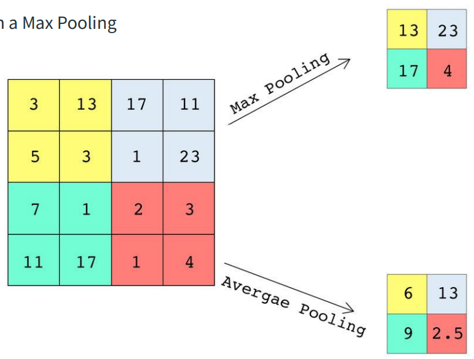
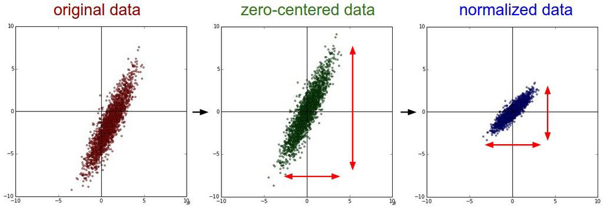

<!-- TOC -->
* [Linear Regression](#linear-regression)
  * [Linear Regression for the Advertising Data](#linear-regression-for-the-advertising-data)
  * [Simple linear regression using a single predictor X.](#simple-linear-regression-using-a-single-predictor-x)
    * [Estimation of the parameters by least squares](#estimation-of-the-parameters-by-least-squares)
    * [Example: advertising data](#example-advertising-data)
    * [Assessing the Accuracy of the Coefficient Estimates](#assessing-the-accuracy-of-the-coefficient-estimates)
    * [Hypothesis testing](#hypothesis-testing)
    * [Results for the advertising data](#results-for-the-advertising-data)
    * [Assessing the Overall Accuracy of the Model](#assessing-the-overall-accuracy-of-the-model)
    * [Advertising data results](#advertising-data-results)
  * [Multiple Linear Regression](#multiple-linear-regression)
    * [Interpreting Regression Coefficients](#interpreting-regression-coefficients)
  * [The Woes of (Interpreting) Regression Coefficients](#the-woes-of-interpreting-regression-coefficients)
  * [Estimation and Prediction for Multiple Regression](#estimation-and-prediction-for-multiple-regression)
  * [Results for Advertising Data](#results-for-advertising-data)
    * [Correlations](#correlations)
  * [Important Questions](#important-questions)
  * [Is at Least One Predictor Useful?](#is-at-least-one-predictor-useful)
  * [Qualitative Predictors with More Than Two Levels](#qualitative-predictors-with-more-than-two-levels)
  * [Results for Ethnicity](#results-for-ethnicity)
  * [Extensions of the Linear Model](#extensions-of-the-linear-model)
    * [Interactions](#interactions)
    * [Modelling Interactions — Advertising Data](#modelling-interactions--advertising-data)
    * [Hierarchy](#hierarchy)
    * [Interactions Between Qualitative and Quantitative Variables](#interactions-between-qualitative-and-quantitative-variables)
    * [Non-linear Effects of Predictors](#non-linear-effects-of-predictors)
* [Classification](#classification)
  * [Qualitative Variables](#qualitative-variables)
  * [Classification Task](#classification-task)
  * [Estimating Probabilities](#estimating-probabilities)
  * [Example: Credit Card Default](#example-credit-card-default)
    * [Default Classification Task](#default-classification-task)
    * [Linear versus Logistic Regression](#linear-versus-logistic-regression)
  * [Logistic Regression](#logistic-regression)
    * [Linear versus Logistic Regression](#linear-versus-logistic-regression-1)
  * [Maximum Likelihood](#maximum-likelihood)
  * [Making Predictions](#making-predictions)
    * [Using Student as the Predictor](#using-student-as-the-predictor)
  * [Logistic Regression with Several Variables](#logistic-regression-with-several-variables)
  * [Confounding](#confounding)
  * [Example: South African Heart Disease](#example-south-african-heart-disease)
  * [Case-control sampling and logistic regression](#case-control-sampling-and-logistic-regression)
  * [Diminishing returns in unbalanced binary data](#diminishing-returns-in-unbalanced-binary-data)
  * [Logistic regression with more than two classes](#logistic-regression-with-more-than-two-classes)
* [Linear Model Selection and Regularization](#linear-model-selection-and-regularization)
  * [Alternatives to Least Squares](#alternatives-to-least-squares)
    * [Why Consider Alternatives to Least Squares?](#why-consider-alternatives-to-least-squares)
    * [Three Classes of Methods](#three-classes-of-methods)
  * [Shrinkage Methods](#shrinkage-methods)
    * [Ridge Regression and Lasso](#ridge-regression-and-lasso)
  * [Ridge Regression](#ridge-regression)
    * [Tuning parameter $\lambda$](#tuning-parameter-lambda)
    * [Standardizing the Variables](#standardizing-the-variables)
  * [Why Does Ridge Regression Improve Over Least Squares?](#why-does-ridge-regression-improve-over-least-squares)
    * [The Bias-Variance Tradeoff](#the-bias-variance-tradeoff)
  * [The Lasso](#the-lasso)
  * [Comparing the Lasso and Ridge Regression](#comparing-the-lasso-and-ridge-regression)
* [Neural Networks](#neural-networks)
  * [Perceptrón](#perceptrón)
    * [Funciones de Activación](#funciones-de-activación)
      * [Step(u)](#stepu)
      * [Sigmoid](#sigmoid)
      * [tanh(u)](#tanhu)
      * [ReLU](#relu)
      * [lineal(u)](#linealu)
  * [Red Neuronal](#red-neuronal)
    * [Ejemplo](#ejemplo)
      * [Calcular XOR](#calcular-xor)
    * [Generalización](#generalización)
  * [Teorema Universal de Aproximación (Universal Approximation Theorem)](#teorema-universal-de-aproximación-universal-approximation-theorem)
  * [Redes Neuronales Profundas](#redes-neuronales-profundas)
    * [Ilustración de una red general profunda](#ilustración-de-una-red-general-profunda)
    * [Batches](#batches)
  * [Función de Salida](#función-de-salida)
  * [Entrenamiento](#entrenamiento)
    * [Función de Error](#función-de-error)
    * [Función de Pérdida](#función-de-pérdida)
    * [Descenso de Gradiente](#descenso-de-gradiente)
  * [Backpropagation](#backpropagation)
    * [Ejemplo 1](#ejemplo-1)
    * [Funciones de Más de Una Variable](#funciones-de-más-de-una-variable)
  * [Layer](#layer)
  * [Tensor](#tensor)
    * [Scalars (rank-0 tensors)](#scalars-rank-0-tensors)
    * [Vectors (rank-1 tensors)](#vectors-rank-1-tensors)
    * [Matrices (rank-2 tensors)](#matrices-rank-2-tensors)
    * [Rank-3 and higher-rank tensors](#rank-3-and-higher-rank-tensors)
    * [Key attributes](#key-attributes)
    * [Notion of Data Batches](#notion-of-data-batches)
  * [Tensor Operations](#tensor-operations)
    * [Element-wise Operations](#element-wise-operations)
    * [Broadcasting](#broadcasting)
    * [Tensor Product](#tensor-product)
  * [Architecture](#architecture)
* [Introduction to deep learning for computer vision](#introduction-to-deep-learning-for-computer-vision)
  * [History](#history)
  * [The goals of a Convolutional Neural Networks (CNN)](#the-goals-of-a-convolutional-neural-networks-cnn)
    * [Common Neural Network Approach](#common-neural-network-approach)
    * [CNN Approach](#cnn-approach)
  * [Convolutional Neural Networks (CNN)](#convolutional-neural-networks-cnn)
    * [Locality](#locality)
    * [Translation invariance](#translation-invariance)
    * [Spatial Hierarchies of Patterns](#spatial-hierarchies-of-patterns)
  * [Basic CNN Architecture](#basic-cnn-architecture)
  * [Convolution](#convolution)
    * [Common 2D Convolution](#common-2d-convolution)
    * [Convolutions on RGB image](#convolutions-on-rgb-image)
  * [Padding](#padding)
  * [Stride](#stride)
  * [Pooling](#pooling)
    * [Max Pooling](#max-pooling)
  * [CNN example: AlexNet](#cnn-example-alexnet)
    * [Input Layer](#input-layer)
    * [Convolutional Layers](#convolutional-layers)
    * [Fully Connected Layers](#fully-connected-layers)
    * [Output Layer](#output-layer)
* [Advanced deep learning for computer vision](#advanced-deep-learning-for-computer-vision)
  * [Computer Vision Tasks](#computer-vision-tasks)
    * [Image Classification](#image-classification)
    * [Image Segmentation](#image-segmentation)
    * [Object Detection](#object-detection)
  * [Modern Convnet Architecture Patterns](#modern-convnet-architecture-patterns)
    * [Modularity, Hierarchy, and Reuse](#modularity-hierarchy-and-reuse)
    * [Residual Connections](#residual-connections)
    * [Batch normalization](#batch-normalization)
* [⏳ Deep learning for timeseries](#-deep-learning-for-timeseries)
  * [A temperature-forecasting example](#a-temperature-forecasting-example)
* [The Trade-Of Between Prediction Accuracy and Model Interpretability](#the-trade-of-between-prediction-accuracy-and-model-interpretability)
* [The Bias-Variance Trade-Of](#the-bias-variance-trade-of)
* [Q & A](#q--a)
<!-- TOC -->

# Linear Regression

Linear regression is a simple approach to supervised learning. It assumes that the dependence of Y on $X_1, X_2, ..., X_p$ is linear.
- True regression functions are never linear!


- Although it may seem overly simplistic, linear regression is extremely useful both conceptually and practically.

## Linear Regression for the Advertising Data

Consider the advertising data shown.

Questions we might ask:

- Is there a relationship between advertising budget and sales?
- How strong is the relationship between advertising budget and sales?
- Which media contribute to sales?
- How accurately can we predict future sales?
- Is the relationship linear?
- Is there synergy among the advertising media?


## Simple linear regression using a single predictor X.

We assume a model

$$Y = \beta_0 + \beta_1 X + \epsilon$$

where $\beta_0$ and $\beta_1$ are two unknown constants that represent the intercept and slope, also known as coefficients or parameters, and $\epsilon$ is the error term.

Given some estimates $\hat{\beta_0}$ and $\hat{\beta_1}$ for the model coefficients, we predict future sales using

$$\hat{y} = \hat{\beta_0} + \hat{\beta_1}x,$$

where $\hat{y}$ indicates a prediction of Y on the basis of $X = x$. The hat symbol denotes an estimated value.

### Estimation of the parameters by least squares

Let $\hat{y}_i = \hat{\beta}_0 + \hat{\beta}_1 x_i$ be the prediction for $Y$ based on the $i$ th value of $X$. Then $e_i = y_i - \hat{y}_i$ represents the $i$ th residual.

We define the residuals sum of squares (RSS) as

$$RSS = e_1^2 + e_2^2 + ... + e_n^2,$$

or equivalently as

$$RSS = (y_1 - \hat{\beta}_0 - \hat{\beta}_1 x_1)^2 + (y_2 - \hat{\beta}_0 - \hat{\beta}_1 x_2)^2 + ... + (y_n - \hat{\beta}_0 - \hat{\beta}_1 x_n)^2.$$

The least squares approach chooses $\hat{\beta}_0$ and $\hat{\beta}_1$ to minimize the RSS. The minimizing values can be shown to be

$${\hat{\beta}_1 = \frac{\sum_{i=1}^n (x_i - \bar{x})(y_i - \bar{y})}{\sum_{i=1}^n (x_i - \bar{x})^2},}$$

$$\hat{\beta}_0 = \bar{y} - \hat{\beta}_1 \bar{x},$$

where $\bar{y} = \frac{1}{n} \sum_{i=1} y_i$ and $\bar{x} = \frac{1}{n} \sum_{i=1} x_i$ are the sample means.

### Example: advertising data


For the Advertising data, the least squares fit for the regression of sales onto TV is shown. The fit is found by minimizing the sum of squared errors. Each grey line segment represents an error, and the fit makes a compromise by averaging their squares. In this case, a linear fit captures the essence of the relationship, although it is somewhat deficient in the left of the plot.

### Assessing the Accuracy of the Coefficient Estimates
The standard error of an estimator reflects how it varies under repeated sampling. We have

$$SE(\hat{\beta}_1)^2 = \frac{\sigma^2}{\sum_{i=1}^n (x_i - \bar{x})^2}, \quad SE(\hat{\beta}_0)^2 = \sigma^2 \left( \frac{1}{n} + \frac{\bar{x}^2}{\sum_{i=1}^n (x_i - \bar{x})^2} \right),$$

where $\sigma^2 = \text{Var}(\epsilon)$.

These standard errors can be used to compute confidence intervals. A 95% confidence interval is defined as a range of values such that with 95% probability, the range will contain the true unknown value of the parameter. It has the form

$$\hat{\beta}_1 \pm 2 \cdot SE(\hat{\beta}_1).$$

Confidence interval $-$ continued
That is, there is approximately a 95% chance that the interval

$$[\hat{\beta}_1 - 2 \cdot SE(\hat{\beta}_1), \hat{\beta}_1 + 2 \cdot SE(\hat{\beta}_1)]$$

will contain the true value of $\beta_1$ (under a scenario where we got repeated samples like the present sample).

For the advertising data, the 95% confidence interval for $\beta_1$ is [0.042, 0.053].

### Hypothesis testing
Standard errors can also be used to perform **hypothesis tests** on the coefficients. The most common hypothesis test involves testing the **null hypothesis** of

$$H_0: \text{There is no relationship between } X \text{ and } Y$$

versus the **alternative hypothesis**

$$H_A: \text{There is some relationship between } X \text{ and } Y.$$

Mathematically, this corresponds to testing

$$H_0: \beta_1 = 0$$

versus

$$H_A: \beta_1 \neq 0,$$

since if $\beta_1 = 0$ then the model reduces to $Y = \beta_0 + \epsilon$, and $X$ is not associated with $Y$.

To test the null hypothesis, we compute a **t-statistic**, given by

$$t = \frac{\hat{\beta}_1 - 0}{SE(\hat{\beta}_1)},$$

This will have a t-distribution with $n - 2$ degrees of freedom, assuming $\beta_1 = 0$.

Using statistical software, it is easy to compute the probability of observing any value equal to $|t|$ or larger. We call this probability the **p-value**.

### Results for the advertising data

|           | Coefficient | Std. Error | t-statistic | p-value  |
|-----------|-------------|------------|-------------|----------|
| Intercept | 7.0325      | 0.4578     | 15.36       | < 0.0001 |
| TV        | 0.0475      | 0.0027     | 17.67       | < 0.0001 |

### Assessing the Overall Accuracy of the Model

We compute the **Residual Standard Error**

$$RSE = \sqrt{\frac{1}{n - 2} RSS} = \sqrt{\frac{1}{n - 2} \sum_{i=1}^n (y_i - \hat{y}_i)^2},$$

where the **residual sum-of-squares** is $RSS = \sum_{i=1}^n (y_i - \hat{y}_i)^2$ .

**R-squared** or fraction of variance explained is

$$R^2 = \frac{TSS - RSS}{TSS} = 1 - \frac{RSS}{TSS},$$

where $TSS = \sum_{i=1}^n (y_i - \bar{y})^2$ is the total sum of squares.

It can be shown that in this simple linear regression setting that $R^2 = r^2$, where $r$ is the correlation between $X$ and $Y$:

$$r = \frac{\sum_{i=1}^n (x_i - \bar{x})(y_i - \bar{y})}{\sqrt{\sum_{i=1}^n (x_i - \bar{x})^2 \sum_{i=1}^n (y_i - \bar{y})^2}}.$$

### Advertising data results

| Quantity                | Value  |
|-------------------------|--------|
| Residual Standard Error | 3.26   |
| $R^2$                   | 0.612  |
| F-statistic             | 312.1  |

## Multiple Linear Regression

Here our model is

$$Y = \beta_0 + \beta_1X_1 + \beta_2X_2 + \cdots + \beta_pX_p + \epsilon,$$

We interpret $\beta_j$ as the average effect on $Y$ of a one unit increase in $X_j$, holding all other predictors fixed. In the advertising example, the model becomes

$$\text{sales} = \beta_0 + \beta_1 \times \text{TV} + \beta_2 \times \text{radio} + \beta_3 \times \text{newspaper} + \epsilon.$$

### Interpreting Regression Coefficients

The ideal scenario is when the predictors are uncorrelated — a **balanced design**:
- Each coefficient can be estimated and tested separately.
- Interpretations such as “a unit change in $X_j$ is associated with a $\beta_j$ change in $Y$, while all the other variables stay fixed”, are possible.

Correlations amongst predictors cause problems:
- The variance of all coefficients tends to increase, sometimes dramatically.
- Interpretations become hazardous — when $X_j$ changes, everything else changes.

**Claims of causality** should be avoided for observational data.

## The Woes of (Interpreting) Regression Coefficients

“Data Analysis and Regression” Mosteller and Tukey 1977:
- A regression coefficient $\beta_j$ estimates the expected change in $Y$ per unit change in $X_j$, with all other predictors held fixed. But predictors usually change together!

_Example:_
- $Y$: total amount of change in your pocket;
- $X_1$: number of coins;
- $X_2$: number of pennies, nickels, and dimes. By itself, the regression coefficient of $Y$ on $X_2$ will be > 0. But how about with $X_1$ in the model?

_Example:_
- $Y$: number of tackles by a football player in a season;
- $W$ and $H$: his weight and height.
- Fitted regression model is $\hat{Y} = \hat{\beta}_0 + 0.50W - 0.10H$. How do we interpret $\hat{\beta}_2 < 0$?

## Estimation and Prediction for Multiple Regression

Given estimates $\hat{\beta}_0, \hat{\beta}_1, \ldots, \hat{\beta}_p$, we can make predictions using the formula

$$\hat{y} = \hat{\beta}_0 + \hat{\beta}_1x_1 + \hat{\beta}_2x_2 + \cdots + \hat{\beta}_px_p$$ .

We estimate $\beta_0, \beta_1, \ldots, \beta_p$ as the values that minimize the sum of squared residuals

$$RSS = \sum_{i=1}^n (y_i - \hat{y}_i)^2 = \sum_{i=1}^n (y_i - \hat{\beta}_0 - \hat{\beta}_1x_{i1} - \hat{\beta}_2x_{i2} - \cdots - \hat{\beta}_px_{ip})^2$$ .

This is done using standard statistical software. The values $\hat{\beta}_0, \hat{\beta}_1, \ldots, \hat{\beta}_p$ that minimize $RSS$ are the multiple least squares regression coefficient estimates.


## Results for Advertising Data

|           | Coefficient | Std. Error | t-statistic | p-value  |
|-----------|-------------|------------|-------------|----------|
| Intercept | 2.939       | 0.3119     | 9.42        | < 0.0001 |
| TV        | 0.046       | 0.0014     | 32.81       | < 0.0001 |
| radio     | 0.189       | 0.0086     | 21.89       | < 0.0001 |
| newspaper | -0.001      | 0.0059     | -0.18       | 0.8599   |

### Correlations

|           | TV     | radio  | newspaper | sales  |
|-----------|--------|--------|-----------|--------|
| TV        | 1.0000 | 0.0548 | 0.0567    | 0.7822 |
| radio     |        | 1.0000 | 0.3541    | 0.5762 |
| newspaper |        |        | 1.0000    | 0.2283 |
| sales     |        |        |           | 1.0000 |

## Important Questions

1. Is at least one of the predictors $X_1, X_2, \ldots, X_p$ useful in predicting the response?
2. Do all the predictors help to explain $Y$, or is only a subset of the predictors useful?
3. How well does the model fit the data?
4. Given a set of predictor values, what response value should we predict, and how accurate is our prediction?

## Is at Least One Predictor Useful?

For the first question, we can use the **F-statistic**

$$F = \frac{(TSS - RSS)/p}{RSS/(n - p - 1)} \sim F_{p, n-p-1}$$

| Quantity                | Value  |
|-------------------------|--------|
| Residual Standard Error | 1.69   |
| $R^2$                   | 0.897  |
| F-statistic             | 570    |

## Qualitative Predictors with More Than Two Levels
With more than two levels, we create additional dummy variables. For example, for the ethnicity variable we create two dummy variables. The first could be

$$x_{i1} = \begin{cases} 1 & \text{if } i\text{th person is Asian} \\ 0 & \text{if } i\text{th person is not Asian} \end{cases}$$

and the second could be

$$x_{i2} = \begin{cases} 1 & \text{if } i\text{th person is Caucasian} \\ 0 & \text{if } i\text{th person is not Caucasian} \end{cases}$$

Then both of these variables can be used in the regression equation, in order to obtain the model

$$y_i = \beta_0 + \beta_1x_{i1} + \beta_2x_{i2} + \epsilon_i = \begin{cases} \beta_0 + \beta_1 + \epsilon_i & \text{if } i\text{th person is Asian} \\ \beta_0 + \beta_2 + \epsilon_i & \text{if } i\text{th person is Caucasian} \\ \beta_0 + \epsilon_i & \text{if } i\text{th person is AA} \end{cases}$$

There will always be one fewer dummy variable than the number of levels. The level with no dummy variable — African American in this example — is known as the baseline.

## Results for Ethnicity

|                      | Coefficient | Std. Error | t-statistic | p-value  |
|----------------------|-------------|------------|-------------|----------|
| Intercept            | 531.00      | 46.32      | 11.464      | < 0.0001 |
| ethnicity[Asian]     | -18.69      | 65.02      | -0.287      | 0.7740   |
| ethnicity[Caucasian] | -12.50      | 56.68      | -0.221      | 0.8260   |

## Extensions of the Linear Model

Removing the additive assumption: interactions and nonlinearity

### Interactions

In our previous analysis of the Advertising data, we assumed that the effect on sales of increasing one advertising medium is independent of the amount spent on the other media.

For example, the linear model

$$\text{sales} = \beta_0 + \beta_1 \times \text{TV} + \beta_2 \times \text{radio} + \beta_3 \times \text{newspaper}$$

states that the average effect on sales of a one-unit increase in TV is always $\beta_1$, regardless of the amount spent on radio.

Suppose that spending money on radio advertising actually increases the effectiveness of TV advertising, so that the slope term for TV should increase as radio increases.

In this situation, given a fixed budget of \$100,000, spending half on radio and half on TV may increase sales more than allocating the entire amount to either TV or to radio.

In marketing, this is known as a **synergy** effect, and in statistics, it is referred to as an **interaction** effect.


### Modelling Interactions — Advertising Data

Model takes the form

$$\text{sales} = \beta_0 + \beta_1 \times \text{TV} + \beta_2 \times \text{radio} + \beta_3 \times (\text{radio} \times \text{TV}) + \epsilon = \beta_0 + (\beta_1 + \beta_3 \times \text{radio}) \times \text{TV} + \beta_2 \times \text{radio} + \epsilon.$$

Results:

|           | Coefficient | Std. Error | t-statistic | p-value  |
|-----------|-------------|------------|-------------|----------|
| Intercept | 6.7502      | 0.248      | 27.23       | < 0.0001 |
| TV        | 0.0191      | 0.002      | 12.70       | < 0.0001 |
| radio     | 0.0289      | 0.009      | 3.24        | 0.0014   |
| TV×radio  | 0.0011      | 0.000      | 20.73       | < 0.0001 |

The results in this table suggest that interactions are important. The p-value for the interaction term TV×radio is extremely low, indicating that there is strong evidence for $H_A : \beta_3 \neq 0$.

The $R^2$ for the interaction model is 96.8%, compared to only 89.7% for the model that predicts sales using TV and radio without an interaction term.

This means that $(96.8 - 89.7)/(100 - 89.7) = 69\%$ of the variability in sales that remains after fitting the additive model has been explained by the interaction term.

The coefficient estimates in the table suggest that an increase in TV advertising of \$1,000 is associated with increased sales of

$$(\hat{\beta}_1 + \hat{\beta}_3 \times \text{radio}) \times 1000 = 19 + 1.1 \times \text{radio} \text{ units}.$$

An increase in radio advertising of \$1,000 will be associated with an increase in sales of

$$(\hat{\beta}_2 + \hat{\beta}_3 \times \text{TV}) \times 1000 = 29 + 1.1 \times \text{TV} \text{ units}.$$

### Hierarchy

Sometimes it is the case that an interaction term has a very small p-value, but the associated main effects (in this case, TV and radio) do not.

The **hierarchy principle**:
If we include an interaction in a model, we should also include the main effects, even if the p-values associated with their coefficients are not significant.

The rationale for this principle is that interactions are hard to interpret in a model without main effects — their meaning is changed. Specifically, the interaction terms also contain main effects, if the model has no main effect terms.

### Interactions Between Qualitative and Quantitative Variables

Consider the Credit data set, and suppose that we wish to predict balance using income (quantitative) and student (qualitative).

**Without an interaction term**, the model takes the form

$$\text{balance}_i \approx \beta_0 + \beta_1 \times \text{income}_i + \begin{cases} \beta_2 & \text{if } i\text{th person is a student} \\ 0 & \text{if } i\text{th person is not a student} \end{cases} = \beta_1 \times \text{income}_i + \begin{cases} \beta_0 + \beta_2 & \text{if } i\text{th person is a student} \\ \beta_0 & \text{if } i\text{th person is not a student} \end{cases}$$

**With interactions**, it takes the form

$$\text{balance}_i \approx \beta_0 + \beta_1 \times \text{income}_i + \begin{cases} \beta_2 + \beta_3 \times \text{income}_i & \text{if student} \\ 0 & \text{if not student} \end{cases}= \begin{cases}(\beta_0 + \beta_2) + (\beta_1 + \beta_3) \times \text{income}_i & \text{if student} \\ \beta_0 + \beta_1 \times \text{income}_i & \text{if not student} \end{cases}$$


### Non-linear Effects of Predictors

Polynomial regression on Auto data:


The figure suggests that

$$\text{mpg} = \beta_0 + \beta_1 \times \text{horsepower} + \beta_2 \times \text{horsepower}^2 + \epsilon$$

may provide a better fit.

|              | Coefficient | Std. Error | t-statistic | p-value  |
|--------------|-------------|------------|-------------|----------|
| Intercept    | 56.9001     | 1.8004     | 31.6        | < 0.0001 |
| horsepower   | -0.4662     | 0.0311     | -15.0       | < 0.0001 |
| horsepower^2 | 0.0012      | 0.0001     | 10.1        | < 0.0001 |

# Classification

## Qualitative Variables

Qualitative variables take values in an unordered set $C$, such as:
- $\text{eye color} \in \{ \text{brown}, \text{blue}, \text{green} \}$
- $\text{email} \in \{ \text{spam}, \text{ham} \}$

## Classification Task

Given a feature vector $X$ and a qualitative response $Y$ taking values in the set $C$, the classification task is to build a function $C(X)$ that takes as input the feature vector $X$ and predicts its value for $Y$; i.e. $C(X) \in C$.

## Estimating Probabilities

Often we are more interested in estimating the probabilities that $X$ belongs to each category in $C$. For example, it is more valuable to have an estimate of the probability that an insurance claim is fraudulent, than a classification of fraudulent or not.

## Example: Credit Card Default


### Default Classification Task

Suppose for the Default classification task that we code:

$$Y = \begin{cases} 0 & \text{if No} \\ 1 & \text{if Yes} \end{cases}$$

Can we simply perform a linear regression of $Y$ on $X$ and classify as Yes if $\hat{Y} > 0.5$?

- In this case of a binary outcome, linear regression does a good job as a classifier and is equivalent to linear discriminant analysis, which we discuss later.
- Since in the population $E(Y | X = x) = \Pr(Y = 1 | X = x)$, we might think that regression is perfect for this task.
- However, linear regression might produce probabilities less than zero or greater than one. Logistic regression is more appropriate.

### Linear versus Logistic Regression


The orange marks indicate the response $Y$, either 0 or 1. Linear regression does not estimate $\Pr(Y = 1 | X)$ well. Logistic regression seems well suited to the task.

Now suppose we have a response variable with three possible values. A patient presents at the emergency room, and we must classify them according to their symptoms.

$$Y = \begin{cases} 1 & \text{if stroke} \\ 2 & \text{if drug overdose} \\ 3 & \text{if epileptic seizure} \end{cases}$$

This coding suggests an ordering and in fact implies that the difference between stroke and drug overdose is the same as between drug overdose and epileptic seizure.

Linear regression is not appropriate here. Multiclass Logistic Regression or Discriminant Analysis are more appropriate.

## Logistic Regression

Let's write $p(X) = \Pr(Y = 1|X)$ for short and consider using balance to predict default. Logistic regression uses the form:

$$p(X) = \frac{e^{\beta_0 + \beta_1 X}}{1 + e^{\beta_0 + \beta_1 X}}$$

where $e \approx 2.71828$ is a mathematical constant (Euler's number). It is easy to see that no matter what values $\beta_0$, $\beta_1$, or $X$ take, $p(X)$ will have values between 0 and 1.

A bit of rearrangement gives:

$$\log \left( \frac{p(X)}{1 - p(X)} \right) = \beta_0 + \beta_1 X$$

This monotone transformation is called the **log odds** or **logit** transformation of $p(X)$ (by log we mean natural log: ln).

### Linear versus Logistic Regression


Logistic regression ensures that our estimate for $p(X)$ lies between 0 and 1.

## Maximum Likelihood

We use maximum likelihood to estimate the parameters.

$$L(\beta_0, \beta_1) = \prod_{i:y_i=1} p(x_i) \prod_{i:y_i=0} (1 - p(x_i))$$

This **likelihood** gives the probability of the observed zeros and ones in the data. We pick $\beta_0$ and $\beta_1$ to maximize the likelihood of the observed data.

Most statistical packages can fit linear logistic regression models by maximum likelihood. In R, we use the `glm` function.

|           | Coefficient | Std. Error | Z-statistic | P-value  |
|-----------|-------------|------------|-------------|----------|
| Intercept | -10.6513    | 0.3612     | -29.5       | < 0.0001 |
| balance   | 0.0055      | 0.0002     | 24.9        | < 0.0001 |

## Making Predictions

What is our estimated probability of default for someone with a balance of \$1000?

$$\hat{p}(X) = \frac{e^{\hat{\beta}_0 + \hat{\beta}_1 X}}{1 + e^{\hat{\beta}_0 + \hat{\beta}_1 X}} = \frac{e^{-10.6513 + 0.0055 \times 1000}}{1 + e^{-10.6513 + 0.0055 \times 1000}} = 0.006$$

With a balance of \$2000?

$$\hat{p}(X) = \frac{e^{\hat{\beta}_0 + \hat{\beta}_1 X}}{1 + e^{\hat{\beta}_0 + \hat{\beta}_1 X}} = \frac{e^{-10.6513 + 0.0055 \times 2000}}{1 + e^{-10.6513 + 0.0055 \times 2000}} = 0.586$$

### Using Student as the Predictor

|              | Coefficient | Std. Error | Z-statistic | P-value  |
|--------------|-------------|------------|-------------|----------|
| Intercept    | -3.5041     | 0.0707     | -49.55      | < 0.0001 |
| student[Yes] | 0.4049      | 0.1150     | 3.52        | 0.0004   |

$$\widehat{Pr}(\text{default=Yes}|\text{student=Yes}) = \frac{e^{-3.5041 + 0.4049 \times 1}}{1 + e^{-3.5041 + 0.4049 \times 1}} = 0.0431$$

$$\widehat{Pr}(\text{default=Yes}|\text{student=No}) = \frac{e^{-3.5041 + 0.4049 \times 0}}{1 + e^{-3.5041 + 0.4049 \times 0}} = 0.0292$$

## Logistic Regression with Several Variables

$$\log \left( \frac{p(X)}{1 - p(X)} \right) = \beta_0 + \beta_1 X_1 + \cdots + \beta_p X_p$$

$$p(X) = \frac{e^{\beta_0 + \beta_1 X_1 + \cdots + \beta_p X_p}}{1 + e^{\beta_0 + \beta_1 X_1 + \cdots + \beta_p X_p}}$$

|              | Coefficient | Std. Error | Z-statistic | P-value  |
|--------------|-------------|------------|-------------|----------|
| Intercept    | -10.8690    | 0.4923     | -22.08      | < 0.0001 |
| balance      | 0.0057      | 0.0002     | 24.74       | < 0.0001 |
| income       | 0.0030      | 0.0082     | 0.37        | 0.7115   |
| student[Yes] | -0.6468     | 0.2362     | -2.74       | 0.0062   |

Why is the coefficient for student negative, while it was positive before?

## Confounding


- Students tend to have higher balances than non-students, so their marginal default rate is higher than for non-students.
- But for each level of balance, students default less than non-students.
- Multiple logistic regression can tease this out.

## Example: South African Heart Disease

- 160 cases of MI (myocardial infarction) and 302 controls (all male in age range 15-64), from Western Cape, South Africa in early 80s.
- Overall prevalence very high in this region: 5.1%.
- Measurements on seven predictors (risk factors), shown in scatterplot matrix.
- Goal is to identify relative strengths and directions of risk factors.
- This was part of an intervention study aimed at educating the public on healthier diets.


Scatterplot matrix of the South African Heart Disease data. The response is color coded — The cases (MI) are red, the controls turquoise. `famhist` is a binary variable, with 1 indicating family history of MI.

```r
> heartfit <- glm(chd ~ ., data = heart, family = binomial)
> summary(heartfit)
Call:
glm(formula = chd ~ ., family = binomial, data = heart)

Coefficients:
				 Estimate  Std. Error  z value  Pr(>|z|)
(Intercept)     -4.1295997  0.9641558  -4.283   1.84e-05 ***
sbp              0.0057607  0.0056326   1.023   0.30643
tobacco          0.0795256  0.0262150   3.034   0.00242 **
ldl              0.1847793  0.0574115   3.219   0.00129 **
famhistPresent   0.9391855  0.2248691   4.177   2.96e-05 ***
obesity         -0.0345434  0.0291053  -1.187   0.23529
alcohol          0.0006065  0.0044550   0.136   0.89171
age              0.0425412  0.0101749   4.181   2.90e-05 ***
(Dispersion parameter for binomial family taken to be 1)

Null deviance: 596.11 on 461 degrees of freedom
Residual deviance: 483.17 on 454 degrees of freedom
AIC: 499.17
```

## Case-control sampling and logistic regression

In South African data, there are 160 cases, 302 controls — $\tilde{\pi} = 0.35$ are cases. Yet the prevalence of MI in this region is $\pi = 0.05$.

With case-control samples, we can estimate the regression parameters $\beta_j$ accurately (if our model is correct); the constant term $\beta_0$ is incorrect.

We can correct the estimated intercept by a simple transformation:

$$ \hat{\beta}_0^* = \hat{\beta}_0 + \log \left( \frac{\pi}{1 - \pi} \right) - \log \left( \frac{\tilde{\pi}}{1 - \tilde{\pi}} \right) $$

Often cases are rare and we take them all; up to five times that number of controls is sufficient.

## Diminishing returns in unbalanced binary data

Sampling more controls than cases reduces the variance of the parameter estimates. But after a ratio of about 5 to 1, the variance reduction flattens out.

## Logistic regression with more than two classes

So far we have discussed logistic regression with two classes. It is easily generalized to more than two classes. One version (used in the R package glmnet) has the symmetric form:

$$\Pr(Y = k|X) = \frac{e^{\beta_{0k} + \beta_{1k}X_1 + \ldots + \beta_{pk}X_p}}{\sum_{j=1}^K e^{\beta_{0j} + \beta_{1j}X_1 + \ldots + \beta_{pj}X_p}}$$

Here there is a linear function for **each** class.

(The mathier students will recognize that some cancellation is possible, and only $K - 1$ linear functions are needed as in 2-class logistic regression.)

Multiclass logistic regression is also referred to as **multinomial regression**.

# Linear Model Selection and Regularization

Despite its simplicity, the linear model has distinct  advantages in terms of its interpretability and often shows  good predictive performance.

Hence, we discuss some ways in which the simple linear model can be improved, by replacing ordinary least squares fitting with some alternative fitting procedures.

## Alternatives to Least Squares

### Why Consider Alternatives to Least Squares?

**Prediction Accuracy**

If $n$ (the number of observations) is not much larger than $p$ (the number of variables or predictor or features), then there can be a lot of variability in the least  squares fit. Sometimes we need to shrink $p$, especially when $p > n$, to control the variance.

**Model Interpretability**

By removing irrelevant features — that is, by setting the corresponding coefficient estimates to zero — we can obtain a model that is more easily interpreted. We will present some approaches for automatically performing feature selection.

### Three Classes of Methods

**Subset Selection**

We identify a subset of the $p$ predictors that we believe to be related to the response. We then fit a model using least squares on the reduced set of variables.

There are $2^p$ possible models, so this is computationally infeasible for large $p$.

**Shrinkage**

We fit a model involving all $p$ predictors, but the estimated coefficients are shrunken towards zero relative to the least squares estimates. This shrinkage (also known as **regularization**) has the effect of reducing variance and can also perform variable selection.

**Dimension Reduction**

We project the $p$ predictors into an $M$-dimensional subspace, where $M < p$. This is achieved by computing $M$ different linear combinations, or projections, of the variables. Then these $M$ projections are used as predictors to fit a linear regression model by least squares.

## Shrinkage Methods

### Ridge Regression and Lasso
- The subset selection methods use least squares to fit a linear model that contains a subset of the predictors.
- As an alternative, we can fit a model containing all $p$ predictors using a technique that **constrains** or **regularizes** the coefficient estimates, or equivalently, that **shrinks** the coefficient estimates towards zero.
- It may not be immediately obvious why such a constraint should improve the fit, but it turns out that shrinking the coefficient estimates can significantly reduce their variance.

## Ridge Regression
Recall that the least squares fitting procedure estimates $\beta_0, \beta_1, \ldots, \beta_p$ using the values that minimize

$$RSS = \sum_{i=1}^n \left( y_i - \beta_0 - \sum_{j=1}^p \beta_j x_{ij} \right)^2.$$

In contrast, the ridge regression coefficient estimates $\hat{\beta}^R$ are the values that minimize

$$\sum_{i=1}^n \left( y_i - \beta_0 - \sum_{j=1}^p \beta_j x_{ij} \right)^2 + \lambda \sum_{j=1}^p \beta_j^2 = RSS + \lambda \sum_{j=1}^p \beta_j^2,$$

where $\lambda \geq 0$ is a tuning parameter, to be determined separately.

- As with least squares, ridge regression seeks coefficient estimates that fit the data well, by making the RSS small.
- However, the second term, $\lambda \sum_{j} \beta_j^2$, called a shrinkage penalty, is small when $\beta_1, \ldots, \beta_p$ are close to zero, and so it has the effect of shrinking the estimates of $\beta_j$ towards zero.
- The **tuning parameter** $\lambda$ serves to control the relative impact of these two terms on the regression coefficient estimates.
	- $\lambda = 0$: The penalty term has no effect. Ridge regression estimates will be identical to least squares estimates.
	- $\lambda \to \infty$: The penalty term dominates the criterion, and the ridge regression coefficient estimates will be shrunk towards zero.
- Selecting a good value for $\lambda$ is critical; cross-validation is used for this.

### Tuning parameter $\lambda$


- In the left-hand panel, each curve corresponds to the ridge  regression coefficient estimate for one of the ten variables,  plotted as a function of $\lambda$.
	- The right-hand panel displays the same ridge coefficient estimates as the left-hand panel, but instead of displaying $\lambda$ on the x-axis, we now display $||\hat{\beta}^R_\lambda||_2/||\hat{\beta}^R||_2$, where $\hat{\beta}$  denotes the vector of least squares coefficient estimates.
- The notation $||\hat{\beta}||_2$ denotes the $\ell_2$ norm (pronounced “ell 2”) of a vector, and is defined as $||\hat{\beta}||_2 = \sqrt{\sum_{j=1}^p \beta_j^2}$ .

### Standardizing the Variables

It is best to apply ridge regression after standardizing the predictors, using the formula

$$\tilde{x}_{ij} = \frac{x_{ij}}{\sqrt{\frac{1}{n} \sum_{i=1}^n (x_{ij} - \bar{x}_j)^2}},$$

so that they are all on the **same scale**. In this formula, the denominator is the estimated standard deviation of the $j$-th predictor. Consequently, all the standardized predictors will have a standard deviation of one. As a result, the final fit will not depend on the scale on which the predictors are measured.

## Why Does Ridge Regression Improve Over Least Squares?

### The Bias-Variance Tradeoff


Simulated data with $n = 50$ observations, $p = 45$ predictors, all having nonzero coefficients. Squared bias (black), variance (green), and test mean squared error (purple) for the ridge regression predictions on a simulated data set, as a function of $\lambda$ and $\frac{||\hat{\beta}^R_\lambda||_2}{||\hat{\beta}||_2}$. The horizontal dashed lines indicate the minimum possible MSE. The purple crosses indicate the ridge regression models for which the MSE is smallest.

## The Lasso

- Ridge regression does have one obvious disadvantage: unlike subset selection, which will generally select models that involve just a subset of the variables, ridge regression will include all $p$ predictors in the final model.
- The Lasso is a relatively recent alternative to ridge regression that overcomes this disadvantage. The lasso coefficients, $\hat{\beta}^L_\lambda$, minimize the quantity

$$\sum_{i=1}^n \left( y_i - \beta_0 - \sum_{j=1}^p \beta_j x_{ij} \right)^2 + \lambda \sum_{j=1}^p |\beta_j| = RSS + \lambda \sum_{j=1}^p |\beta_j|.$$

- In statistical parlance, the lasso uses an $\ell_1$ (pronounced “ell 1”) penalty instead of an $\ell_2$ penalty. The $\ell_1$ norm of a coefficient vector $\beta$ is given by $||\beta||_1 = \sum |\beta_j|$.

- As with ridge regression, the lasso shrinks the coefficient estimates towards zero.
	- However, in the case of the lasso, the $\ell_1$ penalty has the effect of forcing some of the coefficient estimates to be exactly equal to zero when the tuning parameter $\lambda$ is sufficiently large.
	- Hence, much like best subset selection, the lasso performs **variable selection**.
- We say that the lasso yields **sparse models** — that is, models that involve only a subset of the variables.
- As in ridge regression, selecting a good value of $\lambda$ for the lasso is critical; cross-validation is again the method of choice.

## Comparing the Lasso and Ridge Regression


- **Left**: Plots of squared bias (black), variance (green), and test MSE (purple) for the lasso on simulated data set of Slide 32.
- **Right**: Comparison of squared bias, variance and test MSE between lasso (solid) and ridge (dashed). Both are plotted against their $R^2$ on the training data, as a common form of indexing. The crosses in both plots indicate the lasso model for which the MSE is smallest.


- **Left**: Plots of squared bias (black), variance (green), and test MSE (purple) for the lasso. The simulated data is similar to that in Slide 38, except that now only two predictors are related to the response.
- **Right**: Comparison of squared bias, variance and test MSE between lasso (solid) and ridge (dashed). Both are plotted against their $R^2$ on the training data, as a common form of indexing. The crosses in both plots indicate the lasso model for which the MSE is smallest.

These two examples illustrate that neither ridge regression nor the lasso will universally dominate the other.
- In general, one might expect the **lasso to perform better** when **the response is a function of only a relatively small number of predictors**.
- However, the number of predictors that is related to the response is never known a priori for real data sets.
- A technique such as **cross-validation** can be used in order to **determine which approach is better on a particular data set**.

# Neural Networks

## Perceptrón
La unidad de computación más básica basada en la neurona.


El perceptrón recibe
- entradas $X_{1}, \dots, X_{k}$ ,
	- cada entrada va a tener parámetros **pesos** $W_{1},\dots, W_{k}$ respectivamente;
- parámetro **sesgo/bias** $b$;
- y va a tener una salida $y$.

Los parámetros pesos y bias se aprenden en el algoritmo.

Suponiendo que:
- $X_{1}, \dots, X_{k}$ son binarios (como 0 y 1)
- $W_{1},\dots, W_{k}$ son reales

Se define una variable $u$ que representa cuanta información está acumulando el perceptron.

$$u = X_{1}W_{1} + \dots + X_{k}W_{k} + b$$

Sea $f$ la **función de excitación**, la salida del perceptrón es:

$$y = f(u)$$

### Funciones de Activación

#### Step(u)

$$step(u) = \begin{cases} 1 & \text{si } u \geq 0 \\ 0 & \text{si } u < 0 \end{cases}$$


#### Sigmoid

$$sigmoid(u)=\frac{1}{1+e^{-u}}$$


#### tanh(u)

$$\tanh(u) = \frac{e^{u} - e^{-u}}{e^{u} + e^{-u}}$$


#### ReLU

$$ReLU(u) = max(0, u)$$


**ReLU (Rectified Linear Unit)** es una de las funciones de activación más utilizadas en redes neuronales profundas.

*Ventajas de ReLU:*

- Simplicidad Computacional: La función **ReLU es muy simple de calcular**, ya que solo requiere evaluar si un número es mayor que cero.
- No Saturación Positiva: A diferencia de funciones de activación como la sigmoide o tanh, que pueden saturarse y derivar en gradientes muy pequeños (problema de vanishing gradients), **ReLU no se satura en la región positiva, permitiendo un aprendizaje más rápido**.
- Sparsity (Esparsidad): Como ReLU activa solo las unidades que reciben una entrada positiva, tiende a producir una red más esparsa, lo que puede ayudar a reducir la complejidad computacional y mejorar la interpretabilidad.
- Mejor Convergencia: En muchos casos, ReLU ayuda a las redes neuronales a converger más rápido que otras funciones de activación, como la sigmoide o tanh, debido a su naturaleza lineal en la parte positiva.

*Desventajas de ReLU:*

- Muerte de Neuronas (Dead Neurons): Uno de los principales problemas de ReLU es que si las neuronas reciben entradas negativas constantes durante el entrenamiento, pueden quedar atrapadas en esa región y dejar de activarse, lo que se conoce como "muerte de neuronas". En este caso, los gradientes se vuelven cero, y las neuronas dejan de contribuir al aprendizaje.
- Gradientes Explosivos: Aunque ReLU ayuda a mitigar el problema de vanishing gradients, no evita el problema de los gradientes explosivos en las redes neuronales profundas.
- No Centrados en Cero: ReLU no es centrada en cero, lo que significa que puede inducir un sesgo en la salida y, en algunos casos, afectar el rendimiento de la red.
- No Diferenciabilidad en 0: En el punto donde la entrada es 0, ReLU no es diferenciable, aunque en la práctica, esto rara vez afecta el rendimiento de la red debido a cómo se manejan los cálculos durante el entrenamiento.
	- Se eligen valores arbitrarios en 0.

#### lineal(u)

$$lineal(u) = u$$


Para $y$ se utiliza $sigmoid$ en problemas de clasificación y $lineal$ en problemas de regresión.

## Red Neuronal
Una red neuronal es una conexión de neuronas (perceptrones).

**Red Neuronal:**


- k entradas ($X_{1},\dots,X_{k}$) a k perceptrones
- la salida de esos perceptrones es la entrada del último perceptron que calcula la salida y.
- Donde están los x se llama capa de entrada, la siguiente es la capa oculta y la última es la de salida.
	- La capa de salida tiene una función de activación $g$.
- Cada perceptrón es independiente y se puede calcular en paralelo.
- Para calcular una capa es necesario calcular la anterior.
- En general para una misma capa oculta hay una misma función de activación.
	- Es más eficiente.

**Perceptrón en la red:**


- Cada perceptrón tiene su peso $W_{1i}, W_{2i}, \dots W_{ki}$ y bias $b_{i}$

### Ejemplo

#### Calcular XOR

*Red para XOR:*


*Cálculo para $(X_{1},X_{2})=(0,1)$:*


*Cálculo para $(X_{1},X_{2})=(1,1)$:*


$h_{1}$ y $h_{2}$ son las salidas de las neuronas.


### Generalización


- **Capa de entrada**: Recibe las entradas y las pasa a la capa oculta.
	- Cada neurona en la capa de entrada corresponde a una característica de la entrada.
	- Las entradas son $x_{1}, \dots, x_{k}$.
- **Capa oculta**: Procesa las entradas y las pasa a la capa de salida.
	- Cada neurona en la capa oculta toma las salidas de la capa de entrada y las combina para producir una salida.
	- La salida es $h_{j} = f(\sum_{i} x_{i}W_{ij} + b_{j})$.
- **Capa de salida**: Produce la salida final.
	- La salida es $y = g(\sum_{j} h_{j}U_{j} + c)$.

$$\begin{aligned} \vec{h} &= f(\vec{x}W+\vec{b}) \\ y &= g(\vec{h}U+c)\end{aligned}$$

Donde:
- $\vec{h}$ es el vector de salidas de la capa oculta.
- $f$ es la función de activación de la capa oculta.
- $\vec{x}$ es el vector de entradas.
- $\vec{b}$ es el vector de bias de la capa oculta.
- $W$ es la matriz de pesos de la capa oculta.
- $g$ es la función de activación de la capa de salida.

*Dimensiones:*
- $\vec{x}$ : (1, F) $\rightarrow$ F es el número de características (features).
- $W$: (F, r)
- $\vec{b}$: (1, r)
- $\vec{h}$ : (1, r)

**Más de una neurona en la capa de salida:**


$$\begin{aligned} \vec{h} &= f(\vec{x}W+\vec{b}) \\ \vec{y} &= g(\vec{h}U+\vec{c})\end{aligned}$$

- La capa de salida puede tener más de una neurona.
- Cada neurona en la capa de salida corresponde a una clase.
- La salida de la red es un vector de probabilidades de pertenecer a cada clase.

## Teorema Universal de Aproximación (Universal Approximation Theorem)

Sea $f: [0,1]^k \rightarrow [0,1]$ una función continua. Luego para todo $\epsilon > 0$, existe $W$, $\vec{b}$ y $U$ tal que

$$ F(\vec{x}) = sigmoid(\vec{x} W + \vec{b}) U $$ cumple

$$|F(\vec{x})-f(\vec{x})| < \epsilon \text{ para todo } \vec{x} \in [0,1]^k$$

- Es muy poderoso, porque dice que una red neuronal con una capa oculta puede aproximar cualquier función continua tanto como se quiera.
- El teorema no dice nada de los tamaños ni de los valores de $W$, $\vec{b}$ y $U$.
- Tampoco te dice nada de la cantidad de neuronas en la capa oculta.

La razón por la que se usa más de una capa oculta en la práctica es que con una capa oculta se necesitan muchas neuronas para aproximar una función. Con más capas ocultas se necesitan menos neuronas.

El teorema se demostró con una función de activación sigmoidal, pero se generaliza a otras funciones de activación no lineales acotadas por arriba y por abajo. Es decir, con ReLU no funciona, puede funcionar si se usa más de una capa oculta.

## Redes Neuronales Profundas

Se llaman Multilayer Perceptrons (MLP) o Feedforward-Fully Connected Neural Networks (FNN).

- Se llaman *Feedforward* porque la información fluye de la capa de entrada a la de salida sin ciclos.
	- Las redes convolucionales también son feedforward.
- Se llaman *Fully Connected* porque cada neurona en una capa está conectada a todas las neuronas de la capa anterior.

### Ilustración de una red general profunda


- $L$ es la cantidad de capas ocultas.
- $d_{(i)}$ es la cantidad de neuronas en la capa oculta i.
- $F$ es la cantidad de características (features) de entrada.
	- La capa de entrada tiene $F$ neuronas.
- $W^{(i)}$ es la matriz de pesos de la capa oculta i.
	- Tiene dimensiones $(d_{(i-1)}, d_{(i)})$.
- $C$ es la cantidad de neuronas en la capa de salida.
	- $C$ es la cantidad de clases en un problema de clasificación.
		- En ese caso, la salida de la red es un vector de probabilidades de pertenecer a cada clase.

$$\begin{aligned} \vec{h}^{(1)} &= f^{(1)}(\vec{x}W^{(1)}+\vec{b}^{(1)}) \\ \vec{h}^{(2)} &= f^{(2)}(\vec{h}^{(1)}W^{(2)}+\vec{b}^{(2)}) \\ &\dots \\ \vec{h}^{(i)} &= f^{(i)}(\vec{h}^{(i-1)}W^{(i)}+\vec{b}^{(i)}) \\ &\dots \\ \vec{h}^{(L)} &= f^{(L)}(\vec{h}^{(L-1)}W^{(L)}+\vec{b}^{(L)}) \\ \vec{y} &= g(\vec{h}^{(L)}U+\vec{c})\end{aligned}$$

### Batches


Se hace operación **broadcasting** en $b^{(i)}$ para que tenga la misma forma que $X W^{(i)}$.

## Función de Salida

En clasificación multiclase, la salida de la red es un vector de probabilidades de pertenecer a cada clase. Es decir: $\hat{y}_{i} = P(y=i|x)$

Para ello se requiere una función que:
1. Deje todos los números entre 0 y 1.
2. Asegure que la suma de todos los números sea 1.

La función más común es **softmax**.

$$\begin{aligned} softmax((z_{1}, \dots, z_{C})) &= (s_{1}, \dots, s_{C}) \\ s_{i} &= \frac{e^{z_{i}}}{\sum_{j=1}^{C} e^{z_{j}}} \end{aligned}$$

Se llama softmax porque suaviza los números. Si un número es muy grande en comparación con los demás, el softmax lo va a hacer cercano a 1 y los demás cercanos a 0.

En clasificación binaria, se puede usar **sigmoid**.

La diferencia entre las funciones de activación y la de salida es que en la función de activación se aplican independientemente a cada neurona, mientras que en la de salida se depende de todas las neuronas.

## Entrenamiento

Se tiene un conjunto de entrenamiento $\mathcal{D} = \{(x^{(1)}, y^{(1)}), \dots, (x^{(n)}, y^{(n)})\}$.

- En el entrenamiento se usan $X$ y $Y$.
	- Si tengo este input $x^{(i)}$, espero que la red me de este output $y^{(i)}$.
- $\hat{y}^{(i)}$ es la salida de la red.
	- $\hat{y} = forward(x)$

### Función de Error

$error(\hat{y}^{(i)}, y^{(i)})$ es una función que mide cuánto se equivoca la red al predecir $\hat{y}$ cuando el valor real es $y$.
- Es positiva.
- Cómo mínimo es 0.

La elección de la función de error es importante y depende del problema.

### Función de Pérdida

Se promedia el error en todo el conjunto de entrenamiento. Obteniendo el **error promedio**:

$$\mathcal{L} = \frac{1}{n} \sum_{i=1}^{n} error(\hat{y}^{(i)}, y^{(i)})$$

$\mathcal{L}$ es la función de pérdida, también llamada **loss**.
- Cuantifica cuánto se equivoca la red en promedio con respecto a los datos de entrenamiento.
- Cuando más pequeño es $\mathcal{L}$, mejor es la red.
- $\mathcal{L}$ es una función de $\theta$ y $\mathcal{D}$.
	- $\theta = (W^{(1)}, \vec{b}^{(1)}, \dots, W^{(L)}, \vec{b}^{(L)}, U, \vec{c})$
	- Como los datos van a estar fijos, se puede escribir $\mathcal{L}(\theta)$, ya que solo van a variar los parámetros $\theta$.

Para obtener el menor valor de $\mathcal{L}$, se necesita encontrar los valores de $\theta$ que minimizan $\mathcal{L}$.

$$\theta^{\star} = \arg \min_{\theta} \mathcal{L}(\theta)$$

Sea:
- $d$ la cántidad de neuronas en la capa más chica.
- $L$ la profundidad de la red.

La **cantidad de parámetros mínima** de la red es $\Omega(Ld^{2})$. $d^{2}$ porque es la dimensionalidad de la matriz de pesos.

Cómo son muchos los valores que se deben optimizar, se usa **descenso de gradiente**.

### Descenso de Gradiente

Suponiendo que $\theta$ es solo una variable, se puede graficar $\mathcal{L}(\theta)$ de la siguiente manera:


En el algoritmo, se calcula el gradiente de la función de pérdida con respecto a los parámetros de la red y se actualizan los parámetros en la dirección contraria al gradiente.

**Algoritmo:**

> $\hat{\theta} := random$
>
> $\text{repetir hasta algún criterio de parada:}$
> > $ \hat{\theta} := \hat{\theta} - \lambda \frac{d\mathcal{L}}{d\theta}|_{\hat{\theta}}$

- $\lambda$ es el **learning rate**.
	- Indica cuánto se mueve en cada paso.
- No hay garantía de que el algoritmo converja al mínimo global, pero en la práctica funciona bien.
- Lo más costoso computacionalmente del descenso de gradiente es calcular el gradiente de la función de pérdida con respecto a los parámetros de la red.
	- Para calcular el gradiente se usa **backpropagation**.

Al haber más de un parámetro se calcula la derivada parcial de la función de pérdida con respecto a cada parámetro evaluada en los valores actuales de los parámetros.


## Backpropagation

El grafo computacional dice cómo están interactuando las variables en la red.


*Grafo de una NN Feedforward - Fully Connected*

Características:
- Es un árbol
	- Dirigido
	- Acíclico
	- Conexo
- Todas las hojas son:
	- Parámetros de la red (pesos y bias)
	- Entradas de la red

El algoritmo utiliza este grafo para calcular la derivada de forma eficiente.

Backpropagation is simply the application of the chain rule to a computation graph. There’s nothing more to it. Backpropagation starts with the final loss value and works backward from the top layers to the bottom layers, computing the contribution that each parameter had in the loss value. That’s where the name “backpropagation” comes from: we “back propagate” the loss contributions of different nodes in a computation graph.

La regla de la cadena dice:

$$\begin{aligned} h(x) &= f(g(x)) \\ h'(x) &= f'(g(x))g'(x) \end{aligned}$$

En notación de Leibniz: Si la variable z depende de y que depende de x, entonces:

$$\frac{dz}{dx} = \frac{dz}{dy} \frac{dy}{dx}$$

### Ejemplo 1


Cuando se calcula $\frac{d\mathcal{L}}{db}$ ya tengo calculado las derivadas necesarias.


Luego, se vuelve completando con los valores.

### Funciones de Más de Una Variable


$$\frac{\partial \mathcal{L}}{\partial u} = \sum_{i=1}^k \frac{\partial \mathcal{L}}{\partial v_{i}} \frac{\partial v_{i}}{\partial u}$$


El nodo tiene:
- grad
- data

## Layer

The core building block of neural networks is the **layer**. You can think of a layer as a filter for data: some data goes in, and it comes out in a more useful form. Specifically, **layers extract representations out of the data fed into them**—hopefully, representations that are more meaningful for the problem at hand.

```python
from tensorflow import keras
from tensorflow.keras import layers
model = keras.Sequential([
	layers.Dense(512, activation="relu"),
	layers.Dense(10, activation="softmax")
])
```

Here, our model consists of a sequence of two **Dense layers**, which are densely connected(also called **fully connected**) neural layers. The second (and last) layer is a 10-way **softmax classification** layer, which means it will return an array of 10 probability scores (summing to 1). Each score will be the probability that the current digit image belongs to one of our 10 digit classes.

To make the model ready for training, we need to pick three more things as part of the compilation step:
- An **optimizer** — The mechanism through which the model will update itself based on the training data it sees, so as to improve its performance.
- A **loss function** — How the model will be able to measure its performance on the training data, and thus how it will be able to steer itself in the right direction.
- **Metrics** to monitor during training and testing.

## Tensor

At its core, a tensor is a container for data—usually numerical data. So, it’s a container for numbers. You may be already familiar with matrices, which are rank-2 tensors:tensors are a generalization of matrices to an arbitrary number of **dimensions** (note that in the context of tensors, a dimension is often called an **axis**).

### Scalars (rank-0 tensors)
A tensor that contains only one number is called a **scalar** (or scalar tensor, or **rank-0 tensor**, or 0D tensor). In NumPy, a float32 or float64 number is a scalar tensor (or scalar array).  The number of axes of a tensor is also called its rank.

``` python
>>> import numpy as np
>>> x = np.array(12)
>>> x
array(12)
>>> x.ndim
0
```

### Vectors (rank-1 tensors)
An array of numbers is called a **vector**, or **rank-1 tensor**, or 1D tensor. A rank-1 tensor is said to have exactly one axis. Following is a NumPy vector:

```python
>>> x = np.array([12, 3, 6, 14, 7])
>>> x
array([12, 3, 6, 14, 7])
>>> x.ndim
1
```

This vector has five entries and so is called a 5-dimensional vector. A **5D vector** has only one axis and has five dimensions along its axis, whereas a **5D tensor** has five axes (and may have any number of dimensions along each axis).

**Dimensionality** can denote either the _number of entries_ along a specific axis (as in the case of our 5D vector) or the _number of axes_ in a tensor (such as a 5D tensor), which can be confusing at times.

### Matrices (rank-2 tensors)

An array of vectors is a matrix, or **rank-2** tensor, or 2D tensor. A matrix has **two axes** (often referred to as rows and columns).
```python
>>> x = np.array([[5, 78, 2, 34, 0],
				  [6, 79, 3, 35, 1],
				  [7, 80, 4, 36, 2]])
>>> x.ndim
2
```

### Rank-3 and higher-rank tensors

If you pack such matrices in a new array, you obtain a **rank-3 tensor** (or 3D tensor), which you can visually interpret as a cube of numbers. Following is a NumPy rank-3 tensor:

```python
>>> x = np.array([[[5, 78, 2, 34, 0],
				   [6, 79, 3, 35, 1],
				   [7, 80, 4, 36, 2]],
				  [[5, 78, 2, 34, 0],
				   [6, 79, 3, 35, 1],
				   [7, 80, 4, 36, 2]],
				  [[5, 78, 2, 34, 0],
				   [6, 79, 3, 35, 1],
				   [7, 80, 4, 36, 2]]])
>>> x.ndim
3
```

By packing rank-3 tensors in an array, you can create a rank-4 tensor, and so on. In deep learning, you’ll generally manipulate tensors with ranks 0 to 4, although you may go up to 5 if you process video data.

### Key attributes
A tensor is defined by three key attributes:
- Number of **axes (rank)** — For instance, a rank-3 tensor has three axes, and a matrix has two axes.
- **Shape** — This is a tuple of integers that describes how many dimensions the tensor has along each axis. For instance, the previous _matrix_ example has shape(3, 5), and the _rank-3 tensor_ example has shape (3, 3, 5). A _vector_ has a shape with a single element, such as (5,), whereas a _scalar_ has an empty shape, ().
- **Data type** — This is the type of the data contained in the tensor.

### Notion of Data Batches

In general, the first axis (**axis 0**, because indexing starts at 0) in all data tensors you’ll come across in deep learning will be the **samples axis** (sometimes called the samples dimension). In the MNIST example, “samples” are images of digits.

In addition, deep learning models don’t process an entire dataset at once; rather, they break the data into **small batches**.

## Tensor Operations

All transformations learned by deep neural networks can be reduced to a handful of tensor operations (or tensor functions) applied to tensors of numeric data.

A layer can be interpreted as a function, which takes as input a matrix and returns another matrix—a new representation for the input tensor. Specifically, the function is as follows (where `W` is a matrix and `b` is a vector, both attributes of the layer):

`output = relu(dot(input, W) + b)`

Let’s unpack this. We have three tensor operations here:
- A dot product (`dot`) between the input tensor and a tensor named W
- An addition (`+`) between the resulting matrix and a vector b
- A relu operation: `relu(x)` is `max(x, 0)`; “relu” stands for “rectified linear unit”

### Element-wise Operations

- The relu operation and addition are element-wise operations: operations that are  applied independently to each entry in the tensors being considered.
- These operations are highly amenable to massively parallel implementations.

### Broadcasting

What happens with addition when the shapes of the two
tensors being added differ? When possible, and if there’s no ambiguity, **the smaller tensor will be broadcast to match the shape of the larger tensor**. Broadcasting consists of two steps:

1. Axes (called broadcast axes) are added to the smaller tensor to match the `ndim` of the larger tensor.
2. The smaller tensor is repeated alongside these new axes to match the full shape of the larger tensor

Let’s look at a concrete example. Consider X with shape `(32, 10)` and y with shape `(10,)`:

```python
import numpy as np
X = np.random.random((32, 10))
y = np.random.random((10,))
```

First, we add an empty first axis to y, whose shape becomes (1, 10):

```python
y = np.expand_dims(y, axis=0)
```

Then, we repeat y 32 times alongside this new axis, so that we end up with a tensor Y  with shape (32, 10), where Y[i, :] == y for i in range(0, 32):

```python
Y = np.concatenate([y] * 32, axis=0)
```

At this point, we can proceed to add X and Y, because they have the same shape.

With broadcasting, you can generally perform element-wise operations that take two inputs tensors if one tensor has shape `(a, b, … n, n + 1, … m)` and the other has shape `(n, n + 1, … m)`. The broadcasting will then automatically happen for axes `a` through `n - 1`.

### Tensor Product

The **tensor product**, or **dot product $\cdot$** (not to be confused with an element-wise product, the $*$ operator)

- The dot product between two vectors is a scalar
- The dot product between a matrix x and a vector y, which returns a vector where the coefficients are the dot products between y and the rows of x.
- As soon as one of the two tensors has an ndim greater than 1, dot is no longer symmetric, which is to say that `dot(x, y)` isn’t the same as `dot(y, x)`.


You can take the dot product between higher-dimensional tensors, following the same rules for shape compatibility as outlined earlier for the 2D case:

$$(a, b, c, d) \cdot (d,) \rightarrow (a, b, c)$$

$$(a, b, c, d) \cdot (d, e) \rightarrow (a, b, c, e)$$

## Architecture

# Introduction to deep learning for computer vision

## History

1. Computer vision is the earliest and biggest success story of deep learning.
2. 1998, LeNet-5 (Yann LeCunn et al., 1989)
3. 2011, Dan Ciresan wins the ICDAR 2011 Chinese character recognition competition and the IJCNN 2011 German traffic signs recognition competition
4. 2012, AlexNet (Alex Krizhevsky et al., 2012). Hinton’s group winning the high-profile ImageNet large-scale visual recognition challenge.
5. In 2013 and 2014, deep learning still faced intense skepticism from many senior computer vision researchers.
6. It was only in 2016 that it finally became dominant.

## The goals of a Convolutional Neural Networks (CNN)

### Common Neural Network Approach

Dense layers learn **global** patterns in their input feature space.


### CNN Approach

Convolution layers learn **local** patterns—in the case of images, patterns found in small 2D windows of the inputs.


## Convolutional Neural Networks (CNN)

### Locality


### Translation invariance


After learning a certain pattern in the lower-right corner of a picture, a convnet can recognize it anywhere: for example, in the upper-left corner. A densely connected model would have to learn the pattern anew if it appeared at a new location. This makes convnets data-efficient when processing images (because the visual world is fundamentally translation-invariant): they need fewer training samples to learn representations that have generalization power.

### Spatial Hierarchies of Patterns

- A first convolution layer will learn small local patterns such as edges.
- A second convolution layer will learn larger patterns made of the features of the first layers, and so on.

This allows convnets to efficiently learn increasingly complex and abstract visual concepts, because the visual world is fundamentally spatially hierarchical.


## Basic CNN Architecture


## Convolution

2D convolution is a dot product between an image (nxn matrix) and a kernel (3x3).

Convolutions operate over rank-3 tensors called **feature maps**, with two **spatial** axes (height and width) as well as a **depth** axis (also called the **channels** axis). For an RGB  image, the dimension of the depth axis is 3, because the image has three color channels: red, green, and blue. For a black-and-white picture the  depth is 1 (levels of gray).

The convolution operation extracts patches from its input  feature map and applies the same transformation to all of these patches, producing  an **output feature map**. This output feature map is still a rank-3 tensor: it has a width and a height. Its depth can be arbitrary, because the output depth is a parameter of the layer, and the different channels in that depth axis no longer stand for specific colors as in RGB input; rather, they stand for **filters**. Filters encode specific aspects of the input data: at a high level, a single filter could encode the concept “presence of a face in the input,” for instance.

In the MNIST example, the first convolution layer takes a feature map of size (28, 28, 1) and outputs a feature map of size (26, 26, 32): it computes 32 filters over its input. Each of these 32 output channels contains a 26 × 26 grid of values, which is a**response map** of the filter over the input, indicating the response of that filter pattern at different locations in the input.


That is what the term feature map means: every dimension in the depth axis is a feature(or filter), and the rank-2 tensor output[:, :, n] is the 2D spatial map of the response of this filter over the input.

Convolutions are defined by two key parameters:
-  Size of the patches extracted from the inputs—These are typically 3 × 3 or 5 × 5. In the example, they were 3 × 3, which is a common choice.
- Depth of the output feature map—This is the number of filters computed by the convolution. The example started with a depth of 32 and ended with a depth of 64.

In Keras `Conv2D` layers, these parameters are the first arguments passed to the layer: `Conv2D(output_depth, (window_height, window_width))`.

A convolution works by **sliding** these windows of size 3 × 3 or 5 × 5 over the 3D input feature map, stopping at every possible location, and extracting the 3D patch of surrounding features (shape `(window_height, window_width, input_depth)`). Each such 3D patch is then transformed into a 1D vector of shape `(output_depth,)`, which is done via a tensor product with a learned weight matrix, called the **convolution kernel**— the same kernel is reused across every patch. All of these vectors (one per patch) are then spatially reassembled into a 3D output map of shape `(height, width, output_depth)`. Every spatial location in the output feature map corresponds to the same location in the input feature map (for example, the lower-right corner of the output contains information about the lower-right corner of the input). For instance, with 3 × 3 windows, the vector `output[i, j, :]` comes from the 3D patch `input[i-1:i+1, j-1:j+1, :]`.

The **output width and height may differ from the input width** and height for two reasons:
- **Border effects**, which can be countered by padding the input feature map
- The use of **strides**


### Common 2D Convolution


_Edge detector_


_Sharpening_


_Gaussian_


_Smoothing_

Don’t worry! The CNN will learn the kernels!

### Convolutions on RGB image


## Padding

In general, a 2D convolution reduces the size of the image.


Consider a 5 × 5 feature map (25 tiles total). There are only 9 tiles around which you can center a 3 × 3 window, forming a 3 × 3 grid. Hence, the output feature map will be 3 × 3. It shrinks a little: by exactly two tiles alongside each dimension, in this case.


If you want to get an output feature map with the same spatial dimensions as the input, you can use padding. **Padding** consists of adding an appropriate number of rows and columns on each side of the input feature map so as to make it possible to fit center convolution windows around every input tile. For a **3 × 3 window**, you add one column on the right, one column on the left, one row at the top, and one row at the bottom. For a **5 × 5 window**, you add two rows.

## Stride

Stride is the **number of rows and columns traversed per windows**. In general, a 2D convolution kernel moves 1 row at a time in both directions.

Our description of convolution so far has assumed that the center tiles of the convolution windows are all contiguous. But the **distance between two successive windows** is a parameter of the convolution, called its stride, which defaults to 1. It’s possible to have strided convolutions: convolutions with a stride higher than 1.


*Patches  extracted by a 3 × 3 convolution with stride 2 over a 5 × 5 input (without padding).*

Using **stride 2** means the width and height of the feature map are downsampled by a factor of 2 (in addition to any changes induced by border effects). Strided convolutions are rarely used in classification models, but they come in handy for some types of models.

Reasons for stride of 2 vertically and 2 horizontally:
- Computational efficiency
- Downsampling


## Pooling

Pooling is image compression to reduce computation.



### Max Pooling

The role of max pooling is to aggressively downsample feature maps, much like strided convolutions. Max pooling consists of extracting windows from the input feature maps and outputting the **max value of each channel**.

It’s conceptually similar to convolution, except that instead of transforming local patches via a learned linear transformation (the convolution kernel), they’re **transformed via a hardcoded max tensor operation**. A big difference from convolution is that max pooling is usually done with **2 × 2 windows** and **stride 2**, in order to **downsample the feature maps by a factor of 2**. On the other hand, convolution is typically done with 3 × 3 windows and no stride (stride 1).

In short, the reason to use downsampling is to **reduce the number of feature-map coefficients** to process, as well as to **induce spatial-filter hierarchies** by making successive convolution layers look at increasingly large windows (in terms of the fraction of the original input they cover).

## CNN example: AlexNet


### Input Layer

AlexNet takes images of the input size of 227x227x3 RGB pixels.

### Convolutional Layers

1. **First Layer**: 96 kernels of size 11×11 with a stride of 4, ReLU activation, and Max Pooling.
2. **Second Layer**: 256 kernels of size 5x5x48.
3. **Third Layer**: 384 kernels of size 3x3x256.
4. **Fourth Layer**: 384 kernels of size 3x3x192.
5. **Fifth Layer**: 256 kernels of size 3x3x192.

### Fully Connected Layers

The fully connected layers have 4096 neurons each.

### Output Layer

The output layer is a SoftMax layer that outputs probabilities of the 1000 class labels.

# Advanced deep learning for computer vision

## Computer Vision Tasks


- [Image Classification](#image-classification)
- [Image Segmentation](#image-segmentation)
- [Object Detection](#object-detection)

### Image Classification

Where the goal is to assign one or more labels to an image. It may be either single-label classification (an image can only be in one category, excluding the others), or multi-label classification (tagging all categories that an image belongs to).

### Image Segmentation

Where the goal is to “segment” or “partition” an image into different areas, with each area usually representing a category. For instance, when Zoom or Google Meet diplays a custom background behind you in a video call, it’s using an image segmentation model to tell your face apart from what’s behind it, at pixel precision.

There are two different flavors of image segmentation:
- **Semantic** segmentation, where each pixel is independently classified into a semantic category, like “cat.” If there are two cats in the image, the corresponding pixels are all mapped to the same generic “cat” category.
- **Instance** segmentation, which seeks not only to classify image pixels by category, but also to parse out individual object instances. In an image with two cats in it, instance segmentation would treat “cat 1” and “cat 2” as two separate classes of pixels.


A **segmentation mask** is the image-segmentation equivalent of a label: it’s an image the same size as the input image, with a single color channel where each integer value corresponds to the class of the corresponding pixel in the input image.


***Strides***

We **downsample by adding strides** to every other convolution layer. We do this because, in the case of image segmentation, we care a lot about the **spatial location** of information in the image, since we need to produce per-pixel target masks as output of the model.

When you do 2 × 2 max pooling, you are completely destroying location information within each pooling window:you return one scalar value per window, with zero knowledge of which of the four locations in the windows the value came from. So while **max pooling** layers perform well for **classification tasks**, they would hurt us quite a bit for a segmentation task. **Strided convolutions** do a better job at downsampling feature maps while retaining location information.

***Conv2DTranspose layer***

We want our final output to have the same shape as the target masks. Therefore, we need to apply a kind of inverse of the transformations we’ve applied so far—something that will **upsample** the feature maps instead of downsampling them. That’s the purpose of the **Conv2DTranspose** layer: you can think of it as a kind of convolution layer that learns to upsample.

If you have an input of `shape (100, 100, 64)`, and you run it through the layer `Conv2D(128, 3, strides=2, padding="same")`, you get an output of `shape (50, 50, 128)`. If you run this output through the layer `Conv2DTranspose(64, 3, strides=2, padding="same")`, you get back an output of `shape (100, 100, 64)`, the same as the original.

### Object Detection

Where the goal is to draw rectangles (called bounding boxes) around objects of interest in an image, and associate each rectangle with a class. A self-driving car could use an object-detection model to monitor cars, pedestrians, and signs in view of its cameras, for instance.

## Modern Convnet Architecture Patterns

A model’s “architecture” is the sum of the choices that went into creating it:
- which layers to use,
- how to configure them,
- and in what arrangement to connect them.

These choices define the **hypothesis space of your model**: the space of possible functions that gradient descent can search over, parameterized by the model’s weights. Like feature engineering, a good hypothesis space encodes prior knowledge that you have about the problem at hand and its solution.

A good model architecture will **accelerate learning** and will enable your model to **make efficient use of the training data** available, reducing the need for large datasets. A good model architecture is one that **reduces the size of the search space** or otherwise **makes it easier to converge to a good point** of the search space. Just like feature engineering and data curation, model architecture is all about making the **problem simpler for gradient descent to solve**. And remember that gradient descent is a pretty stupid search process, so it needs all the help it can get.

### Modularity, Hierarchy, and Reuse

MHR formula (modularity-hierarchy-reuse):
1. structure your amorphous soup of complexity into **modules**,
2. organize the modules into a **hierarchy**, and
3. start **reusing** the same modules in multiple places as appropriate (“reuse” is another word for abstraction in this context).

***VGG16 architecture***


- Structured into repeated “conv, conv, max pooling” blocks (modules).
- Most convnets often feature pyramid-like structures (feature hierarchies).
- The number of filters grows with layer depth, while the size of the feature maps shrinks accordingly

**Deeper hierarchies** are intrinsically good because they encourage feature reuse, and therefore abstraction. In general, a deep stack of narrow layers performs better than a shallow stack of large layers. However, there’s a limit to how deep you can stack layers, due to the problem of **vanishing gradients**. This leads us to our first essential model architecture pattern: **residual connections**.

### Residual Connections

As it happens, **backpropagation** in a sequential deep learning model is pretty similar to the **game of Telephone**. You’ve got a chain of functions, like this one:

```y = f4(f3(f2(f1(x))))```

The name of the game is to adjust the parameters of each function in the chain based on the error recorded on the output of f4 (the loss of the model). To adjust f1, you’ll need to percolate error information through f2, f3, and f4. However, each successive function in the chain introduces some amount of noise. If your function chain is too deep, this noise starts overwhelming gradient information, and backpropagation stops working. Your model won’t train at all. This is the **vanishing gradients** problem.

The fix is simple: just **force each function in the chain to be nondestructive**—to **retain a noiseless version of the information** contained in the previous input. The easiest way to implement this is to use a **residual connection**. It’s dead easy: just **add the input of a layer or block of layers back to its output**. The residual connection acts as an information shortcut around destructive or noisy blocks (such as blocks that contain relu activations or dropout layers), enabling error gradient information from early layers to propagate noiselessly through a deep network.


Note that adding the input back to the output of a block implies that the output should have the same shape as the input. However, this is not the case if your block includes convolutional layers with an increased number of filters, or a max pooling layer. In such cases, use a 1 × 1 Conv2D layer with no activation to linearly project the residual to the desired output shape.


You’d typically use `padding="same"` in the convolution layers in your target block so as to avoid spatial downsampling due to padding, and you’d use strides in the residual projection to match any downsampling caused by a max pooling layer.


With residual connections, you can build networks of arbitrary depth, without having to worry about vanishing gradients.

### Batch normalization



Normalization is a broad category of methods that seek to **make different samples seen by a machine learning model more similar to each other**, which **helps the model learn and generalize well to new data**.

The **most common** form of data normalization is: centering the data on zero by subtracting the mean from the data, and giving the data a unit standard deviation by dividing the data by its standard deviation. In effect, this makes the **assumption that the data follows a normal (or Gaussian) distribution** and makes sure this distribution is centered and scaled to unit variance:

`normalized_data = (data - np.mean(data, axis=...)) / np.std(data, axis=...)`

Batch normalization is a **type of layer**; it can **adaptively normalize data** even as the mean and variance change over time during training. During **training**, it uses the **mean and variance of the current batch** of data to normalize samples, and during **inference** (when a big enough batch of representative data may not be available), it uses an **exponential moving average of the batch-wise mean and variance** of the data seen during training.

Although the original paper stated that batch normalization operates by “reducing internal covariate shift,” no one really knows for sure why batch normalization helps. In practice, the main effect of batch normalization appears to be that it **helps with gradient propagation**—much like residual connections—and thus allows for deeper networks.


I would generally recommend placing the previous layer’s activation after the batch normalization layer. Batch normalization will center your inputs on zero, while your relu activation uses zero as a pivot for keeping or dropping activated channels: doing normalization before the activation maximizes the utilization of the relu.

# ⏳ Deep learning for timeseries

A **timeseries** can be any data obtained via measurements at regular intervals, like the daily price of a stock, the hourly electricity consumption of a city, or the weekly sales of a store. Working with timeseries involves understanding the dynamics of a system—its periodic cycles, how it trends over time, its regular regime and its sudden spikes.

By far, the most common timeseries-related task is **forecasting**: predicting what will happen next in a series. But there’s actually a wide range of other things you can do with timeseries:
- **Classification:** Assign one or more categorical labels to a timeseries. For instance, given the timeseries of the activity of a visitor on a website, classify whether the visitor is a bot or a human.
- **Event detection:** Identify the _occurrence of a specific expected event_ within a  continuous data stream. A particularly useful application is “hotword detection,” where a model monitors an audio stream and detects utterances like “Ok Google” or “Hey Alexa.”
- **Anomaly detection:** Detect _anything unusual happening within a continuous datastream_. Anomaly detection is typically done via _unsupervised learning_, because you often don’t know what kind of anomaly you’re looking for, so you can’t train on specific anomaly examples.

## A temperature-forecasting example

- All of our code examples will target a single problem: **predicting the temperature 24 hours in the future**, given a timeseries of hourly measurements of quantities.
- Densely connected networks and convolutional networks aren’t well-equipped to deal with this kind of dataset, while a different kind of **machine learning technique—recurrent neural networks (RNNs)**—really shines on this type of problem.

# The Trade-Of Between Prediction Accuracy and Model Interpretability


*In general, as the flexibility of a method increases, its interpretability decreases.*

There are several reasons that we might prefer a more restrictive model instead of a very flexible approach. If we are mainly interested in inference, then restrictive models are much more interpretable. For instance, when inference is the goal, the linear model may be a good choice since it will be quite easy to understand the relationship between $Y$ and $X_1, X_2,...,X_p$. In contrast, very flexible approaches, such as the splines and boosting methods, can lead to such complicated estimates of $f$ that it is difficult to understand how any individual predictor is associated with the response.

We have established that when inference is the goal, there are clear advantages to using simple and relatively inflexible statistical learning methods. In some settings, however, we are only interested in prediction, and the interpretability of the predictive model is simply not of interest. For instance, if we seek to develop an algorithm to predict the price of a stock, our sole requirement for the algorithm is that it predict accurately— interpretability is not a concern. In this setting, we might expect that it will be best to use the most flexible model available. Surprisingly, this is not always the case! We will often obtain more accurate predictions using a less flexible method. This phenomenon, which may seem counterintuitive at frst glance, has to do with the potential for overflowing in highly flexible methods.

# The Bias-Variance Trade-Of

Though the mathematical proof is beyond the scope of this book, it is possible to show that the expected test MSE, for a given value $x_0$, can always be decomposed into the sum of three fundamental quantities: the variance of $\hat{f}(x_0)$, the squared bias of $\hat{f}(x_0)$, and the variance of the error terms $\epsilon$. That is,

$$E \left[ (y_0 - \hat{f}(x_0))^2 \right] = \text{Var}(\hat{f}(x_0)) + [\text{Bias}(\hat{f}(x_0))]^2 + \text{Var}(\epsilon)$$

Here the notation $E \left[ (y_0 - \hat{f}(x_0))^2 \right]$ defines the expected test MSE at $x_0$, and refers to the average test MSE that we would obtain if we repeatedly estimated $f$ using a large number of training sets, and tested each at $x_0$. The overall expected test MSE can be computed by averaging $E \left[ (y_0 - \hat{f}(x_0))^2 \right]$ over all possible values of $x_0$ in the test set.

In order to minimize the expected test error, we need to select a statistical learning method that simultaneously achieves low variance and low bias. Note that variance is inherently a nonnegative quantity, and squared bias is also nonnegative. Hence, we see that the expected test MSE can never lie below  $\text{Var}(\epsilon)$, the irreducible error from (2.3).

What do we mean by the variance and bias of a statistical learning method? **Variance** refers to the amount by which $\hat{f}$ would change if we estimated it using a different training data set. Since the training data are used to fit the statistical learning method, different training data sets will result in a different $\hat{f}$. But ideally, the estimate for $f$ should not vary too much between training sets. However, if a method has high variance, then small changes in the training data can result in large changes in $\hat{f}$. In general, **more flexible statistical methods have higher variance**. Consider the green and orange curves in Example 1. The flexible green curve is following the observations very closely. It has high variance because changing any one of these data points may cause the estimate $\hat{f}$ to change considerably. In contrast, the orange least squares line is relatively inflexible and has low variance, because moving any single observation will likely cause only a small shift in the position of the line.

On the other hand, **bias** refers to the error that is introduced by approximating a real-life problem, which may be extremely complicated, by a much simpler model. For example, linear regression assumes that there is a linear relationship between $Y$ and $X_1, X_2, \ldots, X_p$. It is unlikely that any real-life problem truly has such a simple linear relationship, and so performing linear regression will undoubtedly result in some bias in the estimate of $f$. In Example 3, the true $f$ is substantially non-linear, so no matter how many training observations we are given, it will not be possible to produce an accurate estimate using linear regression. In other words, linear regression results in high bias in this example. However, in Example 2 the true $f$ is very close to linear, and so given enough data, it should be possible for linear regression to produce an accurate estimate. Generally, more flexible methods result in less bias.

As a general rule, **as we use more flexible methods, the variance will increase and the bias will decrease**. The relative rate of change of these two quantities determines whether the test MSE increases or decreases. As we increase the flexibility of a class of methods, the bias tends to initially decrease faster than the variance increases. Consequently, the expected test MSE declines. However, at some point increasing flexibility has little impact on the bias but starts to significantly increase the variance. When this happens the test MSE increases. Note that we observed this pattern of decreasing test MSE followed by increasing test MSE in the right-hand panels of Examples 1-3.

| Example 1                                                                                                                                                                                                                                                                                                                                                                                        | Example 2                                                                                                                       | Example 3                                                                                                            |
|--------------------------------------------------------------------------------------------------------------------------------------------------------------------------------------------------------------------------------------------------------------------------------------------------------------------------------------------------------------------------------------------------|---------------------------------------------------------------------------------------------------------------------------------|----------------------------------------------------------------------------------------------------------------------|
|                                                                                                                                                                                                                                                                                                                                                                    |                                                                                                   |                                                                                        |
| Left: Data simulated from f, shown in black. Three estimates of f are shown: the linear regression line (orange curve), and two smoothing spline fts (blue and green curves). Right: Training MSE (grey curve), test MSE (red curve), and minimum possible test MSE over all methods (dashed line). Squares represent the training and test MSEs for the three fts shown in the left-hand panel. | Using a different true f that is much closer to linear. In this setting, linear regression provides a very good ft to the data. | Using a different f that is far from linear. In this setting, linear regression provides a very poor ft to the data. |


The three plots in  illustrate the examples 1-3. In each case, the blue solid curve represents the squared bias, for different levels of flexibility, while the orange curve corresponds to the variance. The horizontal dashed line represents $\text{Var}(\epsilon)$, the irreducible error. Finally, the red curve, corresponding to the test set MSE, is the sum of these three quantities. In all three cases, the variance increases and the bias decreases as the method’s flexibility increases. However, the flexibility level corresponding to the optimal test MSE differs considerably among the three data sets, because the squared bias and variance change at different rates in each of the data sets. In the left-hand panel, the bias initially decreases rapidly, resulting in an initial sharp decrease in the expected test MSE. On the other hand, in the center panel of figure the true $f$ is close to linear, so there is only a small decrease in bias as flexibility increases, and the test MSE only declines slightly before increasing rapidly as the variance increases. Finally, in the right-hand panel of figure, as flexibility increases, there is a dramatic decline in bias because the true $f$ is very non-linear. There is also very little increase in variance as flexibility increases. Consequently, the test MSE declines substantially before experiencing a small increase as model flexibility increases.

The relationship between bias, variance, and test set MSE given in equation and displayed in figure is referred to as the bias-variance trade-off. Good test set performance of a statistical learning method requires low variance as well as low squared bias. This is referred to as a trade-off because it is easy to obtain a method with extremely low bias but high variance (for instance, by drawing a curve that passes through every single training observation) or a method with very low variance but high bias (by fitting a horizontal line to the data). The challenge lies in finding a method for which both the variance and the squared bias are low. This trade-off is one of the most important recurring themes in this book.

In a real-life situation in which $f$ is unobserved, it is generally not possible to explicitly compute the test MSE, bias, or variance for a statistical learning method. Nevertheless, one should always keep the bias-variance trade-off in mind. In this book, we explore methods that are extremely flexible and hence can essentially eliminate bias. However, this does not guarantee that they will outperform a much simpler method such as linear regression. To take an extreme example, suppose that the true $f$ is linear. In this situation, linear regression will have no bias, making it very hard for a more flexible method to compete. In contrast, if the true $f$ is highly non-linear and we have an ample number of training observations, then we may do better using a highly flexible approach.

# Q & A

En el entrenamiento de redes neuronales convolucionales, el problema del gradiente desvaneciente puede afectar el aprendizaje de la red. ¿Qué caracteriza al efecto del gradiente desvaneciente?

Seleccione una:
1. Los gradientes de las capas más profundas se acercan a cero, dificultando la actualización adecuada de los pesos en estas capas.
2. Los gradientes de todas las capas se vuelven exactamente cero, deteniendo completamente el entrenamiento.
3. Los gradientes de las capas superiores se vuelven extremadamente grandes, lo que provoca actualizaciones de pesos inestables.
4. Los gradientes en las capas iniciales se vuelven negativos, lo que lleva a pesos negativos en toda Ia red.

En una red neuronal convolucional (CNN), después de aplicar un filtro o kernel a una imagen o capa anterior, se produce un "feature map". ¿Cuál es el principal propósito de este "feature map"?

1. Convertir la imagen original en una representación binaria para facilitar el procesamiento.
2. Resaltar características específicas de la entrada, como bordes, texturas o patrones.
3. Reducir inmediatamente la dimensionalidad de la imagen para ahorrar espacio de memoria.

Si estás diseñando una red neuronal para abordar un problema de regresión lineal, ¿cuál de las siguientes afirmaciones sobre la arquitectura de la red es correcta?
1. La red debe utilizar exclusivamente funciones de activación ReLU en todas las capas, incluida la capa de salida.
2. La capa de salida debe tener una función de activación softmax.
3. La red debe contener múltiples capas de salida para representar diferentes
4. La capa de salida debe tener exactamente una neurona sin función de activación o con una función de activación lineal.

Estás trabajando con una red neuronal convolucional (CNN) y observas que el modelo no está desempeñándose lo suficientemente bien. ¿Cuál de las siguientes acciones podría ayudar a mejorar el desempeño de tu CNN?
1. Introducir técnicas de aumento de datos para expandir y diversificar el conjunto de entrenamiento.
2. Reducir al mínimo el número de filtros en las capas convolucionales para acelerar el entrenamiento.
3. Utilizar únicamente capas completamente conectadas y eliminar las capas convolucionales.
4. Modificar el tamaño de la imagen de entrada para que coincida exactamente con el tamaño de los kernels.

En el aprendizaje profundo, cuando un modelo presenta "overfitting", ¿qué significa?
1. EI modelo tiene un rendimiento mediocre tanto en los datos de entrenamiento como en los datos de prueba.
2. El modelo tiene un rendimiento sobresaliente en los datos de entrenamiento, pero no se desempeña tan bien en datos no vistos o de prueba.
3. El modelo se entrena demasiado rápido y no necesita regularización.
4. El modelo es demasiado sencillo y no puede capturar la complejidad subyacente de los datos.

En regresión lineal, el método de regularización Lasso (LI) es utilizado para penalizar modelos complejos. ¿Cuál es una característica distintiva de la regularización Lasso en comparación con otros métodos de regularización, como Ridge (L2)?
1. Lasso puede llevar algunos coeficientes exactamente a cero, realizando así una selección de características.
2. Lasso aumenta la multicolinealidad entre las variables independientes.
3. Lasso siempre prioriza Ia penalización de coeficientes negativos sobre los positivos.
4. Lasso solo penaliza los coeficientes más grandes, dejando los demás sin cambios.

En el contexto de la regresión, ¿cuál es el propósito principal de la técnica de regularización Ridge?
1. Reducir la multicolinealidad entre las variables independientes.
2. Añadir un término de penalización al modelo para prevenir el sobreajuste, penalizando los coeficientes grandes.
3. Aumentar la varianza del modelo para mejorar su capacidad de generalización.
4. Minimizar el valor absoluto de los coeficientes a cero para reducir la dimensionalidad.

En el aprendizaje profundo, cuando un modelo presenta "underfitting", ¿qué implica?
1. El modelo tiene una capacidad excesiva y memoriza los datos de entrenamiento.
2. EI modelo necesita más capas y neuronas para mejorar su rendimiento.
3. El modelo se desempeña excepcionalmente bien en datos no vistos o de prueba, pero mal en los datos de entrenamiento.
4. El modelo es demasiado simple y no logra capturar patrones o relaciones subyacentes en los datos.

En regresión lineal, ¿qué indica el valor de $R^2R$ (coeficiente de determinación) sobre un modelo?
1. La precisión con la que las variables independientes son seleccionadas.
2. La varianza total de los errores del modelo.
3. La proporción de la varianza de la variable dependiente que es predecida a partir de las variables independientes.
4. La relación entre la media de las variables independientes y dependientes.

En el contexto de la regresión lineal múltiple,  ¿qué es la multicolinealidad?
1. Es una situación en la que dos o más variables independientes en un modelo de regresión múltiple tienen una alta correlación entre sí.
2. Es la técnica para maximizar el ajuste del modelo.
3. Es el valor predicho por el modelo de regresión.
4. Es cuando las variables independientes tienen una correlación perfecta entre  sí.

En análisis de datos, ¿por qué es importante identificar y manejar los "outliers"?
1. Porque son siempre errores en los datos y deben ser eliminados.
2. Porque pueden mejorar la precisión y  relevancia de las conclusiones.
3. Porque indican que el modelo de análisis es incorrecto.
4. Porque pueden distorsionar y sesgar los resultados, afectando la validez de las conclusiones.
